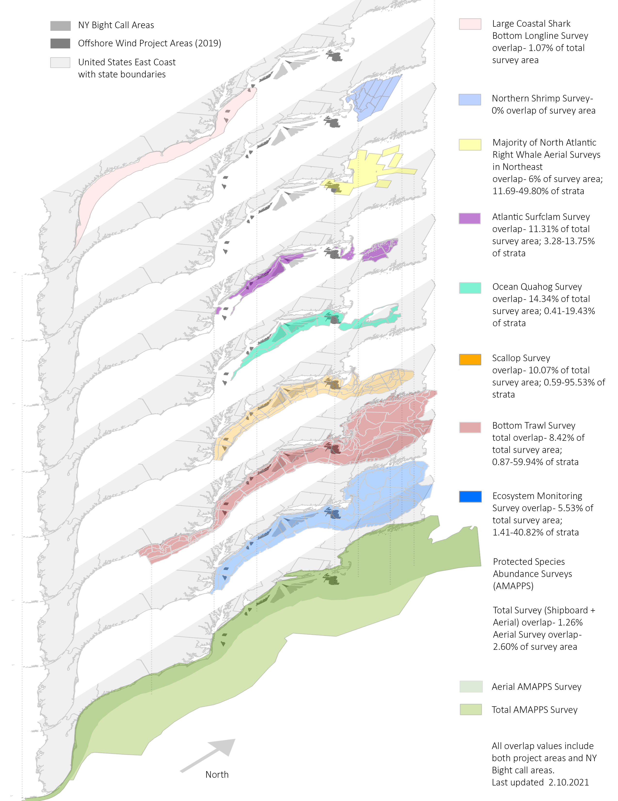

---
title:
csl: plos.csl
fontsize: 10pt
output:
  pdf_document:
    includes:
      in_header: latex/header.tex
    keep_tex: yes
  html_document:
    df_print: paged
  word_document: default
link-citations: yes
geometry: left=2cm, right=2cm, top=2cm, bottom=3cm, footskip = .5cm
subparagraph: yes
bibliography: SOE2021.bib
urlcolor: blue
---

```{r setup, include=FALSE}

# library(tint)
# # invalidate cache when the package version changes
# knitr::opts_chunk$set(tidy = FALSE, cache.extra = packageVersion('tint'))
# options(htmltools.dir.version = FALSE)

#Default Rmd options
knitr::opts_chunk$set(echo = FALSE,
                      message = FALSE,
                      dev = "cairo_pdf",
                      warning = FALSE,
                      fig.width = 4,
                      fig.asp = 0.45,
                      fig.align = 'center'
                      ) #allows for inserting R code into captions

#Plotting and data libraries
#remotes::install_github("noaa-edab/ecodata@0.1.0") #change to 2020 ecodata version for release
library(tidyverse)
library(tidyr)
library(ecodata)
library(here)
library(kableExtra)

```

```{r, code = readLines("https://raw.githubusercontent.com/NOAA-EDAB/ecodata/master/chunk-scripts/human_dimensions_NE.Rmd-setup.R")}
```

```{r, code = readLines("https://raw.githubusercontent.com/NOAA-EDAB/ecodata/master/chunk-scripts/human_dimensions_NE.Rmd-GIS-setup.R")}
```

```{r, code = readLines("https://raw.githubusercontent.com/NOAA-EDAB/ecodata/master/chunk-scripts/macrofauna_NE.Rmd-setup.R")}
```

```{r, code = readLines("https://raw.githubusercontent.com/NOAA-EDAB/ecodata/master/chunk-scripts/LTL_NE.Rmd-setup.R")}
```

\setcounter{page}{5}

# Introduction

## About This Report

This report is for the New England Fishery Management Council (NEFMC) and synthesizes ecosystem information to better meet fishery management objectives. The major messages of the report are summarized on pages 1, 2, and 3 and synthesis themes are illustrated on page 4. Information in this report is organized into two sections: (1) [performance measured against ecosystem-level management objectives](#performance-relative-to-fishery-management-objectives) (Table \ref{tab:management-objectives}), and (2) potential [risks to meeting fishery management objectives](#risks-to-meeting-fishery-management-objectives) ([climate change](#climate-and-ecosystem-productivity) and [other ocean uses](#other-ocean-uses:-offshore-wind)).  

## Report structure

The two main sections contain subsections for each management objective or potential risk. Within each subsection, indicator trends are reviewed, as is the status of the most recent year relative to a threshold (if available) or the long-term average. Second, results of other indicators and information are presented to highlight potential implications for management (i.e., thereby connecting indicator(s) status to management and why an indicator(s) is important). For example, if there are multiple drivers related to an indicator trend, which drivers may be more or less supported by current information, and which, if any, can be affected by management actions? Similarly, which risk indicators warrant continued monitoring to evaluate potential regime shifts or ecosystem reorganization. These implications are offered as testable hypotheses at present, rather than “answers,” because the science behind these indicators and syntheses continues to develop.  

A glossary of terms^[https://noaa-edab.github.io/tech-doc/glossary.html], detailed technical methods documentation^[https://NOAA-EDAB.github.io/tech-doc] and indicator data^[https://github.com/NOAA-EDAB/ecodata] are available online. The details of standard figure formatting (Fig. \ref{fig:docformat}a), categorization of fish and invertebrate species into feeding groups (Table \ref{tab:species-groupings}), and definitions of ecological production units (EPUs, including Georges Bank, GB, and the Gulf of Maine, GOM; Fig. \ref{fig:docformat}b) are provided at the end of the document. 

```{r management-objectives}

mng_obj <- data.frame("Objective Categories" = c("Seafood Production",
                                                 "Profits","Recreation",
                                                 "Stability","Social & Cultural",
                                                 "Protected Species",
                                                 "Biomass","Productivity",
                                                 "Trophic structure","Habitat"),
"Indicators reported here" = c("Landings by feeding guild","Revenue decomposed to price and volume",
                               "Days fished; recreational catch",
                               "Diversity indices (fishery and species)",
                               "Community engagement/reliance status",
                               "",
                               "Biomass or abundance by feeding guild from surveys",
                               "Condition and recruitment of managed species, Primary productivity",
                               "Relative biomass of feeding guilds, Zooplankton",
                               "Estuarine and offshore habitat conditions"))

knitr::kable(mng_obj, linesep = "",
      col.names = c("Objective Categories","Indicators reported here"),
      caption = "Example ecosystem-scale objectives for the New England Region",
      #align = 'c',
      booktabs = T) %>%
 # kable_styling(latex_options = "hold_position", "scale_down") %>%
 # column_spec(c(2), width = c("25em")) %>%
  row_spec(0, bold = TRUE) %>%
 # group_rows("Provisioning/Cultural", 1,4) %>%
 # group_rows("Supporting/Regulating", 5,9)
  pack_rows("Provisioning/Cultural Services", 1,6) %>%
  pack_rows("Supporting/Regulating Services", 7,10)


```
 
# Performance relative to fishery management objectives

In this section, we examine indicators related to broad, ecosystem-level fishery management objectives. We also provide hypotheses on the implications of these trends—*why* we are seeing them, what’s driving them, and identify potential or observed regime shifts or changes in ecosystem structure. Identifying multiple drivers, regime shifts, and potential changes to ecosystem structure, as well as identifying the most vulnerable resources, can help managers determine how best to meet objectives and how to address and prioritize for upcoming issues/risks. 

## Seafood Production 

### Indicator: Landings

Total commercial landings (black) within the GOM and NEFMC’s managed landings (red) in both regions continue to trend downward (Fig. \ref{fig:total-landings}). 

```{r total-landings, fig.cap = "Commercial seafood landings for Georges Bank and the Gulf of Maine.  The red lines are landings of species managed by the New England Fishery Management Council (NEFMC) while the black lines includes both the managed species as well as landings of species not managed by the NEFMC. mt = metric tons", code = readLines("https://raw.githubusercontent.com/NOAA-EDAB/ecodata/master/chunk-scripts/human_dimensions_NE.Rmd-comdat-total-landings.R"), fig.width = 7.5, fig.asp = 0.21}
```

```{r comm-landings-gb, fig.cap = "Commercial landings for Georges Bank by feeding guild.  The red lines are landings of species managed by the New England Fishery Management Council (NEFMC) while the black lines includes both the managed species as well as landings of species not managed by the NEFMC.", code = readLines("https://raw.githubusercontent.com/NOAA-EDAB/ecodata/master/chunk-scripts/human_dimensions_NE.Rmd-comdat-commercial-landings-gb.R"), fig.asp = 1.2}
```

The downward trend on Georges Bank is due to declines in the piscivores and benthos groups and slightly offset by increases in the planktivores (Fig. \ref{fig:comm-landings-gb}). The downward trend in the GOM is evident in the piscivores, planktivores, and benthivores groups (Fig. \ref{fig:comm-landings-gom}).

```{r comm-landings-gom, fig.cap = "Commercial landings for the Gulf of Maine by feeding guild.  The red lines are landings of species managed by the New England Fishery Management Council (NEFMC) while the black lines includes both the managed species as well as landings of species not managed by the NEFMC.", code = readLines("https://raw.githubusercontent.com/NOAA-EDAB/ecodata/master/chunk-scripts/human_dimensions_NE.Rmd-comdat-commercial-landings-gom.R"), fig.asp=1.2}
```

Overall, recreational harvest (retained fish presumed to be eaten) have also declined in New England (Fig. \ref{fig:rec-landings}).

```{r rec-landings, fig.cap = paste0("Total recreational seafood harvest (millions of fish) in the ",region," region."), code = readLines("https://raw.githubusercontent.com/NOAA-EDAB/ecodata/master/chunk-scripts/human_dimensions_NE.Rmd-recdat-landings.R")}

```

Recreational shark landings of pelagic and prohibited sharks have increased over the last couple of years (Fig \ref{fig:rec_hms}). A recent regulatory change implemented in 2018 should help rebuild the shortfin mako stock and should decrease the number of prohibited sharks species landed in the region.

```{r rec_hms, fig.cap="Recreational shark landings from Large Pelagics Survey.", code = readLines("https://raw.githubusercontent.com/NOAA-EDAB/ecodata/master/chunk-scripts/human_dimensions_NE.Rmd-rec_hms.R"), fig.width=5, fig.asp=.35}

```

Aquaculture production is not yet included in total seafood landings, but we are working towards that in future reports. Available aquaculture production of oysters for a subset of New England states is showing an increase in annual production per acre leased (Fig. \ref{fig:aquaculture}).  This increase in productivity is generally attributed to the increasing use of off-bottom culture methods and improvements in hatchery stocks that reduce mortality rates.

```{r aquaculture, fig.cap="Total oyster production per acre leased for New England states.", code = readLines("https://raw.githubusercontent.com/NOAA-EDAB/ecodata/master/chunk-scripts/human_dimensions_NE.Rmd-aquaculture-pa.R")}

```

### Implications

Declines in commercial and recreational landings in the region may be caused by various factors, including combinations of ecological and stock production, management actions, market conditions, and environmental changes.  While we cannot evaluate all possible drivers at present, here we evaluate the extent to which ecosystem overfishing (total landings exceeding ecosystem productive capacity), stock status, and changes in system biomass play a role.

#### Ecosystem Overfishing and Stock Status Indices

Thresholds for ecosystem-level overfishing based on system production characteristics have been proposed [@link_global_2019], and are applied here for GB and GOM. The proposed ecosystem overfishing thresholds are calculated based on *total catch* while our preliminary indicators are based on *commercial landings*. Therefore, our current indicators are underestimated compared with the proposed thresholds. In future reports we may be able to include commercial discards and recreational removals to evaluate total catch.

Based on the ratio of total landings to total primary production (Fogarty Index, Fig. \ref{fig:fogarty}) ecosystem overfishing is presently not occurring; although ecosystem overfishing occurred in the past (and as recently as 2000 in the GOM).  Using a different metric based on total landings per unit area (Ryther Index, Fig. \ref{fig:ryther}), there is an indication that marginal ecosystem overfishing may still be occurring in the GOM. This is further corroborated by the nine stocks below $B_{MSY}$ while status relative to $B_{MSY}$ could not be assessed for 14 additional stocks (Fig. \ref{fig:stock-status}). Therefore, stock status and associated management constraints are likely contributing to decreased landings. To better address the role of management in future reports, we could examine how the total allowable catch (TAC) and the percentage of the TAC taken for each species has changed through time.

```{r fogarty, fig.cap="Fogarty Index, the ratio of total landings to total primary production in an ecosystem. Link and Watson (2019) give an optimal range (green shading) of the Fogarty ratio of 0.22 to 0.92 parts per thousand (PPT). Previous work suggested that index values exceeding 1 to 2 PPT (orange shading) lead to ecosystem tipping points.", code = readLines("https://raw.githubusercontent.com/NOAA-EDAB/ecodata/master/chunk-scripts/human_dimensions_NE.Rmd-fogarty.R"), fig.width = 7.5}
```

```{r ryther, fig.cap="Ryther index; total landings presented on a unit area basis for an ecosystem. Theoretical estimates (Link and Watson, 2019) imply the index should range from 0.3 - 1.1 mt per sq km annually (green shading) with a limit of 3 mt per sq km annually, above which tipping points could occur in fished ecosystems (orange shading). Expected system-wide MSYs can be in the range from 1 to 3 mt per sq km (unshaded).", code = readLines("https://raw.githubusercontent.com/NOAA-EDAB/ecodata/master/chunk-scripts/human_dimensions_NE.Rmd-ryther.R"), fig.width = 7.5}
```

```{r stock-status, fig.cap = "Summary of single species status for NEFMC and jointly federally managed stocks (Goosefish and Spiny dogfish).  The dotted vertical line is the target biomass reference point of B\\textsubscript{MSY}.  The dashed lines are the management thresholds of B\\textsubscript{MSY} (verticle) or F\\textsubscript{MSY} (horizontal).", code = readLines("https://raw.githubusercontent.com/NOAA-EDAB/ecodata/master/chunk-scripts/human_dimensions_NE.Rmd-stock-status.R"), fig.width = 7.5, fig.asp = 0.5}
```

The amount of potential yield from a marine ecosystem depends on (1) the amount of production entering at the base of the food web, primarily in the form of phytoplankton; (2) the pathways this energy follows to reach harvested species; (3) the efficiency of transfer of energy at each step in the food web; and (4) the fraction of production removed by the fisheries. GB commercial landings are now sustained by a lower proportion of the ecosystem’s primary production compared  to the 1960s and 70s when ecosystem overfishing occurred (Fig. \ref{fig:ppr-ne}).  Conversely, the amount of primary production used to sustain commercial landings in the GOM has remained relatively constant over time (Fig. \ref{fig:ppr-ne}).

```{r ppr-ne, fig.cap="Primary production required to support commercial landings for GB and GOM. Included are the top species accounting for 80\\% of the landings in each year, with 15\\% transfer efficiency assumed between trophic levels. PPD is total primary production. The solid line is based on satellite-derived PPD and the dashed line is based on reconstructed PPD.", code = readLines("https://raw.githubusercontent.com/NOAA-EDAB/ecodata/master/chunk-scripts/human_dimensions_NE.Rmd-ppr.R"), fig.width = 6, fig.asp = .4}
```

#### System Biomass

Even with potential ecosystem overfishing, aggregate biomass trends derived from scientific resource surveys have been relatively stable in both regions (Fig. \ref{fig:nefsc-biomass-gb} & Fig. \ref{fig:nefsc-biomass-gom}). The lone exception is the benthivores group which spiked during the last decade driven by haddock recruitment but appears to be returning to average levels (although many surveys were not completed in 2020). While managed species comprise varying proportions of aggregate biomass (Figs. \ref{fig:comm-landings-gb} and \ref{fig:comm-landings-gom}), trends in landings are not mirroring shifts in the overall trophic structure of survey-sampled fish and invertebrates.

```{r nefsc-biomass-gb, fig.cap = "Spring (left) and fall (right) surveyed biomass on Georges Bank. The shaded area around each annual mean represents 2 standard deviations from the mean.", code = readLines("https://raw.githubusercontent.com/NOAA-EDAB/ecodata/master/chunk-scripts/macrofauna_NE.Rmd-aggregate-biomass.R"), fig.width=8, fig.asp = 0.75}
```

```{r nefsc-biomass-gom, fig.cap = "Spring (left) and fall (right) surveyed biomass in the Gulf of Maine. The shaded area around each annual mean represents 2 standard deviations from the mean.", code = readLines("https://raw.githubusercontent.com/NOAA-EDAB/ecodata/master/chunk-scripts/macrofauna_NE.Rmd-agg-bio.R"), fig.width=8, fig.asp = 0.75}
```

#### Effect on Seafood Production

With potential ecosystem overfishing occurring in the past and poor or unknown stock status of many managed species, the decline in commercial landings is most likely reflects lower catch quotas implemented to rebuild overfished stocks, as well as market dynamics.  

The decline in recreational seafood landings stems from multiple drivers. Some of the decline, such as for recreational shark landings,  is driven by tightening regulations. However, the MRIP survey methodology was updated in 2018, and it is unclear at this point whether the decline in landings estimated in that year is an artifact of those methodological changes or actually driven by changes in fishing behavior. The current recreational harvests are near the lowest in the time series.  

Other environmental changes require monitoring as they may become important drivers of future landings:
  
  - Climate is trending into uncharted territory. Globally, 2020 was tied with the warmest year on record^[https://www.nasa.gov/press-release/2020-tied-for-warmest-year-on-record-nasa-analysis-shows] with regional marine heatwaves apparent (see [Climate Risks section](#climate-and-ecosystem-productivity)).
  - Stocks are shifting distribution, moving towards the northeastward and into deeper waters throughout the Northeast US Large Marine Ecosystem (Fig. \ref{fig:species-dist}).
  - Some ecosystem composition and production changes have been observed (see [Stability section](#stability)). 
  - Fishing engagement has increased in some communities (see [Social and Cultural section](#social-and-cultural)).  
        
```{r species-dist, fig.cap = "Aggregate species distribution metrics for species in the Northeast Large Marine Ecosystem.", code = readLines("https://raw.githubusercontent.com/NOAA-EDAB/ecodata/master/chunk-scripts/macrofauna_MAB.Rmd-species-dist.R"), fig.asp=0.8}
```

## Commercial Profits 
        
### Indicators: revenue (a proxy for profits), with price and volume components  

Total commercial revenues (black) continue to be driven by single species in New England; Sea scallops on GB and American lobster in the GOM (Fig. \ref{fig:comm-revenue}). High GB revenue is due to the high volume and price of scallops. The cyclical nature of these revenues reflects the rotational area management system for the sea scallop resource. Total revenues in the GOM are currently above average due to high lobster prices, despite a lower volume in 2019. The declining trend in revenue from managed species (red) in the GOM probably reflects declines in quotas and low allowable catches for stocks with rebuilding plans.
        
```{r comm-revenue, fig.width = 4, fig.asp = 0.45, fig.cap = "Total revenue for the region (black) and revenue from NEFMC managed species (red).", code = readLines("https://raw.githubusercontent.com/NOAA-EDAB/ecodata/master/chunk-scripts/human_dimensions_NE.Rmd-comdat-comm-revenue.R"), fig.width = 7.5, fig.asp = 0.2}
```
        
Revenue earned by harvesting marine resources is a function of both the quantity landed of each species and the prices paid for landings. Beyond monitoring yearly changes in revenue, it is even more valuable to determine what drives these changes:  harvest levels, the mix of species landed, price changes, or a combination of these. The Bennet Indicator decomposes revenue change into two parts, one driven by changing quantities (volumes), and a second driven by changing prices.
        
Total revenue trends, decomposed to price and volume indicators (Fig. \ref{fig:bennet}), mirror those for the benthos (sea scallops; orange in fig. \ref{fig:bennet-all}) on GB and benthivores (lobster; purple in fig. \ref{fig:bennet-all}) in the GOM.
        
```{r bennet, fig.cap = paste0("Revenue changes from the 2015 values in dollars (black), Price (PI), and Volume Indicators (VI) for commercial landings on Georges Bank and in the Gulf of Maine."), code = readLines("https://raw.githubusercontent.com/NOAA-EDAB/ecodata/master/chunk-scripts/human_dimensions_NE.Rmd-bennet2.R"), fig.width=6, fig.asp=.5, echo = FALSE, message=FALSE, results='hide'}
```
        
```{r bennet-all, fig.cap = "Total component value in dollars (black) for commercial landings on Georges Bank and in the Gulf of Maine.", code = readLines("https://raw.githubusercontent.com/NOAA-EDAB/ecodata/master/chunk-scripts/human_dimensions_NE.Rmd-bennet-all.R"), fig.width = 7.5, fig.asp = 0.5, echo = FALSE, message=FALSE, results='hide'}
```
        
### Implications 

The continued dependence on lobster in the GOM and sea scallops on GB is affected by multiple drivers including resource availability and market conditions.  As both species are sensitive to ocean warming and acidification, it is important to monitor these and other climate drivers.
        
## Recreational Opportunities 
        
### Indicators: Days fished, fleet diversity  
Recreational effort (days fished) increased during 1980-2010, but has since declined to the long-term average (Fig. \ref{fig:rec-op}). Recreational fleet diversity has remained relatively stable over the latter half of the time series (Fig. \ref{fig:rec-div}). Recreational fleets are defined as either private vessel, shore-based, or party/charter vessels.
        
```{r rec-op, fig.cap = paste0("Recreational effort in ",region,"."), code = readLines("https://raw.githubusercontent.com/NOAA-EDAB/ecodata/master/chunk-scripts/human_dimensions_NE.Rmd-recdat-effort.R")}
```
        
```{r rec-div, fig.cap = paste0("Recreational fleet effort diversity in ",region,"."), code = readLines("https://raw.githubusercontent.com/NOAA-EDAB/ecodata/master/chunk-scripts/human_dimensions_NE.Rmd-recdat-diversity.R")}
```
        
### Implications

The absence of a long term trend in recreational days fished and fleet effort diversity suggests relative stability in the overall number of recreational opportunities in the region.
        
## Stability 

### Indicators: fishery fleet and catch diversity, ecological component diversity
While there are many potential metrics of stability, we use diversity indices as a first check to evaluate overall stability in fisheries and ecosystems. In general, diversity that remains constant over time suggests a similar capacity to respond to change over time. A significant change in diversity over time does not necessarily indicate a problem or an improvement, but does indicate a need for further investigation. We examine commercial and recreational fleet and species catch diversity, and diversity in zooplankton, larval, and adult fish.

#### Fishery Diversity

Diversity estimates have been developed for fleets and species landed by commercial vessels with New England permits. A fleet is defined here as the combination of gear type (Scallop Dredge, Clam Dredge, Other Dredge, Gillnet, Hand Gear, Longline, Bottom Trawl, Midwater Trawl, Pot, or Purse Seine) and vessel length category (Less than 30 ft, 30 to 50 ft, 50 to 75 feet, 75 ft and above).  Commercial fishery fleet count and fleet diversity in revenue are at or near time series lows (Fig. \ref{fig:commercial-div}). This indicates the shift towards reliance on fewer species as noted in the [Revenue section](#commercial-profits).

```{r commercial-div, fig.cap = paste0("Fleet diversity and fleet count in ",region,"."), code = readLines("https://raw.githubusercontent.com/NOAA-EDAB/ecodata/master/chunk-scripts/human_dimensions_NE.Rmd-commercial-div.R"), fig.asp=0.8}
```

As noted [above](#recreational-opportunities), recreational fleet effort diversity is stable. However, recreational species catch diversity has been above the time series average since 2008, but has shown a declining trend since 2014 (Fig. \ref{fig:commercial-div-species-div}).

```{r commercial-div-species-div,  fig.cap = paste0("Species revenue diversity in ",region,"."), code = readLines("https://raw.githubusercontent.com/NOAA-EDAB/ecodata/master/chunk-scripts/human_dimensions_NE.Rmd-recdat-div-catch.R")}
```

#### Ecological Diversity

Ecological diversity indices show mixed trends. Zooplankton diversity is increasing on GB where two calanoid copepods (*Calanus finmarchicus* and *Centropages typicus*) are declining in dominance (Fig. \ref{fig:zoo-diversity-gb}), while no trend is evident in the GOM (Fig. \ref{fig:zoo-diversity-gom}). Larval fish indices are steady about the mean (Figs. \ref{fig:ichthyo-diversity}). Adult fish diversity is measured as the expected number of species in a standard number of individuals sampled from the NEFSC bottom trawl survey. There is no vessel correction for this metric, so indices collected aboard the research vessel Albatross IV (up to 2008) and the research vessel Henry B. Bigelow (2009 - Present) are calculated separately (Fig. \ref{fig:exp-n}).  This metric shows an increasing trend in the GOM with no trends on GB.

```{r zoo-diversity-gb, fig.cap = "Zooplankton diversity on Georges Bank, based on Shannon diversity index.", code = readLines("https://raw.githubusercontent.com/NOAA-EDAB/ecodata/master/chunk-scripts/LTL_NE.Rmd-zoo-diversity-gb.R"), fig.asp=0.4}
```

```{r zoo-diversity-gom, fig.cap = "Zooplankton diversity in the Gulf of Maine, based on Shannon diversity index.", code = readLines("https://raw.githubusercontent.com/NOAA-EDAB/ecodata/master/chunk-scripts/LTL_NE.Rmd-zoo-diversity-gom.R"), fig.asp=0.4}
```

```{r ichthyo-diversity, fig.cap = "Larval fish diversity on Georges Bank and in the Gulf of Maine, based on Shannon diversity index.", code = readLines("https://raw.githubusercontent.com/NOAA-EDAB/ecodata/master/chunk-scripts/macrofauna_NE.Rmd-ichthyo-diversity.R"), fig.asp=0.7}
```

```{r exp-n, fig.cap = "Adult fish diversity for Georges Bank and in the Gulf of Maine, based on expected number of species.", code = readLines("https://raw.githubusercontent.com/NOAA-EDAB/ecodata/master/chunk-scripts/macrofauna_NE.Rmd-exp-n.R"), fig.width=8, fig.asp=.4}
```

### Implications

Fleet diversity indices can be used to evaluate stability objectives as well as risks to fishery resilience and maintaining equity in access to fishery resources [@gaichas_implementing_2018]. The relatively low diversity estimates for the commercial fishery are likely driven by the continued reliance on just a small number of species.  This trend could diminish the capacity to respond to future fishing opportunities. While the increase in recreational species catch diversity is due to  recent increases in ASMFC and MAFMC managed species within the region as well as decreased limits on more traditional regional species.

Ecological diversity indices can provide insight into ecosystem structure. Changes in ecological diversity over time may indicate altered ecosystem structure with implications for fishery productivity and management [@friedland_changes_2020]. Increasing zooplankton diversity is driven by the declining dominance of the calanoid copepods *Centropages typicus*, while overall abundance of zooplankton species is increasing. Stable larval and adult fish diversity on GB suggests the same overall number and evenness over time, but doesn’t rule out species substitutions (e.g., warm-water species replacing cold-water ones). Increasing adult diversity in the GOM suggests an increase in warm-water species and should be closely monitored.  Stable but variable larval diversity can indicate interannual changes in a dominant species.

As a whole, the examined diversity indicators suggest overall stability in the fisheries and ecosystem components. However, increasing diversity in the recreational catch, GB zooplankton, and GOM adult fish suggests warning signs of a potential regime shift or ecosystem restructuring and warrants continued monitoring to determine if managed species are affected.

## Social and Cultural 

### Indicators: Commercial and recreational engagement and reliance by community

Social vulnerability measures social factors that shape a community’s ability to adapt to change and does not consider gentrification pressure vulnerability. Communities that ranked medium-high or above for one or more of the following indicators: poverty, population composition, personal disruption, or labor force structure, are highlighted in  red. Commercial fishery engagement measures the number of permits, dealers, and landings in a community, while reliance expresses these numbers based on the level of fishing activity relative to the total population of a community.


```{r commercial-engagement, fig.cap= "Commercial engagement, reliance, and social vulnerability for the top commercial fishing communities in New England.", code = readLines("https://raw.githubusercontent.com/NOAA-EDAB/ecodata/master/chunk-scripts/human_dimensions_NE.Rmd-commercial-engagement.R"), fig.width = 7.5, fig.asp = 0.55}
```

```{r recreational-engagement, fig.cap= "Recreational engagement, reliance, and social vulnerability for the top recreational fishing communities in New England.", code = readLines("https://raw.githubusercontent.com/NOAA-EDAB/ecodata/master/chunk-scripts/human_dimensions_NE.Rmd-recreational-engagement.R"), fig.width = 7.5, fig.asp = 0.55}
```

In 2020, we reported that the number of moderately to highly engaged New England commercial fishing communities has shown an increase since 2004. Here we focus on top ten most engaged and top ten most reliant fishing communities and their associated social vulnerability (Fig. \ref{fig:commercial-engagement}). Among these communities, Stonington, ME and Chatham, MA are highly engaged and reliant with medium-high to high social vulnerability.

Recreational fishery engagement measures shore, private vessel, and for-hire fishing activity while reliance expresses these numbers based on fishing effort relative to the population of a community. Bourne, MA is the only community highly engaged and reliant with high social vulnerability (Fig. \ref{fig:recreational-engagement}).

Both commercial and recreational fishing are important activities in Chatham and Gloucester, MA; and Narragansett/Point Judith, RI, meaning some of these communities may be impacted simultaneously by commercial and recreational regulatory changes. Of these communities, Chatham, MA scored medium-high or above for social vulnerability.

### Implications
These plots provide a snapshot of the relationship between social vulnerability and the most highly engaged and most highly reliant commercial and recreational fishing communities in New England. Similar plots are used to inform the annual California Current Ecosystem Status Report. These communities may be vulnerable to changes in fishing patterns due to regulations, shifting fish distributions, and/or climate change. When any of these communities also experience social vulnerability, they may be less able to successfully respond to change. These indicators may also point to communities that are vulnerable due to environmental justice issues. Additional analysis related to ecosystem shifts and National Standard 8 of the Magnuson-Stevens Act is ongoing.

## Protected Species

Protected species include marine mammals protected under the Marine Mammal Protection Act, endangered and threatened species protected under the Endangered Species Act, and migratory birds protected under the Migratory Bird Treaty Act. In the Northeast U.S., endangered/threatened species include Atlantic salmon, Atlantic and shortnose sturgeon, all sea turtle species, and five baleen whales. Fishery management objectives for protected species generally focus on reducing threats and on habitat conservation/restoration. Here we report on the status of these actions as well as indicating the potential for future interactions driven by observed and predicted ecosystem changes in the Northeast U.S. region. Protected species objectives include managing bycatch to remain below potential biological removal (PBR) thresholds, recovering endangered populations, and monitoring unusual mortality events (UMEs). 

```{r harborporpoise, fig.cap="Harbor porpoise average bycatch estimate for Mid-Atlantic and New England fisheries (blue) and the potential biological removal (red). 2019 estimates are preliminary.", code = readLines("https://raw.githubusercontent.com/NOAA-EDAB/ecodata/master/chunk-scripts/macrofauna_MAB.Rmd-harborporpoise.R"), fig.width = 6}
```

### Indicators: bycatch, population (adult and juvenile) numbers, mortalities

Average indices for both harbor porpoise (Fig. \ref{fig:harborporpoise}) and gray seal bycatch (Fig. \ref{fig:grayseal}) are below current PBR thresholds, meeting management objectives. However, the 2019 bycatch estimate for gray seals was highest in the time series.

```{r grayseal, fig.cap="Gray Seal average bycatch estimate for New England gillnet fisheries (blue) and and the potential biological removal (red). 2019 estimates are preliminary.", code = readLines("https://raw.githubusercontent.com/NOAA-EDAB/ecodata/master/chunk-scripts/macrofauna_MAB.Rmd-grayseal.R"), fig.width=6}
```

The North Atlantic right whale population was on a recovery trajectory until 2010, but has since declined (Fig. \ref{fig:narw-abundance}). Reduced survival rates of adult females and diverging abundance trends between sexes have also been observed. It is estimated that there are only about 100 adult females remaining in the population. 

```{r narw-abundance, fig.cap = "Estimated North Atlanic right whale abundance on the Northeast Shelf.", code = readLines("https://raw.githubusercontent.com/NOAA-EDAB/ecodata/master/chunk-scripts/macrofauna_MAB.Rmd-narw-abundance.R"), fig.width=5}
```

North Atlantic right whale calf counts have also been declining (Fig. \ref{fig:NARW-calf-abundance}). In 2018 there were zero observed new calves, and a drop in annual calves roughly mirrors the abundance decline, however seven new calves were born in 2019. Preliminary 2020 observations of 12 calves have been recorded as of January 2021. 

```{r NARW-calf-abundance, fig.cap = "Number of North Atlantic right whale calf births, 1990 - 2019.", code = readLines("https://raw.githubusercontent.com/NOAA-EDAB/ecodata/master/chunk-scripts/macrofauna_MAB.Rmd-NARW-calf-abundance.R"), fig.width=5}
```

This year, four Unusual Mortality Events (UMEs) continued, three for large whales (North Atlantic right whales, humpback whales, and minke whales) and one for gray and harbor seals.

Since 2017, the total UME right whale mortalities includes 32 dead stranded whales, 11 in the US and 21 in Canada. When alive but seriously injured whales (14) are taken into account, 46 individual whales are included in the UME. During 2020, two mortalities were documented, however, recent research suggests that many mortalities go unobserved and the true number of mortalities are about three times the count of the observed mortalities [@pace_cryptic_2021]. The primary cause of death is “human interaction” from entanglements or vessel strikes. 

Coastal bottlenose dolphin stocks off North Carolina and Virginia are listed as depleted, so a take reduction team met in 2019 and has been evaluating and implementing some of the team's consensus recommendations. 

Also, a UME for both gray and harbor seals was declared in 2018 due to a high number of mortalities thought to be caused by phocine distemper virus.

### Implications

Bycatch management measures have been implemented to maintain bycatch below Potential Biological Removal (PBR) thresholds. The downward trend in harbor porpoise bycatch can also be due to a decrease in  harbor porpoise abundance in US waters, which has reduced their overlap with fisheries, and a decrease in gillnet effort. The increasing trend in gray seal bycatch may be related to an increase in the gray seal population (U.S. pup counts).

The number of gray seals in U.S. waters has risen dramatically in the last three  decades. Based on a survey conducted in 2016, the size of the gray seal population in the U.S. during the breeding season was approximately 27,000 animals, while in Canada the population,was estimated to be roughly 425,000. A survey conducted in 2021 in both countries will provide updated estimates of abundance. The population in Canada is increasing at roughly 4% per year, and contributing to rates of increase in the U.S., where the number of pupping sites has increased from 1 in 1988 to 9 in 2019. Mean rates of increase in the number of pups born at various times since 1988 at four of the more data-rich pupping sites (Muskeget, Monomoy, Seal, and Green Islands) ranged from no change on Green Island to high rates increase on the other three islands, with a maximum increase of 26.3% (95\%CI: 21.6 - 31.4\%; @wood_rates_2020 Fig. \ref{fig:seals}). These high rates of increase provide further support for the hypothesis that seals from Canada are continually supplementing the breeding population in U.S. waters.  

```{r seals, fig.cap = "Estimated mean rates of increase (solid line) and CIs (shaded area) in number of gray seal pups born at four United States pupping colonies at various times from 1988 to 2019. From Wood et al. 2019", code = readLines("https://raw.githubusercontent.com/NOAA-EDAB/ecodata/master/chunk-scripts/macrofauna_NE.Rmd-seal-pups.R"), fig.width=5, fig.asp = .7}
```

Strong evidence exists to suggest that interactions between right whales and the offshore lobster gear in the U.S. and snow crab gear in Canada is contributing substantially to the decline of the species. Further, right whale distribution has changed since 2010. New research suggests that recent climate driven changes in ocean circulation have resulted in right whale distribution changes driven by increased warm water influx through the Northeast Channel, which has reduced the primary right whale prey (*Calanus finmarchicus*) in the central and eastern portions of the Gulf of Maine [@hayes_north_2018; @record_rapid_2019; @sorochan_north_2019].

The UMEs are under investigation and are likely the result of multiple drivers. For all three large whale UMEs, human interaction appears to have contributed to increased mortalities, although investigations are not complete. An investigation into the cause of the seal UME so far suggests phocine distemper virus as a potential cause. 

A marine mammal climate vulnerability assessment is currently underway for Atlantic and Gulf of Mexico populations and will be reported on in future versions of this report.

\newpage

# Risks to meeting fishery management objectives

## Climate and Ecosystem Productivity

### Climate Change Indicators: ocean currents, temperature, and heatwaves

Regional ocean current indicators remain at unprecedented levels. In 2019, the Gulf Stream  was at its most northern position since 1993 (Fig. \ref{fig:GSI}). A more northerly Gulf Stream position is associated with warmer ocean temperature on the Northeast US shelf [@zhang_role_2007], a higher proportion of Warm Slope Water in the Northeast Channel, and increased sea surface height along the U.S. east coast [@goddard_extreme_2015].

```{r GSI, fig.cap = "Index representing changes in the location of the Gulf Stream north wall. Positive values represent a more northerly Gulf Stream position.", code=readLines("https://raw.githubusercontent.com/NOAA-EDAB/ecodata/master/chunk-scripts/LTL_MAB.Rmd-gsi.R"), fig.width=6}
```

In 2019, we also observed the second lowest proportion of Labrador Slope Water entering the Gulf of Maine since 1978 (Fig. \ref{fig:wsw-prop}). The changing proportions of source water affect the temperature, salinity, and nutrient inputs to the Gulf of Maine ecosystem.

```{r wsw-prop, fig.cap = "Proportion of Warm Slope Water (WSW) and Labrador slope water (LSLW) entering the GOM through the Northeast Channel.", code=readLines("https://raw.githubusercontent.com/NOAA-EDAB/ecodata/master/chunk-scripts/LTL_NE.Rmd-slopewater.R"), fig.width=6}
```

Ocean temperatures continue to warm at both the bottom (Figs. \ref{fig:bottom-temp-gb} and \ref{fig:bottom-temp-gom}) and the surface (Fig. \ref{fig:seasonal-sst-anom-gridded}). Warming is not seasonally uniform, however: the 2020 winter and spring surface temperatures were just slightly warmer than average, while the summer and fall temperatures were up to 2-4 $^\circ$C above the climatological mean.

```{r bottom-temp-gb, fig.cap="Annual Georges Bank bottom temperature anomalies. (black = observations, red = reanalysis)", code=readLines("https://raw.githubusercontent.com/NOAA-EDAB/ecodata/master/chunk-scripts/LTL_NE.Rmd-bottom-temp-gb.R"), fig.width=6}
```

```{r bottom-temp-gom, fig.cap="Annual Gulf of Maine bottom temperature anomalies. (black = observations, red = reanalysis)", code=readLines("https://raw.githubusercontent.com/NOAA-EDAB/ecodata/master/chunk-scripts/LTL_NE.Rmd-bottom-temp-gom.R"), fig.width=6}
```

```{r seasonal-sst-anom-gridded, fig.cap="New England seasonal sea surface temperature time series overlaid onto 2020 seasonal spatial anomalies.", code=readLines("https://raw.githubusercontent.com/NOAA-EDAB/ecodata/master/chunk-scripts/LTL_NE.Rmd-seasonal-sst-anomaly-gridded.R"), fig.width = 8, fig.asp = 1}
```

New England experienced frequent marine heatwaves of moderate to severe intensity in 2020 that extended well into December (Fig. \ref{fig:heatwave-year-gb} and Fig. \ref{fig:heatwave-year-gom}). Here we define a marine heatwave as a warming event that lasts for five or more days with sea surface temperatures above the 90th percentile of the  historical daily climatology (1982-2010) [@hobday_hierarchical_2016].  Marine heatwaves are measured in terms of intensity (water temperature) and duration (the cumulative number of degree days) using satellite measurements of daily sea surface temperature (Figs. \ref{fig:heatwave-intensity-gb} and \ref{fig:heatwave-intensity-gom}). Plotted are the maximum intensity and cumulative intensity, which is intensity times duration. These included the warmest heatwave on record on GB at 4.3 $^\circ$C above the heatwave threshold (in mid-August) (Fig. \ref{fig:heatwave-intensity-gb}). This record heatwave on GB began on July 8th and lasted 51 days (Fig. \ref{fig:heatwave-year-gb}).

```{r heatwave-year-gb, fig.cap="Marine heatwave events (red) on Georges Bank occuring in 2020.", code=readLines("https://raw.githubusercontent.com/NOAA-EDAB/ecodata/master/chunk-scripts/LTL_NE.Rmd-heatwave-year-gb.R"), fig.asp=.6}
```

```{r heatwave-year-gom, fig.cap="Marine heatwave events (red) in the Gulf of Maine occuring in 2020.", code=readLines("https://raw.githubusercontent.com/NOAA-EDAB/ecodata/master/chunk-scripts/LTL_NE.Rmd-heatwave-year-gom.R"), fig.asp=.6}
```

```{r heatwave-intensity-gb, fig.cap="Marine heatwave cumulative intensity (left) and maximum intensity (right) on Georges Bank.", code=readLines("https://raw.githubusercontent.com/NOAA-EDAB/ecodata/master/chunk-scripts/LTL_NE.Rmd-heatwave-gb.R"), fig.width=8, fig.asp=.25}
```

```{r heatwave-intensity-gom, fig.cap="Marine heatwave cumulative intensity (left) and maximum intensity (right) in the Gulf of Maine.", code=readLines("https://raw.githubusercontent.com/NOAA-EDAB/ecodata/master/chunk-scripts/LTL_NE.Rmd-heatwave-gom.R"), fig.width=8, fig.asp=.25}
```

### Ecosystem Productivity Indicators: primary production, zooplankton, forage fish, fish condition

Increased temperatures, as reported above, can increase the rate of photosynthesis by phytoplankton (i.e. primary productivity). Annual primary production has increased over time, primarily driven by increased productivity in the summer months (Figs. \ref{fig:pp-monthly}, \ref{fig:chl-weekly}, and \ref{fig:pp-weekly}).

```{r pp-monthly,  fig.cap="Monthly primary production trends show the annual cycle (i.e. the peak during the summer months) and the changes over time for each month.", code=readLines("https://raw.githubusercontent.com/NOAA-EDAB/ecodata/master/chunk-scripts/LTL_NE.Rmd-pp-monthly.R"), fig.width=8, fig.asp=.75}
```

Larger than average phytoplankton blooms were observed from late fall into winter in 2020 (Fig. \ref{fig:chl-weekly}).

```{r chl-weekly, fig.cap = "Weekly chlorophyll concentrations on Georges Bank and in the Gulf of Maine are shown for by the colored line for 2020. The long-term mean is shown in black and shading indicates +/- 1 sample SD.", code=readLines("https://raw.githubusercontent.com/NOAA-EDAB/ecodata/master/chunk-scripts/LTL_NE.Rmd-chl-weekly.R"), fig.width = 5, fig.asp=.4}
```

```{r pp-weekly, fig.cap = "Weekly primary productivity on Georges Bank and in the Gulf of Maine are shown for by the colored line for 2020. The long-term mean is shown in black and shading indicates +/- 1 sample SD.", code=readLines("https://raw.githubusercontent.com/NOAA-EDAB/ecodata/master/chunk-scripts/LTL_NE.Rmd-pp-weekly.R"), fig.width = 5, fig.asp=.4}
```

```{r weekly-phyto-size-gb, fig.cap="The annual climatology (1998-2019) percent composition of the phytoplankton size classes on Georges Bank based on satellite observations.", code=readLines("https://raw.githubusercontent.com/NOAA-EDAB/ecodata/master/chunk-scripts/LTL_NE.Rmd-weekly-phyto-size-gb.R"), fig.asp=.6}
```

Climatology of seasonal phytoplankton size fractions confirms that the phytoplankton community in the summer is dominated by smaller (pico and nano) size classes (Figs. \ref{fig:weekly-phyto-size-gb} and \ref{fig:weekly-phyto-size-gom}). This implies less efficient transfer of primary production to higher trophic levels during the peak production summer period.

```{r weekly-phyto-size-gom, fig.cap="The annual climatology (1998-2019) percent composition of the phytoplankton size classes in the Gulf of Maine based on satellite observations.", code=readLines("https://raw.githubusercontent.com/NOAA-EDAB/ecodata/master/chunk-scripts/LTL_NE.Rmd-weekly-phyto-size-gom.R"), fig.asp=.6}
```

Trends in gelatinous zooplankton and krill are the same across ecological production units (EPUs) as last year (data were updated to 2019; Fig. \ref{fig:zoo-strat-abun}). There has been a long term increase in almost all regions.

```{r zoo-strat-abun, fig.cap="Stratified abundance of cnidarians and euphausiids on Georges Bank and in the Gulf of Maine.", code=readLines("https://raw.githubusercontent.com/NOAA-EDAB/ecodata/master/chunk-scripts/LTL_NE.Rmd-zoo-strat-abun.R"), fig.width=7.5, fig.asp=.5}
```

The dominant type of copepods between small-bodied and large-bodied (*Calanus finmarchicus*) have alternated throughout the time series (Fig. \ref{fig:zoo-abund}). Over the past decade, both GB and GOM have had relatively more small bodied copepods than large, although this trend has been reversed on GB since 2018. 

```{r zoo-abund,  fig.cap= "Large (red) and small-bodied (blue) copepod abundance on Georges Bank and in the Gulf of Maine.", code=readLines("https://raw.githubusercontent.com/NOAA-EDAB/ecodata/master/chunk-scripts/LTL_NE.Rmd-ne-sm-lg.R"), fig.width = 6, fig.asp=.5}
```

In the GOM, the abundance of *Calanus finmarchicus* adults and stage-5 copepodites (c5), the primary prey items for right whales, was high between 2000 and 2010 in all seasons (Fig. \ref{fig:calanus-stage}).  The c5 stage was highly abundant in the fall during this period, potentially contributing to a large portion of diapausing  (seasonally dormant and suspended at depth) copepods. A shift in the summer and fall distribution of right whales from the GOM into Canadian waters occurred after 2010, with whales becoming increasingly present in the Gulf of St. Lawrence after 2014, potentially due to changes in food availability [@simard_narw_shift_2019; @sorochan_narw_food_2019].

```{r calanus-stage,  fig.cap= "Abundance of adult and stage 5 copepodites in the Gulf of Maine.", code=readLines("https://raw.githubusercontent.com/NOAA-EDAB/ecodata/master/chunk-scripts/LTL_NE.Rmd-gom-calanus-stage.R"), fig.width = 6, fig.asp = .5}
```

An index of aggregate zooplankton and forage fish fluctuations (forage anomaly) constructed from zooplankton and ichthyoplankton data has no apparent trend for either GB or GOM (Fig. \ref{fig:forage-anomaly}), although the GOM anomaly is above the time series mean.  Changes in environmental conditions, lower tropic levels, and diversity of the plankton community are potentially impacting the prey of zooplankton and ichthyoplankton.

```{r forage-anomaly, fig.cap="Changes from 2000-2019 average abundance for an aggregate of 13 zooplankton and 16 ichthyoplankton groups sampled on NEFSC ECOMON surveys.", code=readLines("https://raw.githubusercontent.com/NOAA-EDAB/ecodata/master/chunk-scripts/macrofauna_NE.Rmd-forage-anomaly.R"), fig.asp = .5}
```

Nutritional value (energy content) of forage fishes as prey is related to both environmental conditions, fish growth and reproductive cycles. Forage energy density measurements from NEFSC trawl surveys 2017-2019 are building toward a time series to evaluate trends (Fig. \ref{fig:energy-density}). New 2019 measurements were consistent with last year’s report: the energy density of Atlantic herring was almost half the value (5.69 +/- 0.07 kJ/g wet weight) reported in earlier studies (10.6-9.4 kJ/ g wet weight). Silver hake, sandlance, longfin squid (*Loligo* below) and shortfin squid (*Illex* below) were also lower than previous estimates [@steimle_energy_1985; @lawson_important_1998]. Energy density of alewife, butterfish and Atlantic mackerel show seasonal differences, but generally fall within the ranges of previous studies.

```{r energy-density, fig.cap="Forage fish mean energy density mean and standard deviation by season and year, compared with 1980s (Steimle and Terranove 1985) and 1990s (Lawson et al. 1998) values.", code=readLines("https://raw.githubusercontent.com/NOAA-EDAB/ecodata/master/chunk-scripts/macrofauna_MAB.Rmd-energy-density.R"), fig.width = 7.5, fig.asp = 0.5}
```

The health and well being of individual fish can be related to body shape condition indices (i.e. weight at a given length) such as relative condition index, which is the ratio of observed weight to predicted weight based on length [@le_cren_length-weight_1951]. Heavier and fatter fish at a given length have higher relative condition which is expected to influence growth, reproductive output and survival. A pattern of generally good condition was observed across many species prior to 2000, followed by a period of generally poor condition from 2001-2010, with a mix of good and poor condition 2011-2019  (Figs. \ref{fig:gb-cf} & \ref{fig:gom-cf}). While there were no new data to update the condition indicator this year, preliminary results of synthetic analyses described in the [Implications section](#environmental-drivers-of-fish-condition) show that changes in fishing pressure, population size, temperature, and zooplankton influence the condition of different fish species. Potential links between fish condition, fisheries, and markets are under investigation.

```{r gb-cf, fig.cap = "Condition factor for fish species on GB based on fall NEFSC bottom trawl survey data. No survey was conducted in 2020.", out.width = '100%'}

knitr::include_graphics("images/GBcondition_2020_viridis_final.jpg")
```

```{r gom-cf, fig.cap = "Condition factor for fish species in the GOM based on fall NEFSC bottom trawl survey data. No survey was conducted in 2020.", out.width = '100%'}

knitr::include_graphics("images/GOMcondition_2020_viridis_final.jpg")
```

### Ecosystem Structure Indicators: distribution shifts, diversity, predators

As noted in the [Landings Implications section above](#landings), stocks are shifting their spatial distributions throughout the region. In aggregate, fish stocks are moving northeastward along the shelf and into deeper waters.

Zooplankton and adult fish diversity are increasing in the GOM, while zooplankton diversity is increasing on GB.  The rest of the diversity indices are stable over time with current values near the long term average (see [Diversity Indicators section, above](#diversity)).

New indicators for shark populations, combined with information on grey seals (see [Protected Species Implications section, above](#protected-species)), suggests predator populations in New England are either stable (sharks, Figs. \ref{fig:observed-sharks}, \ref{fig:hms-cpue-sharks}) or increasing (gray seals, Fig. \ref{fig:seals}). Stable predator populations suggest stable predation pressure on managed species, but increasing predator populations may reflect increasing predation pressure.

```{r observed-sharks, fig.cap="Estimated number of sharks per unit effort from Northeast Fisheries Observer Program data.", code=readLines("https://raw.githubusercontent.com/NOAA-EDAB/ecodata/master/chunk-scripts/macrofauna_NE.Rmd-observed-sharks.R"), fig.width = 6, fig.asp = .4}
```

```{r hms-cpue-sharks, fig.cap="Estimated number of sharks per unit effort from Highly Migratory Species Pelagic Observer Program data.", code=readLines("https://raw.githubusercontent.com/NOAA-EDAB/ecodata/master/chunk-scripts/macrofauna_MAB.Rmd-hms-cpue-sharks.R"), fig.width=6, fig.asp = .4}
```

As noted in the [Protected Species section](#protected-species), gray seal populations are increasing. Harbor and gray seals occupying New England waters are generalist predators that consume more than 30 different prey species. An evaluation of hard  parts found in seal stomachs showed that harbor and gray seals predominantly exploit abundant demersal fish species (i.e. red, white and silver hake). Other relatively abundant prey species found in hard-part remains include sand lance, yellowtail flounder, four-spotted flounder, Gulf-stream flounder, haddock, herring, redfish, and squids.

A recent stable isotope study utilizing gray seal scat samples obtained from Massachusetts habitats showed individual gray seals can specialize on particular prey. It also found that gray seals vary their diet seasonally, focusing on demersal inshore species prior to the spring molt, and offshore species such as sand lance after molting. DNA studies on gray seal diet in Gulf of Maine and Massachusetts waters found spiny dogfish and Jonah crab present in gray seal scat samples. Skate and crab remains were also found in gray seal stomach remains. In contrast to direct feeding, it is uncertain if the presence of skates and crabs is due to secondary consumption or scavenging.

### Habitat Climate Vulnerability

A recent habitat climate vulnerability analysis links several NEFMC species to various highly vulnerable nearshore habitats. In particular, winter flounder, a species deemed highly vulnerable to climate change, is highly dependent on vulnerable habitats throughout New England and in the Mid-Atlantic. Details on highly vulnerable habitats with linkages to a variety of species (including life stages having different levels of dependence on particular habitats) are available in a detailed table.^[https://noaa-edab.github.io/ecodata/Hab_table]

### Implications

#### Links between climate change and managed species 
Estuarine and nearshore habitats support many life stages of state and federally-managed species that are highly vulnerable to climate change. Overall, multiple drivers interact differently for each species producing a range of population impacts.

#### Heatwave impacts
Marine heatwaves measure not just high temperature, but how long the ecosystem is subjected to the high temperature. They are driven by both atmospheric and oceanographic factors and can have dramatic impacts on marine ecosystems. 

As mentioned [above](#), the New England region had multiple marine heatwaves in 2020 (Figs. \ref{fig:heatwave-year-gb} and \ref{fig:heatwave-year-gom}). Both regions experienced higher than average cumulative and maximum heatwave intensity (Figs. \ref{fig:heatwave-intensity-gb} and \ref{fig:heatwave-intensity-gom}) although 2012 still remains the warmest year on record in the Northeast US LME. Recent papers published on the impacts of the 2012 heatwave give insight into the implications of marine heatwaves. Lobsters were affected, as were the timing of fishing periods and market availability [@mills_fisheries_2013].  Cobia and other more southern species exhibited habitat shifts, and were observed off of Rhode Island.

#### Distribution shift impacts

Trends for a suite of 48 commercially or ecologically important fish species along the entire Northeast Shelf continue to show distributional shifts northeastward and generally into deeper water (Fig. \ref{fig:species-dist}). We hope to expand analysis beyond fish. Marine mammal distribution maps are available online;^[https://www.nefsc.noaa.gov/AMAPPSviewer/] updated maps and trends are currently being developed.

Shifting species distributions alter both species interactions and fishery interactions. In particular, shifting species distributions can alter expected management outcomes from spatial allocations and affect the efficacy of bycatch measures based on historical fish and protected species distributions.

#### Ecosystem productivity change impacts

Climate and associated changes in the physical environment affect ecosystem productivity, with warming waters increasing the rate of photosynthesis at the base of the food web. However, increased summer production in the region may not translate to increased fish biomass because smaller phytoplankton dominate during this season. 

While krill and large gelatinous zooplankton have increased over time, smaller zooplankton are periodically shift in abundance (with no apparent trend) between the larger, more nutritious *Calanus finmarchicus* and smaller bodied copepods with no apparent overall trend.  Forage species are difficult to survey, but a new index that includes ichthyoplankton suggests high interannual variability in abundance of larval fish and zooplankton prey. The nutritional content of larger bodied forage fish and squid changes seasonally and annually in response to ecosystem conditions.  In recent years, apparent declines in energy density have occurred in Atlantic herring and Illex squid relative to the 1980s, but similar energy density for other forage species. Some of these factors are now being linked to the relative condition of higher-level fishes.

##### Environmental drivers of fish condition  
Generalized Additive Models (GAMs) were used to test how measures of fishing pressure, stock abundance, and individual environmental variables performed in explaining the changes of fish condition (fatness) over time. Some species such as Acadian redfish, butterfish and winter flounder were more affected by fishing pressure and stock size, whereas other species such as weakfish, windowpane flounder,  and American plaice may be more affected by local bottom temperatures and zooplankton. 

These relationships can potentially provide insights on which species may be more vulnerable to environmental changes such as climate change, as well as what biomass changes may be expected from certain species given current environmental conditions. 

Correlations were examined between environmental drivers, and as expected there were strong temperature correlations between seasons as well as correlations between temperature and zooplankton indices. Planned future work includes building full GAM models for each fish species, and linking fish condition to socio-economic models to assess whether fish condition impacts the value generated by that species.

##### Potential economic impacts of fish condition
Economic theory and empirical analyses have highlighted that many factors can affect the price of fish, including the total quantity of fish in the market (sometimes including international markets), increased demand around holidays, the time the fish is in storage, and other issues that either affect the quality of the fish or the amount of fish available for purchase. We plan on empirically exploring whether fish condition is a quality metric that drives fish prices. Understanding the socio-economic impact of fish condition will help us more holistically understand the impacts of condition change on society, if any.

## Other Ocean Uses: Offshore Wind

### Indicators: revenue in lease areas, development timeline, survey overlap
More than 20 offshore wind development projects are proposed for construction over the next decade in the Northeast (projects & construction timelines based on Table E-4 of South Fork Wind Farm Draft Environmental Impact Statement). Offshore wind areas may cover more than 1.7 million acres by 2030 (Fig. \ref{fig:wind-dev-cumul}). Just over 1,900 foundations and more than 3,000 miles of inter-array and offshore export cables are proposed to date. Each proposed project has a 2-year construction timeline (BOEM 2021). Based on current timelines, the areas affected would be spread out such that it is unlikely that any one particular area would experience full development at one time. In addition, this rapid build out will be more impactful to the Mid-Atlantic than to New England, recognizing that the lease areas in RI and MA are part of the Mid-Atlantic for the purposes of this report.  Those lease areas are about equal in size to the other lease areas located within the rest of the MAB.   It is also possible that floating offshore technologies may be used in the GOM in the future.

```{r wind-revenue, fig.cap="Fishery revenues from NEFMC managed species in the Wind energy lease areas.", code=readLines("https://raw.githubusercontent.com/NOAA-EDAB/ecodata/master/chunk-scripts/human_dimensions_NE.Rmd-wind-revenue.R"), fig.width = 6, fig.asp = .4}
```

Based on vessel logbook data, average commercial fishery revenue from trips in the proposed offshore wind lease areas, including the New York Bight Call Areas, ranges from 1-12\% of the total average revenue for each NEFMC managed fishery from 2008-2018 (Fig. \ref{fig:wind-revenue}). 

The scallop fishery is the most affected fishery, with a maximum of 19\% of annual fishery revenue occurring within potential wind lease areas during this period. The skate fishery, monkfish, and small-mesh multispecies fisheries were also substantially affected, with a maximum of 11\%, 11\%, and 8\% of annual revenues affected, respectively. The New York Bight Call Areas represented up to a maximum of 7\% of total average fishery revenue from any fishery during 2008-2018, with the skate fishery being the most affected.

```{r wind-dev-cumul, fig.cap = "All Northeast Project areas by year construction ends (each project has 2-year construction period). Data for cumulative project areas, number of foundations, offshore cable area (acres) and offshore cable and interarray cable (miles) are displayed in the graph.", code=readLines("https://raw.githubusercontent.com/NOAA-EDAB/ecodata/master/chunk-scripts/human_dimensions_MAB.Rmd-wind-dev-speed0.R"), fig.width=5, fig.asp=.4}
```

Proposed wind energy project areas and NY Bight Call Areas interact with the region’s federal scientific surveys (Fig. \ref{fig:wind-dev-survey}). The total survey area overlap ranges from 1-14\% across ecosystem, shellfish, fish, shark, and protected species surveys. For example, the sea scallop survey will have significant overlap (up to 96\% of individual strata) while the bottom trawl survey  will have  up to 60\% overlap. Additionally, up to 50\% of the southern New England North Atlantic right whale survey’s area overlaps with proposed project areas. Once again, the majority of this overlap will occur in the Mid-Atlantic but may have implications on assessments for NEFMC managed species.

### Implications
Fishery revenue for major New England species in lease areas could be displaced if all sites are developed.  Displaced fishing effort can alter fishing methods, which can in turn change habitat, species (managed and protected), and fleet interactions. Right whales may be displaced, and altered local oceanography could affect the distribution of their zooplankton prey. Current plans for rapid buildout of offshore wind in a patchwork of areas spreads the impacts differentially throughout the region. Scientific data collection surveys for ocean and ecosystem conditions, fish, and protected species will be altered, potentially increasing uncertainty for management decision making.

```{r wind-dev-survey, fig.cap = "Interaction of Greater Atlantic Fisheries Scientific Surveys and Offshore Wind Development", out.width='90%'}
#knitr::include_url("https://raw.githubusercontent.com/NOAA-EDAB/ecodata/master/docs/images/SurveyMap202128_withlines.png")

```

# Contributors

**Editors** (NOAA NMFS Northeast Fisheries Science Center, NEFSC): Sean Lucey, Sarah Gaichas, Kimberly Bastille, Geret DePiper, Kimberly Hyde, Scott Large, Chris Orphanides 

**Contributors** (NEFSC unless otherwise noted): Andy Beet, Ruth Boettcher (Virginia Department of Game and Inland Fisheries), Mandy Bromilow (NOAA Chesapeake Bay Office), Joseph Caracappa, Zhuomin Chen (Woods Hole Oceanographic Institution), Doug Christel (GARFO), Patricia Clay, Lisa Colburn, Jennifer Cudney (NMFS Atlantic HMS Management Division), Tobey Curtis (NMFS Atlantic HMS Management Division), Geret DePiper, Emily Farr (NMFS Office of Habitat Conservation), Michael Fogarty, Paula Fratantoni, Kevin Friedland, Sarah Gaichas, Ben Galuardi (GARFO), Avijit Gangopadhyay (School for Marine Science and Technology, University of Massachusetts Dartmouth), James Gartland (Virginia Institute of Marine Science), Glen Gawarkiewicz (Woods Hole Oceanographic Institution), Sean Hardison, Kimberly Hyde, John Kocik, Steve Kress (National Audubon Society’s Seabird Restoration Program), Young-Oh Kwon (Woods Hole Oceanographic Institution), Andrew Lipsky, Sean Lucey, Don Lyons (National Audubon Society’s Seabird Restoration Program), Chris Melrose, Shannon Meseck, Ryan Morse, Kimberly Murray, Chris Orphanides, Richard Pace, CJ Pellerin (NOAA Chesapeake Bay Office), Charles Perretti, Grace Roskar (NMFS Office of Habitat Conservation), Grace Saba (Rutgers), Vincent Saba, Chris Schillaci (GARFO), Angela Silva, Emily Slesinger (Rutgers University), Laurel Smith, Talya tenBrink (GARFO), Bruce Vogt (NOAA Chesapeake Bay Office), Ron Vogel (University of Maryland Cooperative Institute of Satellite Earth System Studies and NOAA/NESDIS Center for Satellite Applications and Research), John Walden, Harvey Walsh, Changhua Weng, Mark Wuenschel.  

\newpage 

# Document Orientation

The figure format is illustrated in Fig \ref{fig:docformat}a. Trend lines are shown when the slope is significantly different from 0 at the p < 0.05 level. An orange line signifies an overall positive trend, and purple signifies a negative trend. To minimize bias introduced by small sample size, no trend is fit for < 30 year time series. Dashed lines represent mean values of time series unless the indicator is an anomaly, in which case the dashed line is equal to 0. Shaded regions indicate the past ten years. If there are no new data for 2020, the shaded region will still cover this time period. The spatial scale of indicators is either coastwide, New England states (Connecticut, Rhode Island, Massachusetts, New Hampshire, and Maine), or at one of the two Ecosystem Production Units (EPUs, Fig. \ref{fig:docformat}b) levels in the region, Georges Bank (GB) or Gulf of Maine (GOM).

```{r docformat, fig.cap = "Document orientation. a. Key to figures. b.The Northeast Large Marine Ecosystem.",  fig.width = 8, fig.height = 2.5}
#fig.subcap= c('Key to figures.', 'The Northeast Large Marine Ecosystem.'), out.width = '.49\\linewidth', fig.show="hold" 
# FIgure orientation subfigure
m <- 0.1
x <- 1985:2018
y <-  m*x + rnorm(30, sd = 0.35)

data <- data.frame(x = x,
      y = y)

#Define constants for figure plot
x.shade.max <- max(x)
x.shade.min <- x.shade.max - 9 
hline = mean(y)

#Plot series with trend 
psample <- ggplot2::ggplot(data = data,aes(x = x, y = y)) +
#Highlight last ten years
annotate("rect", fill = shade.fill, alpha = shade.alpha,
xmin = x.shade.min , xmax = x.shade.max,
ymin = -Inf, ymax = Inf) +
geom_point(size = pcex) +
scale_color_manual(aesthetics = "color")+
guides(color = FALSE) +
geom_hline(aes(yintercept = hline),
  size = hline.size,
 alpha = hline.alpha,
 linetype = hline.lty)+
geom_line() +
geom_gls() +
scale_y_continuous(labels = function(l){trans = l / 1000})+
scale_x_continuous(breaks = seq(1985, 2015, by = 5), expand = c(0.01, 0.01)) +
ylab(expression("Invented Index, 10"^3*"widgets")) +
xlab("Time") +
labs(tag = "a")  +
theme_ts()


# EPU map subfigure
# Set lat/lon window for map
xmin = -78
xmax = -65
ymin = 36
ymax = 45
xlims <- c(xmin, xmax)
ylims <- c(ymin, ymax)

#CRS
crs <- "+proj=longlat +lat_1=35 +lat_2=45 +lat_0=40 +lon_0=-77 +x_0=0 +y_0=0 +datum=NAD83 +no_defs +ellps=GRS80 +towgs84=0,0,0"

#Specify data frame with lat/lon locations for labels
epu_labels <- data.frame(EPU = c("Mid-Atlantic\n Bight",
                     "Gulf of Maine",
                     "Georges Bank"),
             latitude = c(40,42.85,41),
             longitude = c(-72.7,-69,-68.5))

#Map of NE LME
epumap <- ggplot() +
geom_sf(data = coast, size = map.lwd) +
geom_sf(data = epu_sf, fill = "transparent", size = map.lwd) +
coord_sf(crs = crs, xlim = xlims, ylim = ylims) +
geom_text(data = epu_labels, aes(x = longitude,
                        y = latitude,
                        label = EPU),
size = 1.7)+
theme_map() +
scale_x_continuous(breaks = seq(-78, -65, by = 4), expand = c(0.01, 0.01)) +
xlab("Longitude") +
ylab("Latitude") +
labs(tag = "b")

psample + plot_spacer() + epumap + plot_layout(ncol = 3, widths=c(3,.5,4.5))

```

Fish and invertebrates are aggregated into similar feeding guild categories (Table \ref{tab:species-groupings}) to evaluate ecosystem level trends in predators and prey. 

```{r species-groupings, warning=F}

# new table with all species listed by management entity
df <- ecodata::species_groupings %>%
dplyr::select(SOE.20, COMNAME, Fed.Managed) %>%
filter(SOE.20 != "Other") %>%
distinct() %>%
group_by(SOE.20, Fed.Managed) %>%
summarize_all(funs(paste(na.omit(.), collapse = ", "))) %>%
spread(Fed.Managed, COMNAME) %>%
arrange(factor(SOE.20, levels = c("Apex Predator", "Piscivore", "Planktivore", "Benthivore", "Benthos")))
df<-df[c(1,3,2,4,5)] %>%
mutate_all(tolower)


knitr::kable(df, booktabs = TRUE, caption = 'Feeding guilds and management bodies.', 
 col.names = c("Guild", "MAFMC", "Joint", "NEFMC", "State or Other")) %>%
kable_styling(font_size=10, latex_options=c("repeat_header", "scale_down", "hold_position")) %>%
row_spec(0,bold=TRUE) %>%
column_spec(1, width="2cm") %>%
column_spec(2, width="4cm") %>%
column_spec(3, width="2cm") %>%
column_spec(4, width="5cm") %>%
column_spec(5, width="6cm") %>%
#column_spec(3, width="7.5cm") #%>%
collapse_rows(columns = 1, latex_hline = "major", valign = "middle")

```

\newpage 

# References
