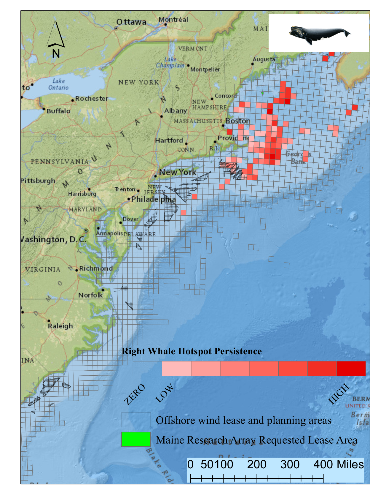

```{r setup, include=FALSE}

# library(tint)
# # invalidate cache when the package version changes
# knitr::opts_chunk$set(tidy = FALSE, cache.extra = packageVersion('tint'))
# options(htmltools.dir.version = FALSE)

#Default Rmd options
knitr::opts_chunk$set(echo = FALSE,
                      message = FALSE,
                      dev = "cairo_pdf",
                      warning = FALSE,
                      fig.width = 4,
                      fig.asp = 0.45,
                      fig.align = 'center'
                      ) #allows for inserting R code into captions

#Plotting and data libraries
#remotes::install_github("noaa-edab/ecodata@0.1.0") #change to 2020 ecodata version for release
library(tidyverse)
library(tidyr)
library(ecodata)
library(here)
library(flextable)

set_flextable_defaults(
  font.size = 9,
  padding.bottom = 0,  
  padding.top = 1, 
  line_spacing = 1,
  font.family = "Palatino")

```

```{r, code = readLines("https://raw.githubusercontent.com/NOAA-EDAB/ecodata/master/chunk-scripts/human_dimensions_NE.Rmd-setup.R")}
```

```{r, code = readLines("https://raw.githubusercontent.com/NOAA-EDAB/ecodata/master/chunk-scripts/human_dimensions_NE.Rmd-GIS-setup.R")}
```

```{r, code = readLines("https://raw.githubusercontent.com/NOAA-EDAB/ecodata/master/chunk-scripts/macrofauna_NE.Rmd-setup.R")}
```

```{r, code = readLines("https://raw.githubusercontent.com/NOAA-EDAB/ecodata/master/chunk-scripts/LTL_NE.Rmd-setup.R")}
```

\setcounter{page}{5}
\thispagestyle{fancy}

# Introduction

## About This Report

This report is for the New England Fishery Management Council (NEFMC). The purpose of this report is to synthesize ecosystem information to allow the NEFMC to better meet fishery management objectives. The major messages of the report are summarized on pages 1, 2, and 3, and synthesis themes are illustrated on page 4. Information in this report is organized into two sections; [performance measured against ecosystem-level management objectives](#performance-relative-to-fishery-management-objectives) (Table \ref{tab:management-objectives}), and potential [risks to meeting fishery management objectives](#risks-to-meeting-fishery-management-objectives) ([climate change](#climate-and-ecosystem-productivity) and [other ocean uses](#other-ocean-uses-offshore-wind)).  

## Report structure

The two main sections contain subsections for each management objective or potential risk. Within each subsection, we first review indicator trends, and the status of the most recent data year relative to a threshold (if available) or relative to the long-term average. Second, we synthesize results of other indicators and information to outline potential implications for management (i.e., connecting indicator(s) status to management and why an indicator(s) is important). For example, if there are multiple drivers related to an indicator trend, which drivers may be more or less supported by current information, and which, if any, can be affected by management action(s)? Similarly, which risk indicators warrant continued monitoring to evaluate whether regime shifts or ecosystem reorganization are likely? We emphasize that these implications are intended to represent testable hypotheses at present, rather than “answers,” because the science behind these indicators and syntheses continues to develop.  

A glossary of terms^[https://noaa-edab.github.io/tech-doc/glossary.html], detailed technical methods documentation^[https://NOAA-EDAB.github.io/tech-doc] and indicator data^[https://github.com/NOAA-EDAB/ecodata] are available online. The details of standard figure formatting (Fig. \ref{fig:docformat}a), categorization of fish and invertebrate species into feeding groups (Table \ref{tab:species-groupings}), and definitions of ecological production units (EPUs, including Georges Bank, GB, and the Gulf of Maine, GOM; Fig. \ref{fig:docformat}b) are provided at the end of the document. 

```{r management-objectives, ft.arraystretch = 1}

mng_obj <- data.frame("Objective Categories" = c("Seafood Production",
                                                 "Profits","Recreation",
                                                 "Stability","Social & Cultural",
                                                 "Protected Species",
                                                 "Biomass","Productivity",
                                                 "Trophic structure","Habitat"),
"Indicators reported" = c("Landings; commercial total and by feeding guild; recreational harvest",
                               "Revenue decomposed to price and volume",
                               "Days fished; recreational fleet diversity",
                               "Diversity indices (fishery and ecosystem)",
                               "Community engagement/reliance status",
                               "Bycatch; population (adult and juvenile) numbers, mortalities",
                               "Biomass or abundance by feeding guild from surveys",
                               "Condition and recruitment of managed species, Primary productivity",
                               "Relative biomass of feeding guilds, Zooplankton",
                               "Estuarine and offshore habitat conditions"))

# knitr::kable(mng_obj, linesep = "",
#       col.names = c("Objective Categories","Indicators reported here"),
#       caption = "Example ecosystem-scale objectives for the New England Region",
#       #align = 'c',
#       booktabs = T) %>%
#  # kable_styling(latex_options = "hold_position", "scale_down") %>%
#  # column_spec(c(2), width = c("25em")) %>%
#   row_spec(0, bold = TRUE) %>%
#  # group_rows("Provisioning/Cultural", 1,4) %>%
#  # group_rows("Supporting/Regulating", 5,9)
#   pack_rows("Provisioning/Cultural Services", 1,6) %>%
#   pack_rows("Supporting/Regulating Services", 7,10)

mng_obj$service <- c(rep("Provisioning and Cultural Services", 6), 
                     rep("Supporting and Regulating Services", 4))

flextable::as_grouped_data(mng_obj, groups = "service") %>% 
  flextable::as_flextable(hide_grouplabel=TRUE) %>% 
  flextable::align(i = ~ !is.na(service), align = "left") %>% 
  flextable::bold(i = ~ !is.na(service), bold = TRUE) %>%
  flextable::set_header_labels(Objective.Categories = "Objective categories",
                               Indicators.reported = "Indicators reported") %>%
  flextable::set_caption("Example ecosystem-scale fishery management objectives for the New England region") %>%
  flextable::autofit()

```
 
# Performance relative to fishery management objectives

In this section, we examine indicators related to broad, ecosystem-level fishery management objectives.  These objectives are derived from National legislation as the NEFMC has not formally adopted any ecosystem-level objectives for management. We also provide hypotheses on the implications of these trends—*why* we are seeing them, what’s driving them, and potential or observed regime shifts or changes in ecosystem structure. Identifying multiple drivers, regime shifts, and potential changes to ecosystem structure, as well as identifying the most vulnerable resources, can help managers determine whether we can do anything differently to meet objectives and how to prioritize for upcoming issues/risks. 

## Seafood Production 

### Indicator: Landings; commercial and recreational

This year, we present updated indicators for total commercial landings (all species, all uses, fleets from all nations),  US seafood landings (species for human consumption landed by US fleets), and Council-managed US seafood landings (New England Fishery Management Council (NEFMC) and jointly managed species landed by US fleets for human consumption).  Total commercial landings (black) within New England show no long-term trends (Fig. \ref{fig:total-landings}).  We treat the last three years of total landings as preliminary, given that the Canadian landings within each EPU have yet to be updated by NAFO. The long term downward trends in commercial seafood landings for the Gulf of Maine remains, although over the last decade landings appears to be relatively stable.

```{r total-landings, fig.cap = "Total commercial landings (black), total U.S. seafood landings (blue), and New England managed U.S. seafood landings (red) for Georges Bank and the Gulf of Maine.  Open circles represent years that are lacking NAFO (foreign) data. mt = metric tons", code = readLines("https://raw.githubusercontent.com/NOAA-EDAB/ecodata/master/chunk-scripts/human_dimensions_NE.Rmd-comdat-total-landings.R"), fig.width = 7.5, fig.asp = 0.4}
```

Overall, recreational harvest (harvested fish presumed to be eaten) have also declined in New England (Fig. \ref{fig:rec-landings}).  Recreational harvest in 2020 was the lowest since estimates began.

```{r rec-landings, fig.cap = paste0("Total recreational seafood harvest (millions of pounds) in the ",region," region."), code = readLines("https://raw.githubusercontent.com/NOAA-EDAB/ecodata/master/chunk-scripts/human_dimensions_NE.Rmd-recdat-landings.R")}

```

Commercial landings by guild include all species and all uses, and are reported as total for the guild and the NEFMC managed species within the guild. As reported in previous years, downward trends persist for a number of guilds in both regions.  A significant upward trend is now present for all benthivores in the GOM which can be attributed to American lobster (Fig. \ref{fig:comm-landings}).

```{r, comm-landings, fig.cap = paste0("Total commercial landings (black) and ",council_abbr," managed U.S seafood landings (red) by feeding guild for the Gulf of Maine."), code = readLines("https://raw.githubusercontent.com/NOAA-EDAB/ecodata/master/chunk-scripts/human_dimensions_NE.Rmd-comdat-commercial-landings-gom.R"), fig.asp=1.4}
```

Recreational shark landings of pelagic and prohibited sharks have decreased over the last couple of years (Fig \ref{fig:rec-hms}). This is likely influenced by regulatory changes implemented in 2018 intended to rebuild shortfin mako stocks. In 2021 the International Commission for the Conservation of Atlantic Tunas (ICCAT) finalized recommendations for a two-year retention ban for shortfin mako (ICCAT Rec.21-09), which will also affect total overall landings of pelagic sharks in coming years.

```{r rec-hms, fig.cap = "Recreational shark landings from Marine Recreational Information Program.", code = readLines("https://raw.githubusercontent.com/NOAA-EDAB/ecodata/master/chunk-scripts/human_dimensions_NE.Rmd-rec_hms.R"), fig.width=6, fig.asp=.4}

```

Aquaculture production is not yet included in total seafood landings, but we are working toward that in future reports. Available aquaculture production of oysters for a subset of New England states was showing an increase in annual production per acre leased until a sharp decline in 2020 caused by the COVID-19 disruptions (Fig. \ref{fig:aquaculture}).  The data in 2021 show a rebound to levels prior to 2020.

```{r aquaculture, fig.cap="Total oyster production per acre leased for New England states.", code = readLines("https://raw.githubusercontent.com/NOAA-EDAB/ecodata/master/chunk-scripts/human_dimensions_NE.Rmd-aquaculture-pa.R")}

```

### Implications

Declining commercial seafood and recreational landings are driven by many interacting factors, including combinations of ecological and stock production, management actions, market conditions (including COVID-19 disruptions), and environmental changes.  While we cannot evaluate all possible drivers at present, here we evaluate the extent to which stock status and changes in system biomass play a role.

#### Stock Status

Single species management objectives (1) maintaining biomass above minimum thresholds and 2) maintaining fishing mortality below overfishing limits) are not being met for some NEFMC managed species.  Nine stocks are currently estimated to be below $B_{MSY}$, while status relative to $B_{MSY}$ could not be assessed for 13 additional stocks (Fig. \ref{fig:stock-status}). Therefore, stock status and associated management constraints are likely contributing to decreased landings. To better address the role of management in future reports, we could examine how the total allowable catch (TAC) and the percentage of the TAC taken for each species has changed through time.  Note that the status of spiny dogfish is based on research track assessments and are thus waiting for a management track update to determine stock status.

```{r stock-status, fig.cap = "Summary of single species status for NEFMC and jointly federally managed stocks (goosefish and spiny dogfish).  The dotted vertical line at one is the target biomass reference point of B\\textsubscript{MSY}.  The dashed lines are the management thresholds of B\\textsubscript{MSY} (vertical) or F\\textsubscript{MSY} (horizontal).  Text color denotes which quadrant of the plot the stocks are in with orange text below F\\textsubscript{MSY} and B\\textsubscript{MSY}, green above F\\textsubscript{MSY} and below B\\textsubscript{MSY}, and blue above both F\\textsubscript{MSY} and B\\textsubscript{MSY}.", code = readLines("https://raw.githubusercontent.com/NOAA-EDAB/ecodata/master/chunk-scripts/human_dimensions_NE.Rmd-stock-status.R"), fig.width = 7.5, fig.asp = 0.5}
```

#### System Biomass

Aggregate biomass trends derived from scientific resource surveys have been relatively stable in both regions (Fig. \ref{fig:nefsc-biomass-gb} & Fig. \ref{fig:nefsc-biomass-gom}). The benthivores group spiked during the last decade, due to a large haddock recruitment, but appears to be returning to average levels. There are also increasing trends in piscivores, planktivores, and benthos in at least one season in both regions. The New Hampshire/Maine state survey does not show these trends while the Massachusetts state survey shows the increasing trend in benthivores and planktivores but a decrease in piscivores in the spring and benthos in the fall (Fig. \ref{fig:mass-biomass}). While managed species comprise varying proportions of aggregate biomass, trends in landings are not mirroring shifts in the overall trophic structure of survey-sampled fish and invertebrates. Therefore, major shifts in feeding guilds or ecosystem trophic structure are unlikely to be driving the decline in landings.

```{r nefsc-biomass-gb, fig.cap = "Spring (left) and fall (right) surveyed biomass on Georges Bank. The shaded area around each annual mean represents 2 standard deviations from the mean.", code = readLines("https://raw.githubusercontent.com/NOAA-EDAB/ecodata/master/chunk-scripts/macrofauna_NE.Rmd-aggregate-biomass-gb.R"), fig.width=8, fig.asp = 0.75}
```

```{r nefsc-biomass-gom, fig.cap = "Spring (left) and fall (right) surveyed biomass in the Gulf of Maine. The shaded area around each annual mean represents 2 standard deviations from the mean.", code = readLines("https://raw.githubusercontent.com/NOAA-EDAB/ecodata/master/chunk-scripts/macrofauna_NE.Rmd-aggregate-biomass-gom.R"), fig.width=8, fig.asp = 0.75}
```

```{r mass-biomass, fig.cap = "Spring (left) and fall (right) surveyed biomass from the state of Massachusetts inshore survey. The shaded area around each annual mean represents 2 standard deviations from the mean.", code = readLines("https://raw.githubusercontent.com/NOAA-EDAB/ecodata/master/chunk-scripts/macrofauna_NE.Rmd-ma-inshore-survey.R"), fig.width=8, fig.asp = 0.75}
```

#### Effect on Seafood Production

With the poor or unknown stock status of many managed species, the decline in commercial seafood landings in the Gulf of Maine most likely reflects lower catch quotas implemented to rebuild overfished stocks, as well as market dynamics.  

The decline in recreational seafood harvest stems from multiple drivers. Some of the decline, such as for recreational shark landings,  continues to be driven by tightening regulations. However, changes in demographics and preferences over recreational activities likely play a role in non-HMS (Highly Migratory Species) declines in recreational harvest, with current harvests near the lowest in the time series.  

Other environmental changes require monitoring as they may become important drivers of future landings:
  
  - Climate is trending into uncharted territory. Globally, 2022 was among the warmest years on record^[https://www.climate.gov/news-features/understanding-climate/climate-change-global-temperature] (see [Climate Risks section](#climate-and-ecosystem-productivity)).
  - Stocks are shifting distribution, moving towards the northeast and into deeper waters throughout the Northeast US Large Marine Ecosystem (Fig. \ref{fig:species-dist}).
  - Some ecosystem composition and production changes have been observed (see [Stability section](#stability)).
  - Some fishing communities are affected by environmental justice vulnerabilities (see [Environmental Justice and Social Vulnerability section](#social-vulnerability)).
    
```{r species-dist, fig.cap = "Aggregate species distribution metrics for species in the Northeast Large Marine Ecosystem.", code = readLines("https://raw.githubusercontent.com/NOAA-EDAB/ecodata/master/chunk-scripts/macrofauna_MAB.Rmd-species-dist.R"), fig.asp=0.8}
```

## Commercial Profits 
        
### Indicators: revenue (a proxy for profits)  

Commercial revenue in the region has been mostly positive with total commercial revenues from all species increasing in 2021 and above the long-term mean for both the GB and GOM regions (Fig. \ref{fig:comm-revenue}.  Although revenue from NEFMC managed species shows a long-term downward trend in the GOM. GB continues to exhibit a cyclical nature with regards to revenue. This is largely driven by rotational management of Atlantic sea scallops.

```{r comm-revenue, fig.cap = "Revenue through 2021 for the New England region: total (black) and from NEFMC managed species (red).", code = readLines("https://raw.githubusercontent.com/NOAA-EDAB/ecodata/master/chunk-scripts/human_dimensions_NE.Rmd-comdat-comm-revenue.R"), fig.width = 7.5, fig.asp = 0.3}
```

Revenue earned by harvesting resources is a function of both the quantity landed of each species and the prices paid for landings. Beyond monitoring yearly changes in revenue, it is even more valuable to determine what drives these changes: harvest levels, the mix of species landed, price changes, or a combination of these. The Bennet Indicator decomposes revenue change into two parts, one driven by changing quantities (volumes), and a second driven by changing prices.

The gains in total revenue were due to both increasing quantities landed (volume) and prices (Fig. \ref{fig:bennet}).  In the GB region, with the exception of 2016, revenues have been positive since 2015, and this trend has generally been due to both increasing volumes and prices.  Breaking down the revenue trend further for GB show that both the volume and price trend have been largely driven by Benthos category (Fig. \ref{fig:bennet}).  In the GOM region, increased volumes for the "Other" and Benthivore categories drove the increase in volume.  In 2021, prices for Benthivores and Benthos in the GOM caused an overall increase in prices, reversing the 2015-2020 negative trend in prices (Fig. \ref{fig:bennet}).

```{r bennet, fig.cap = "Revenue change from the long-term mean in 2015 dollars (black), price, and volume for commercial landings from Georges Bank (GB: top panels) and the Gulf of Maine (GOM: bottom panels)", code = readLines("https://raw.githubusercontent.com/NOAA-EDAB/ecodata/master/chunk-scripts/human_dimensions_NE.Rmd-bennet-all.R"), fig.width = 7.5, fig.asp = 0.4}
```

### Implications 

The continued dependence on lobster in the GOM and sea scallops on GB is affected by multiple drivers including resource availability and market conditions.  As both species are sensitive to ocean warming and acidification, it is important to monitor these and other climate drivers.

## Recreational Opportunities 
        
### Indicators: Angler trips, fleet diversity  

Recreational effort (angler trips) increased during 1980-2010, but has since declined to just below the long-term average (Fig. \ref{fig:rec-op}). Recreational fleets are defined as private vessels, shore-based fishing, or party-charter vessels.  Recreational fleet diversity, or the relative importance of each fleet type, has remained relatively stable over the latter half of the time series (Fig. \ref{fig:rec-div}). 
        
```{r rec-op, fig.cap = paste0("Recreational effort in ",region,"."), code = readLines("https://raw.githubusercontent.com/NOAA-EDAB/ecodata/master/chunk-scripts/human_dimensions_NE.Rmd-recdat-effort.R")}
```
        
```{r rec-div, fig.cap = paste0("Recreational fleet effort diversity in ",region,"."), code = readLines("https://raw.githubusercontent.com/NOAA-EDAB/ecodata/master/chunk-scripts/human_dimensions_NE.Rmd-recdat-diversity.R")}
```
        
### Implications

The absence of a long term trend in recreational angler trips and fleet effort diversity suggests relative stability in the overall number of recreational opportunities in the region.
        
## Stability 

### Indicators: fishery fleet and catch diversity, ecological component diversity

While there are many potential metrics of stability, we use diversity indices to evaluate overall stability in fisheries and ecosystems. In general, diversity that remains constant over time suggests a similar capacity to respond to change over time. A significant change in diversity over time does not necessarily indicate a problem or an improvement, but does indicate a need for further investigation. We examine commercial fleet and species catch diversity, and recreational species catch diversity (with fleet effort diversity discussed above), along with diversity in zooplankton, and larval and adult fishes.

#### Fishery Diversity

Diversity estimates have been developed for species landed by commercial vessels with New England permits, and fleets landing managed species. Over the course of the last two years, there has been a steep decline in the effective number of species being landed in the commercial fleet, to a low since records began (Fig. \ref{fig:permit-div}). At the same time, commercial fishery fleet count is at or near the time series low (Fig. \ref{fig:commercial-div}).  Here a fleet is defined as the combination of gear type (Scallop Dredge, Clam Dredge, Other Dredge, Gillnet, Hand Gear, Longline, Bottom Trawl, Midwater Trawl, Pot, or Purse Seine) and vessel length category (Less than 30 ft, 30 to 50 ft, 50 to 75 feet, 75 ft and above).  

```{r permit-div, fig.cap = paste0("Species revenue diversity in ",region,"."), code = readLines("https://raw.githubusercontent.com/NOAA-EDAB/ecodata/master/chunk-scripts/human_dimensions_NE.Rmd-commercial-div-species-div.R")}
```

```{r commercial-div, fig.cap = paste0("Commercial fleet count and diversity in ",region,"."), code = readLines("https://raw.githubusercontent.com/NOAA-EDAB/ecodata/master/chunk-scripts/human_dimensions_NE.Rmd-commercial-div.R"), fig.asp=0.8}
```

As noted [above](#recreational-opportunities), recreational fleet effort diversity is stable. However, recreational species catch diversity has been above the time series average since 2008 with a long-term positive trend (Fig. \ref{fig:rec-species-div}).  Of note is that, although the positive trend was not significant in the 2021 report, a long-term trend has been reported in the past, indicating the ephemeral nature of the significance of the long-term trend.

```{r rec-species-div,  fig.cap = paste0("Diversity of recreational catch in ",region,"."), code = readLines("https://raw.githubusercontent.com/NOAA-EDAB/ecodata/master/chunk-scripts/human_dimensions_NE.Rmd-recdat-div-catch.R")}
```

#### Ecological Diversity

Ecological diversity indices show mixed trends. Zooplankton diversity is increasing on GB, while no trend is evident in the GOM (Fig. \ref{fig:zoo-diversity-gb}). It is worth noting however that the 2021 index for the GOM is the highest observed.  Larval fish diversity indicators show high interannal variability around the mean with the 2021 values near the mean for GB and near the lowest value for GOM.  Adult fish diversity shows an increasing trend in the GOM and no trend on GB.  This metric is measured as the expected number of species in a standard number of individuals sampled from the NEFSC bottom trawl survey. There is no vessel correction for this metric, so indices collected aboard the research vessel Albatross IV (up to 2008) and the research vessel Henry B. Bigelow (2009 - Present) are calculated separately (Fig. \ref{fig:exp-n}).

```{r zoo-diversity-gb, fig.cap = "Zooplankton diversity on Georges Bank and in the Gulf of Maine, based on Shannon diversity index. 2020 surveys were incomplete due to COVID-19.", code = readLines("https://raw.githubusercontent.com/NOAA-EDAB/ecodata/master/chunk-scripts/LTL_NE.Rmd-zoo-diversity.R"), fig.width = 6, fig.asp = 0.3}
```

```{r exp-n, fig.cap = "Adult fish diversity for Georges Bank and in the Gulf of Maine, based on expected number of species. Results from survey vessels Albatross and Bigelow are reported separately due to catchability differences.", code = readLines("https://raw.githubusercontent.com/NOAA-EDAB/ecodata/master/chunk-scripts/macrofauna_NE.Rmd-exp-n.R"), fig.width=8, fig.asp=.3}
```

### Implications

Fleet diversity indices can be used to evaluate stability objectives as well as risks to fishery resilience and to maintaining equity in access to fishery resources [@gaichas_implementing_2018]. The relatively low diversity estimates for the commercial fishery are likely driven by the continued reliance on a few species, sea scallops and lobster.  This trend could diminish the capacity to respond to future fishing opportunities. Meanwhile, the increase in recreational species catch diversity is due to  recent increases in ASMFC and MAFMC managed species within the region as well as decreased limits on more traditional regional species.

Ecological diversity indices can provide insight into ecosystem structure. Changes in ecological diversity over time may indicate altered ecosystem structure with implications for fishery productivity and management [@friedland_changes_2020]. Increasing zooplankton diversity in GB is attributed to an overall increase in zooplankton abundance and the declining dominance of the calanoid copepod *Centropages typicus*. Stable adult fish diversity on GB suggests the same overall number and evenness over time, but does not rule out species substitutions (e.g., warm-water species replacing cold-water ones). Increasing adult diversity in the GOM suggests an increase in warm-water species and should be closely monitored.  

As a whole, the examined diversity indicators suggest changes in commercial and recreational fisheries, likely driven by changes in the mix of species landed.  However, there seems to be overall stability in ecosystem components. Increasing diversity in the recreational catch, GB zooplankton, and GOM adult fish accompanied by lows in commercial fleet diversity metrics, suggests warning signs of a potential regime shift or ecosystem restructuring and warrants continued monitoring to determine if managed species are affected.

## Environmental Justice and Social Vulnerability 

### Indicators: Environmental Justice and Social Vulnerability in commercial and recreational fishing communities

Social vulnerability measures social factors that shape a community’s ability to adapt to change. A subset of these can be used to assess potential environmental justice issues. Environmental Justice is defined in Executive Order 12898 as federal actions intended to address disproportionately high and adverse human health and environmental effects of federal actions on minority and low-income populations. Three of the existing NOAA Fisheries Community Social Vulnerability Indicators (CSVIs), the Poverty Index, Population Composition Index, and Personal Disruption Index, can be used for mandated Environmental Justice analysis^[https://www.fisheries.noaa.gov/national/socioeconomics/social-indicators-coastal-communities].

```{r commercial-engagement, fig.cap= "Commercial engagement, reliance, and environmental justice vulnerability for the top commercially engaged and reliant fishing communities in New England.  Communities ranked medium-high or above for one or more of the environmental justice indicators are highlighted in orange. *Community scored high (1.00 and above) for both commercial engagement and reliance indicators.", code = readLines("https://raw.githubusercontent.com/NOAA-EDAB/ecodata/master/chunk-scripts/human_dimensions_NE.Rmd-commercial-engagement.R"), fig.width = 7, fig.asp = 0.55}
```

Commercial fishery engagement measures the number of permits and dealers, and pounds and value landed in a community, while reliance expresses these numbers based on the level of fishing activity relative to the total population of a community. Recreational fishery engagement measures shore-based, private vessel, and for-hire fishing effort while reliance expresses these numbers based on fishing effort relative to the population of a community.

Starting 2021 we began reporting the top ten most engaged, and top ten most reliant commercial and recreational fishing communities and their associated social vulnerability. We have again examined the top ten fishing communities for both sectors, and focus on examining the environmental justice vulnerability in these communities.

Communities plotted in the upper right section of Fig.\ref{fig:commercial-engagement} scored high for both commercial engagement and reliance, including Stonington, Vinalhaven, and Beals, ME. Communities that ranked medium-high or above for one or more of the environmental justice indicators are highlighted in orange: Stonington, ME; New Bedford and Boston, MA.

Fig. \ref{fig:commercial-EJ} shows the detailed scores of the three environmental justice indicators for the same communities plotted in Fig.\ref{fig:commercial-engagement}. Communities are plotted clockwise in a descending order of commercial engagement scores from high to low, with the most highly engaged community, New Bedford, MA, listed on the top. Among the communities ranked medium-high or above for environmental justice vulnerability, Boston scored high for the population compostion index and medium-high for the poverty index.  New Bedford, MA scored medium-high for all of the three environmental justice indicators.  Stonington, ME scored medium-high for the poverty index.  Due to missing data, the poverty index score is not available for Cranberry Isle, ME, although that community scored high for the poverty index in last years report.

```{r commercial-EJ, fig.cap="Environmental justice indicators (Poverty Index, population composition index, and personal disruption index) for top commercial fishing communities in New England. *Community scored high (1.00 and above) for both commercial engagement and reliance indicators.", out.width='75%'}

#get rid of the gray excel outline using R package magick
ComEJ <- magick::image_read("https://github.com/NOAA-EDAB/ecodata/raw/master/docs/images/EJ_Commercial_NE_2023.PNG")

#ComEJ <- magick::image_read("images/EJ_Commercial_NE.png") 

# from https://stackoverflow.com/questions/64597525/r-magick-square-crop-and-circular-mask
# get height, width and crop longer side to match shorter side
ii <- magick::image_info(ComEJ)

cropComEJ <- ComEJ %>%
  #magick::image_crop(cropComEJ, "820x580+5+5")
  magick::image_crop(paste0(ii$width-10,"x",ii$height-10, "+5+5"))

cropComEJ
```

No communities in New England scored high for both recreational engagement and reliance (Fig.\ref{fig:recreational-engagement}).  All of the top recreational communities scored lower than medium-high for all of the three environmental justice indicators, meaning that environmental justice may not be a major concern in these communities at this time, based on this particular analysis.

Fig. \ref{fig:recreational-EJ} orders communities clockwise in a descending order of recreational engagement scores from high to low, with the most highly engaged community, Narragansett/Point Judith, RI, listed on the top. Narragansett/Point Judith, like all of these top recreational communities ranked low for environmental justice vulnerability. In fact, the scores below 0 for all three environmental justice indicators implies a lower than average level of vulnerability, based on recreational engagement and reliance,  among the communities included in the analysis. 

```{r recreational-engagement, fig.cap= "Recreational engagement and reliance, and environmental justice vulnerability, for the top recreationally engaged and reliant fishing communities in New England. None of these communities ranked medium-high or above for one or more of the environmental justice indicators.", code = readLines("https://raw.githubusercontent.com/NOAA-EDAB/ecodata/master/chunk-scripts/human_dimensions_NE.Rmd-recreational-engagement.R"), fig.width = 7, fig.asp = 0.5}
```

```{r recreational-EJ, fig.cap="Environmental justice indicators (Poverty Index, population composition index, and personal disruption index) for top recreational fishing communities in New England. *Community scored high (1.00 and above) for both commercial engagement and reliance indicators.", out.width='75%'}
#knitr::include_graphics("images/EJ_Recreational_MAB.png")


#get rid of the gray excel outline using R package magick
RecEJ <- magick::image_read("https://github.com/NOAA-EDAB/ecodata/raw/master/docs/images/EJ_Recreational_NE_2023.PNG") 

# from https://stackoverflow.com/questions/64597525/r-magick-square-crop-and-circular-mask
# get height, width and crop longer side to match shorter side
ii <- magick::image_info(RecEJ)

cropRecEJ <- RecEJ %>%
  #magick::image_crop(cropComEJ, "820x580+5+5")
  magick::image_crop(paste0(ii$width-10,"x",ii$height-10, "+5+5"))

cropRecEJ
```

Both commercial and recreational fishing are important activities in Narragansett/Point Judith, RI; Gloucester, MA; and Newington, NH, meaning these communities may be impacted simultaneously by commercial and recreational regulatory changes. These three communities currently score low for all of the three environmental justice indicators, indicating that environmental justice may not be a major concern in these communities at the moment based on the indicators analyzed.

### Implications
These plots provide a snapshot of the presence of environmental justice issues in the most highly engaged and most highly reliant commercial and recreational fishing communities in New England. These communities may be vulnerable to changes in fishing patterns due to regulations and/or climate change. When any of these communities are also experiencing social vulnerability including environmental justice issues, they may have lower ability to successfully respond to change.

## Protected Species

Protected species include marine mammals protected under the Marine Mammal Protection Act, endangered and threatened species protected under the Endangered Species Act, and migratory birds protected under the Migratory Bird Treaty Act. In the Northeast U.S., endangered/threatened species include Atlantic salmon, Atlantic and shortnose sturgeon, all sea turtle species, and five baleen whales. Fishery management objectives for protected species generally focus on reducing threats and on habitat conservation/restoration. Here we report on the status of these actions as well as indicating the potential for future interactions driven by observed and predicted ecosystem changes in the Northeast U.S. Protected species objectives include managing bycatch to remain below potential biological removal (PBR) thresholds, recovering endangered populations, and monitoring unusual mortality events (UMEs). 

### Indicators: bycatch, population (adult and juvenile) numbers, mortalities

Average indices for both harbor porpoise (Fig. \ref{fig:harborporpoise}) and gray seal bycatch (Fig. \ref{fig:grayseal}) are below current PBR thresholds, meeting management objectives. However, the 2019 bycatch estimate for gray seals was the highest in the time series.

```{r harborporpoise, fig.cap="Harbor porpoise average bycatch estimate for Mid-Atlantic and New England gillnet fisheries (blue) and the potential biological removal (red).", code = readLines("https://raw.githubusercontent.com/NOAA-EDAB/ecodata/master/chunk-scripts/macrofauna_MAB.Rmd-harborporpoise.R"), fig.width=5}
#fig.width=6}
```

```{r grayseal, fig.cap="Gray Seal average bycatch estimate for gillnet fisheries (blue) and and the potential biological removal (red).", code = readLines("https://raw.githubusercontent.com/NOAA-EDAB/ecodata/master/chunk-scripts/macrofauna_MAB.Rmd-grayseal.R"), fig.width=5}
#fig.width=6}
```

The annual estimate for gray seal bycatch has declined since 2019, in part driven by declining gillnet landings. In addition, estimates since 2019 have greater uncertainty stemming from low observer coverage since 2019. The rolling mean confidence interval remains just below the removal threshold.

The North Atlantic right whale population was on a recovery trajectory until 2010, but has since declined (Fig. \ref{fig:narw-abundance}). Reduced survival rates of adult females and diverging abundance trends between sexes have also been observed. It is estimated that there are fewer than 70 adult females remaining in the population. 

```{r narw-abundance, fig.cap = "Estimated North Atlanic right whale abundance on the Northeast Shelf.", code = readLines("https://raw.githubusercontent.com/NOAA-EDAB/ecodata/master/chunk-scripts/macrofauna_MAB.Rmd-narw-abundance.R"), fig.width=5}
```

North Atlantic right whale calf counts have generally declined after 2009 to the point of having zero new calves observed in 2018 (Fig. \ref{fig:NARW-calf-abundance}). However, since 2019, we have seen more calf births each year with 20 births in 2022. 

This year, the Unusual Mortality Event (UME) for North Atlantic right whales continued. Since 2017, the total UME right whale mortalities includes 35 dead stranded whales, 14 in the US and 21 in Canada. When alive but seriously injured whales (22) and sublethal injuries or ill whales (37) are taken into account, 94 individual whales are included in the UME. Recent research suggests that many mortalities go unobserved and the true number of mortalities are about three times the count of the observed mortalities [@pace_cryptic_2021]. The primary cause of death is “human interaction” from entanglements or vessel strikes^[https://www.fisheries.noaa.gov/national/marine-life-distress/2017-2022-north-atlantic-right-whale-unusual-mortality-event]. 

A UME continued from previous years for humpback whales (2016-present); suspected causes include human interactions. A UME for both gray and harbor seals on the Maine coast was declared in June 2022 due to a high number of mortalities thought to be caused by highly pathogenic avian influenza virus. A UME for minke whales that began in 2017 remains open, but is pending closure as of January 2023^[https://www.fisheries.noaa.gov/national/marine-life-distress/active-and-closed-unusual-mortality-events].

```{r NARW-calf-abundance, fig.cap = "Number of North Atlantic right whale calf births, 1990 - 2021.", code = readLines("https://raw.githubusercontent.com/NOAA-EDAB/ecodata/master/chunk-scripts/macrofauna_MAB.Rmd-NARW-calf-abundance.R"), fig.width=5}
```

### Implications

Bycatch management measures have been implemented to maintain bycatch below PBR thresholds. The downward trend in harbor porpoise bycatch can also be due to a decrease in  harbor porpoise abundance in US waters, reducing their overlap with fisheries, and a decrease in gillnet effort. The increasing trend in gray seal bycatch may be related to an increase in the gray seal population (U.S. pup counts).

The number of gray seals in U.S. waters has risen dramatically in the last three  decades. Based on a survey conducted in 2016, the size of the gray seal population in the U.S. during the breeding season was approximately 27,000 animals, while in Canada the population was estimated to be roughly 425,000. The population in Canada is increasing at roughly 4% per year, and contributing to rates of increase in the U.S., where the number of pupping sites has increased from one in 1988 to nine in 2019. Mean rates of increase in the number of pups born at various times since 1988 at four of the more data-rich pupping sites (Muskeget, Monomoy, Seal, and Green Islands) ranged from no change on Green Island to high rates of increase on the other three islands, with a maximum increase of 26.3% (95\%CI: 21.6 - 31.4\%; @wood_rates_2020 Fig. \ref{fig:seals}). These high rates of increase provide further support for the hypothesis that seals from Canada are continually supplementing the breeding population in U.S. waters.  

```{r seals, fig.cap = "Estimated mean rates of increase in the number of gray seal pups born at four United States pupping colonies at various times from 1988 to 2021. Recreated from Wood et al. 2022 (Figure 5).", code = readLines("https://raw.githubusercontent.com/NOAA-EDAB/ecodata/master/chunk-scripts/macrofauna_NE.Rmd-seal-pups.R"), fig.width = 5, fig.asp = .5}
```

Strong evidence exists to suggest that interactions between right whales and both the fixed gear fisheries in the U.S. and Canada and vessel strikes in the U.S. are contributing substantially to the decline of the species [@hayes_north_2018]. Further, right whale distribution has changed since 2010. New research suggests that recent climate driven changes in ocean circulation have resulted in right whale distribution changes driven by increased warm water influx through the Northeast Channel, which has reduced the primary right whale prey (*Calanus finmarchicus*) in the central and eastern portions of the Gulf of Maine [@hayes_north_2018; @record_rapid_2019; @sorochan_north_2019]. Additional potential stressors include offshore wind development, which overlaps with important habitat areas used year-round by right whales, including mother and calf migration corridors and foraging habitat [@quintana-rizzo_narw_wind_2021; @schick_whale_2009]. This area is also a primary right whale winter foraging habitat. Additional information can be found in the [offshore wind section](#other-ocean-uses:-offshore-wind).

The UMEs are under investigation and are likely the result of multiple drivers. For all large whale UMEs, human interaction appears to have contributed to increased mortalities, although investigations are not complete. An investigation into the cause of the seal UME so far suggests avian flu virus as a potential cause. 

A climate vulnerability assessment is currently underway for Atlantic and Gulf of Mexico marine mammal populations and will be reported in future versions of this report.

\newpage

# Risks to meeting fishery management objectives

## Climate and Ecosystem Productivity

Large scale climate related changes in the ecosystem can lead to changes in important habitats and ecological interactions, potentially resulting in regime shifts and ecosystem reorganization.

### Climate Change Indicators: ocean temperatures, extreme events, currents, acidification

#### Ocean temperature and salinity
The ocean continues to warm, altering habitat conditions experienced by a wide range of species.  2022 was among the warmest years on record in the North Atlantic [@cheng_another_2023] and ocean temperatures continue to warm at both the surface (Fig. \ref{fig:seasonal-sst-anom-gridded}) and bottom (Fig. \ref{fig:bottom-temp}) throughout New England. Seasonal sea surface temperatures in 2022 were above average throughout the year, with some seasons rivaling or exceeding the record warm temperatures observed in 2012.

```{r seasonal-sst-anom-gridded, fig.cap="New England (EPUs outlined in grey) 2022 seasonal sea surface temperature (SST) anomalies. The anomalies are the difference between the 2022 seasonal means and the long-term (1991-2020) seasonal means.  Seasons are defined as: Jan-Mar for winter, Apr-Jun for spring, Jul-Sep for summer, and Oct-Dec for fall.", code=readLines("https://raw.githubusercontent.com/NOAA-EDAB/ecodata/master/chunk-scripts/LTL_NE.Rmd-seasonal-sst-anomaly-gridded.R"), fig.width = 7, fig.asp = .8}
```

```{r bottom-temp, fig.cap="Annual Georges Bank and Gulf of Maine seasonal bottom temperature anomalies. Data are obtained from GLORYS, a global ocean reanalysis product that provides high resolution data on ocean physics and incorporates real-time observations.  Data from the last two years (open circles) are from a near-real-time model (PSY) and are considered preliminary.", code=readLines("https://raw.githubusercontent.com/NOAA-EDAB/ecodata/master/chunk-scripts/LTL_NE.Rmd-seasonal-bt-anom.R"), fig.width=6}
```

In addition to increasing seasonal temperatures, ocean summer conditions now last longer within each year. In both GB and GOM, the transition date from cool winter conditions to warm stratified summer conditions is getting earlier. The transition back to well mixed cool temperatures is also getting later in the year, thus increasing the total number of days when the surface temperatures are in the warm summer conditions (Fig. \ref{fig:transition}).

```{r transition, fig.cap="Ocean summer length in New England: the annual total number of days between the spring thermal transition date and the fall thermal transition date.  The transition dates are defined as the day of the year when surface temperatures changeover from cool to warm conditions in the spring and back to cool conditions in the fall. The left is Georges Bank (GB) and the right is Gulf of Maine (GOM).", code=readLines("https://raw.githubusercontent.com/NOAA-EDAB/ecodata/master/chunk-scripts/LTL_NE.Rmd-sumlength.R"), fig.width=6, fig.asp=0.3}

```

#### Extreme temperature events
The increase in surface and bottom water temperature observed in the Northeast US can cause long term incremental stress on marine organisms, especially those relying on cooler water habitats for some or all life stages. In addition to changes in long-term average conditions, short-term extreme temperature events can produce acute stress on marine organisms, especially when the baseline temperature is increasing. To identify these extreme events separately from the baseline warming, we have changed our methods to detect marine heatwaves (MHWs, [@hobday_hierarchical_2016; @jacox_thermal_2020; @jacox_global_2022]) to remove the global warming signal. Therefore, these indicators are different than in previous reports, but MHWs identified now are truly extreme departures from an already warming ecosystem.  A combination of long-term ocean warming and MHWs should be used to assess total heat stress on marine organisms.

In 2022, GB experienced one surface MHW that began on October 26^th^, peaked on November 7^th^ and lasted 28 days (Fig. \ref{fig:heatwave-year-gb}).  This surface MHW ranked 17^th^ on record in terms of maximum intensity and 5^th^ on record in terms of cumulative intensity.

```{r heatwave-year-gb, fig.cap="Marine heatwave events (red shading above black line) on Georges Bank occuring in 2022.", code=readLines("https://raw.githubusercontent.com/NOAA-EDAB/ecodata/master/chunk-scripts/LTL_NE.Rmd-heatwave-year-detrended_gb.R"), fig.asp=.65}
```

The GOM experienced four surface MHWs in 2022 that began on August 4^th^ and 25^th^, September 9^th^, and October 31^th^ (Fig \ref{fig:heatwave-year-gom}).  The strongest event in terms of maximum intensity began on August 4^th^ and peaked on August 7^th^ lasting six days.  This surface MHW ranked 27^th^ on record.  The five most intense surface MHW events on record in the GOM occurred over the last 12 years.  No bottom MHWs were detected for either GB or GOM in 2022.

```{r heatwave-year-gom, fig.cap="Marine heatwave events (red shading above black line) in the Gulf of Maine occuring in 2022.", code=readLines("https://raw.githubusercontent.com/NOAA-EDAB/ecodata/master/chunk-scripts/LTL_NE.Rmd-heatwave-year-detrended_gom.R"), fig.asp=.65}
```

#### Ocean currents and features

Variability of the Gulf Stream is one of the major drivers of changes in the oceanographic conditions of the Slope Sea and subsequently the Northeast U.S. continental shelf [@gangopadhyay_census_2020]. Changes in the Gulf Stream and Slope Sea can affect large-scale climate phenomena as well as local ecosystems and coastal communities. During the last decade, the Gulf Stream has become less stable and shifted northward [@andres_recent_2016; @caesar_observed_2018] (Fig. \ref{fig:GSI}).  A more northern Gulf Stream position is associated with warmer ocean temperature on the northeast shelf [@zhang_role_2007], a higher proportion of Warm Slope Water in the Northeast Channel, and increased sea surface height along the U.S. east coast [@goddard_extreme_2015].

```{r GSI, fig.cap = "Index representing changes in the location of the Gulf Stream north wall. Positive values represent a more northerly Gulf Stream position.", code=readLines("https://raw.githubusercontent.com/NOAA-EDAB/ecodata/master/chunk-scripts/LTL_MAB.Rmd-gsi.R"), fig.width=5, fig.asp = 0.4}
```

Since 2008, the Gulf Stream has moved closer to the Grand Banks, reducing the supply of cold, fresh, and oxygen-rich Labrador Current waters to the Northwest Atlantic Shelf [@goncalves_neto_changes_2021]. Nearly every year since 2010, warm slope water made up more than 75% of the annual slope water proportions entering the Gulf of Maine.  In 2017 and 2019, almost no cooler Labrador Slope water entered the Gulf of Maine through the Northeast Channel (Fig. \ref{fig:wsw-prop}).  The changing proportions of source water affect the temperature, salinity, and nutrient inputs to the Gulf of Maine ecosystem.  In 2021, warm slope water continued to dominate (86.1%) inputs to the Gulf of Maine. 

```{r wsw-prop, fig.cap = "Proportion of Warm Slope Water (WSW) and Labrador slope water (LSLW) entering the GOM through the Northeast Channel.", code=readLines("https://raw.githubusercontent.com/NOAA-EDAB/ecodata/master/chunk-scripts/LTL_NE.Rmd-slopewater.R"), fig.width=5.5, fig.asp=.4}
```

The increased instability of the Gulf Stream position and warming of the Slope Sea may also be connected to the regime shift increase in the number of warm core rings formed annually in the Northwest Atlantic [@gangopadhyay_observed_2019; @gangopadhyay_census_2020] (Fig. \ref{fig:wcr}). When warm core rings and eddies interact with the continental slope they can transport warm, salty water to the continental shelf [@chen_mesoscale_2022], which can alter the habitat and disrupt seasonal movement of fish [@gawarkiewicz_changing_2018].  The transport of offshore water onto the shelf is happening more frequently [@gawarkiewicz_changing_2018; @gawarkiewicz_increasing_nodate] and can contribute to extreme temperatures (i.e. marine heatwaves) along the continental shelf [@gawarkiewicz_characteristics_2019; @chen_mesoscale_2022] as well as the movement of shelf-break species inshore [@gawarkiewicz_changing_2018; @potter_horizontal_2011; @worm_predator_2003]. 


2022 had the same number of warm core rings (21) as 2021, but most of the 2022 rings formed east of 60 W and fewer were observed near the shelf break region.  Warm core rings near GB likely contributed to the marine heatwave and anomalously warm fall surface temperatures.

```{r wcr, fig.cap= "Warm core ring formation on the Northeast U.S. Shelf: Annual number of rings.  A significant regime shift is denoted by the split red line as noted in Gangopadhyay et al. 2019.", code=readLines("https://raw.githubusercontent.com/NOAA-EDAB/ecodata/master/chunk-scripts/LTL_MAB.Rmd-wcr.R")}

```

Changes in ocean temperature and circulation alter habitat features such as the seasonal cold pool, a 20–60 m thick band of cold, relatively uniform near-bottom water that persists from spring to fall over the mid and outer shelf of the Mid-Atlantic Bight and southern flank of GB [@lentz_seasonal_2017; @chen_seasonal_2018]. It is a reservoir of nutrients that feeds phytoplankton productivity, is essential fish spawning and nursery habitat, and affects fish distribution and behavior [@lentz_seasonal_2017; @miles_offshore_2021]. The average temperature of the cold pool is getting warmer over time [@miller_state-space_2016; @du_pontavice_incorporating_nodate], the area is getting smaller [@friedland_middle_2022], and the duration is getting shorter (Fig. \ref{fig:cold-pool}).

```{r cold-pool, fig.cap="Seasonal cold pool indices: mean temperature within the cold pool, cold pool persistence, and spatial extent.",  code=readLines("https://raw.githubusercontent.com/NOAA-EDAB/ecodata/master/chunk-scripts/LTL_MAB.Rmd-cold_pool.R"), fig.width=10, fig.asp=.3}

```

#### Ocean Acidification
Ocean acidification (OA) has caused measured declines in global ocean pH, and is projected to continue declining if high carbon dioxide emissions continue [@intergovernmental_panel_on_climate_change_ipcc_technical_2022]. OA also changes the availability of minerals required by organisms to form calcified structures such as shells and other structures. Calcifying conditions in seawater can be determined by measuring aragonite saturation state ($\Omega_{Arag}$), the tendency of a common type of calcium carbonate, aragonite, to form or dissolve.  When $\Omega_{Arag}$ is less than 1, shells and other calcium carbonate structures begin to dissolve. Typical surface ocean $\Omega_{Arag}$ is 2-4, but extremes can be <1 or >5 [@jiang_climatological_2015]. As the ocean absorbs carbon dioxide, both pH and $\Omega_{Arag}$ decrease and can cause organisms to respond with reduced survival, calcification rates, growth, and reproduction, as well as impaired development, and/or changes in energy allocation [@kroeker_impacts_2013 @saba_recommended_2019]. However, sensitivity levels vary, and some organisms exhibit negative responses to calcification and other processes when $\Omega_{Arag}$ is as low as 3.

Summer-time (2007-present) $\Omega_{Arag}$ on the U.S. Northeast Shelf varies in space and time, ranging from 0.64 to 2.49 (Fig. \ref{fig:ne-oa}, left panel). Spatially, the lowest bottom $\Omega_{Arag}$ has occurred in the Gulf of Maine, western Long Island Sound, nearshore to mid-shelf waters of the Mid-Atlantic Bight off the coast of New Jersey, and in waters > 1000 meters. $\Omega_{Arag}$ was at or below the sensitivity levels for both Atlantic cod and American lobster within their habitat depth ranges in western Gulf of Maine and off the coast of eastern Maine (Fig. \ref{fig:ne-oa}, right panels). These areas include Stellwagen Bank, slope waters south of Penobscot and Blue Hill Bays, and Wilkinson Basin and additionally, for Atlantic cod, slope waters south of Maquoit Bay and in waters of Jeffreys Ledge and Jordan Basin. The sensitivity levels of bottom $\Omega_{Arag}$ for Atlantic cod occurred in at least one of these areas during July 2007, August 2012, June 2013, June 2015, June and August 2016, June 2017, June and July 2018, August 2019, and July 2021, and for American lobster during June 2013, June 2016, June and August 2019, and July and August 2021.


```{r ne-oa, out.width = '80%', fig.cap = "Left panel: Bottom aragonite saturation state ($\\Omega_{Arag}$; summer only: June-August) on the U.S. Northeast Shelf based on quality-controlled vessel- and glider-based datasets from 2007-present. Right panel: Locations where summer bottom $\\Omega_{Arag}$ were at or below the laboratory-derived sensitivity level for Atlantic cod (top panel) and American lobster (bottom). Gray circles indicate locations where carbonate chemistry samples were collected, but bottom $\\Omega_{Arag}$ values were higher than sensitivity values determined for that species."}

#knitr::include_graphics("images/Saba_Fig_SOE_NEFMC - Grace Saba.png")

magick::image_read("https://github.com/NOAA-EDAB/ecodata/raw/master/docs/images/Saba_Fig_SOE_NEFMC.jpg")

```

### Ecosystem Productivity Indicators: phytoplankton, zooplankton, forage fish, fish condition

#### Phytoplankton

Phytoplankton support the food web as the primary food source for zooplankton and filter feeders such as shellfish. Numerous environmental and oceanographic factors interact to drive the abundance, composition, spatial distribution, and productivity of phytoplankton. In 2022, phytoplankton biomass (measured as chlorophyll a concentration) was above average in winter, but below average during the typical spring bloom period on GB.  Summer concentrations were variable but there was an anomalously high fall bloom throughout the region (Fig. \ref{fig:chl-weekly}).  Primary productivity (the rate of photosynthesis) was above average during the winter bloom and well above average from the late summer into winter in the Gulf of Maine (Fig. \ref{fig:pp-weekly}).

The seasonal cycle of size distribution of phytoplankton shows that the spring and fall bloom periods are dominated by larger-celled microplankton, while smaller-celled nanoplankton dominate during the warmer summer months. The proportion of the smallest phytoplankton, picoplankton (0.2-2 microns), is relatively constant throughout the year. In 2022, microplankton proportions in GB were above average during the winter, below average during the typical spring bloom period, and peaked again in late fall.  In the GOM, microplankton proportions were average or above average in all seasons, particularly in winter and fall (Fig. \ref{fig:weekly-phyto-size}).

```{r chl-weekly, fig.cap = "Weekly chlorophyll concentrations on Georges Bank (GB) and in the Gulf of Maine (GOM) are shown by the colored line for 2022. The long-term mean is shown in black and shading indicates +/- 1 sample SD.", code=readLines("https://raw.githubusercontent.com/NOAA-EDAB/ecodata/master/chunk-scripts/LTL_NE.Rmd-chl-weekly.R"), fig.width = 6, fig.asp=.36}
```

```{r pp-weekly, fig.cap = "Weekly primary productivity on Georges Bank (GB) and in the Gulf of Maine (GOM) are shown by the colored line for 2022. The long-term mean is shown in black and shading indicates +/- 1 sample SD.", code=readLines("https://raw.githubusercontent.com/NOAA-EDAB/ecodata/master/chunk-scripts/LTL_NE.Rmd-pp-weekly.R"), fig.width = 6, fig.asp=.36}
```

```{r weekly-phyto-size, fig.cap="The annual climatology (1998-2022) percent composition of the phytoplankton size classes on Georges Bank and Gulf of Maine based on satellite observations in the shaded portions. The 2022 proportions for the microplankton (>20 microns, green) and nanoplankton (2-20 microns, orange) are shown in the bold lines.", code=readLines("https://raw.githubusercontent.com/NOAA-EDAB/ecodata/master/chunk-scripts/LTL_NE.Rmd-weekly-phyto-size.R"), fig.width=6, fig.asp=.36}
```

#### Zooplankton
Zooplankton community diversity varies with changes in dominance of taxa (Fig. \ref{fig:zoo-diversity}). While still showing an overall increasing trend, the GB zooplankton community declined in diversity in 2021 due to the increase in abundance of the copepod *Centropages typicus* and salps. The GOM zooplankton community is usually dominated by *Calanus finmarchicus*, however their abundance decreased in 2021. This decrease plus an increase in abundance of other copepods (*C. typicus, Metridia lucens, Oithona spp.*), siphonophores, and pteropods resulted in high zooplankton diversity index in 2021.

```{r zoo-diversity, fig.cap="Zooplankton community diversity for Georges Bank (GB) and the Gulf of Maine (GOM).", code=readLines("https://raw.githubusercontent.com/NOAA-EDAB/ecodata/master/chunk-scripts/LTL_NE.Rmd-zoo-diversity.R"), fig.width=6, fig.asp=0.4}

```

Decadal periodicity in the abundance of dominant copepods in the GOM and on GB has been previously reported, and these patterns continued to evolve into 2021. The abundance of *C. typicus* has been above average since 2012 in the GOM and on GB, and appears to be negatively correlated with *C. finmarchicus* abundance on GB (Fig. \ref{fig:zoo-abund}). *C. finmarchicus* has been below average in abundance since 2012 on GB following a period of high abundance between 2000-2010. *C. finmarchicus* also had high abundance in the GOM between 2000-2010, which corresponded to a period of recovery for right whales (Fig. \ref{fig:narw-abundance}). The abundance of *Pseudocalanus spp.*, an important prey item for cod larvae and other ichthyoplankton, has been below average on GB since 2000 and was below average in the GOM from 2000-2015, and most recently in 2021 the GOM larval fish diversity declined due to high abundance of hake (red, white, and silver) larvae.

```{r zoo-abund, fig.cap="Abundance Annomalies of three dominante zooplankton (\\textit{Calanus finmarchicus}, \\textit{Calanus typicus}, and \\textit{Pseudocalanus spp}.) on Georges Bank (GB) and the Gulf of Maine (GOM).", code=readLines("https://raw.githubusercontent.com/NOAA-EDAB/ecodata/master/chunk-scripts/LTL_NE.Rmd-zoo-abundance-anom.R"), fig.width=6}

```

#### Forage Fish Energy Content
Nutritional value (energy content) of juvenile and adult forage fish as prey is related to environmental conditions, fish growth, and reproductive cycles. Forage energy density measurements from NEFSC trawl surveys 2017-2022 are building toward a time series to evaluate trends (Fig. \ref{fig:energy-density}). Data from the fall 2021 and spring 2022 survey  measurements were consistent with previous reports: the energy density of Atlantic herring increased to over 7 kJ/g wet weight, but was still well below that observed in the 1980s and 1990s (10.6-9.4 kJ/g wet weight). Silver hake, longfin squid (*Loligo* in figure) and shortfin squid (*Illex* in figure) remain lower than previous estimates [@steimle_energy_1985; @lawson_important_1998]. Energy density of alewife, butterfish, sand lance, and Atlantic mackerel varies seasonally, with seasonal estimates both higher and lower than estimates from previous decades.

```{r energy-density, fig.cap="Forage fish energy density mean and standard deviation by season and year, compared with 1980s (solid line; Steimle and Terranove 1985) and 1990s (dashed line; Lawson et al. 1998) values.", code=readLines("https://raw.githubusercontent.com/NOAA-EDAB/ecodata/master/chunk-scripts/macrofauna_MAB.Rmd-energy-density.R"), fig.width = 7.5, fig.asp = 0.6}
```

#### Forage Fish Biomass Index
The amount of forage fish available in the ecosystem combined with the energy content of the forage species determines the amount of energy potentially available to predators in the ecosystem. Changes in the forage base could pose a risk to managed and protected species production. A new spatially-explicit forage index estimated the combined biomass of 20 forage species using stomach contents information from 22 predatory fish species collected on bottom trawl surveys (Fig. \ref{fig:foragebio}). This new indicator shows an overall higher forage fish biomass in fall relative to spring. There is a long-term decreasing trend in the fall for GB and an increasing trend in the spring on GOM.  Changes in the distribution of forage biomass also affects predator distribution. Spatial subsets of this index were included in the bluefish research track stock assessment to investigate forage-driven changes in bluefish availability to recreational fisheries and surveys.  

```{r foragebio, fig.cap = "Forage fish index based on spring and fall survey predator diets.", code=readLines("https://raw.githubusercontent.com/NOAA-EDAB/ecodata/master/chunk-scripts/macrofauna_NE.Rmd-forage-index.R"), fig.width=6, fig.asp = 0.5}
```

#### Fish Condition
The health and well being of individual fish can be related to body shape condition indices (i.e., weight at a given length) such as relative condition index, which is the ratio of observed weight to predicted weight based on length [@le_cren_length-weight_1951]. Heavier and fatter fish at a given length have higher relative condition which is expected to improve growth, reproductive output, and survival. A pattern of generally good condition was observed across many species prior to 2000, followed by a period of generally poor condition from 2001-2010, with a mix of good and poor condition 2011-2019, and improved condition for many species in 2021 and 2022 (Fig. \ref{fig:gb-cf} & Fig. \ref{fig:gom-cf}). Preliminary results of synthetic analyses show that changes in temperature, zooplankton, fishing pressure, and population size influence the condition of different fish species. 

```{r gb-cf, fig.cap = "Condition factor for fish species on Georges Bank based on fall NEFSC bottom trawl survey data. No survey was conducted in 2020.", out.width = '100%'}

#knitr::include_graphics("images/GB_Condition_allsex_2022_viridis.jpg")

magick::image_read("https://github.com/NOAA-EDAB/ecodata/raw/master/docs/images/GB_Condition_allsex_2023_viridis.jpg")

```

```{r gom-cf, fig.cap = "Condition factor for fish species in the Gulf of Maine based on fall NEFSC bottom trawl survey data. No survey was conducted in 2020.", out.width = '100%'}

#

magick::image_read("https://github.com/NOAA-EDAB/ecodata/raw/master/docs/images/GOM_Condition_allsex_2023_viridis.jpg")

```

#### Fish Productivity
We describe patterns of aggregate fish productivity on GB and the GOM with the small fish per large fish anomaly indicator, derived from NEFSC bottom trawl survey data (Fig. \ref{fig:productivity-anomaly-gb} & Fig. \ref{fig:productivity-anomaly-gom}). The indicator shows great variability with both regions being below average for much of the past decade.

```{r productivity-anomaly-gb, fig.cap = "Small fish per large fish biomass anomaly on Georges Bank. The summed anomaly across species is shown by the black line.", code=readLines("https://raw.githubusercontent.com/NOAA-EDAB/ecodata/master/chunk-scripts/macrofauna_NE.Rmd-productivity-anomaly-gb.R"), fig.width=5, fig.asp=.6}
```

```{r productivity-anomaly-gom, fig.cap = "Small fish per large fish biomass anomaly in the Gulf of Maine. The summed anomaly across species is shown by the black line.", code=readLines("https://raw.githubusercontent.com/NOAA-EDAB/ecodata/master/chunk-scripts/macrofauna_NE.Rmd-productivity-anomaly-gom.R"), fig.width=5, fig.asp=.6}
```

#### Common Tern productivity
2020 was a challenging year for terns raising chicks (Fig. \ref{fig:seabird-ne-productivity}).  While diet composition was similar to the long term average, the quantity of food readily available was apparently less than normal, particularly around the time of chick hatching.  This may have been confounded by cold, wet weather when chicks would normally be close to fledging in mid-to-late July. Anecdotal observations showed that feeding rates were low at both those times.

```{r seabird-ne-productivity, fig.cap = "Productivity of Common terns in the Gulf of Maine.", code=readLines("https://raw.githubusercontent.com/NOAA-EDAB/ecodata/master/chunk-scripts/macrofauna_NE.Rmd-seabird-ne-productivity.R"), fig.width=5, fig.asp=.4}
```

### Ecosystem Structure Indicators: distribution shifts, diversity, predators

As noted in the [Landings Implications section above](#landings), stocks are shifting their spatial distributions throughout the region. In aggregate, fish stocks are moving northeast along the shelf and into deeper waters.

Long-term trends show that zooplankton diversity is increasing on GB, while adult fish diversity is increasing in the GOM which also saw the highest zooplankton diversity index in 2022.  The rest of the diversity indices are stable over time with current values near the long term average (see [Diversity Indicators section, above](#diversity)).

Indicators for shark populations, combined with information on gray seals (see [Protected Species Implications section, above](#protected-species)), suggests predator populations in New England are either stable (sharks, Fig. \ref{fig:hms-cpue-sharks}) or increasing (gray seals, Fig. \ref{fig:seals}). Stable predator populations suggest stable predation pressure on managed species, but increasing predator populations may reflect increasing predation pressure.

```{r hms-cpue-sharks, fig.cap="Estimated number of sharks per unit effort from Highly Migratory Species Pelagic Observer Program data.", code=readLines("https://raw.githubusercontent.com/NOAA-EDAB/ecodata/master/chunk-scripts/macrofauna_MAB.Rmd-hms-cpue-sharks.R"), fig.width=6, fig.asp = .4}
```

Stock status is mixed for Atlantic Highly Migratory Species (HMS) stocks (including sharks, swordfish, billfish, and tunas) occurring in the New England region. While there are several HMS species considered to be overfished or that have unknown stock status, the population status for some managed Atlantic sharks and tunas is at or above the biomass target (Fig. \ref{fig:hms-stock-status} ), suggesting the potential for robust predator populations among these managed species. 

```{r hms-stock-status, fig.cap = "Summary of single species status for HMS stocks; key to species names at https://noaa-edab.github.io/tech-doc/atlantic-highly-migratory-species-stock-status.html.", code=readLines("https://raw.githubusercontent.com/NOAA-EDAB/ecodata/master/chunk-scripts/human_dimensions_MAB.Rmd-hms-stock-status.R"), fig.width = 6, fig.asp = 0.5}
```

As noted in the [Protected Species section](#protected-species), gray seal populations are increasing. Harbor and gray seals occupying New England waters are generalist predators that consume more than 30 different prey species. An evaluation of hard  parts found in seal stomachs showed that harbor and gray seals predominantly exploit abundant demersal fish species (i.e. red, white, and silver hake). Other relatively abundant prey species found in hard-part remains include sand lance, yellowtail flounder, four-spotted flounder, Gulfstream flounder, haddock, herring, redfish, and squids.

A stable isotope study utilizing gray seal scat samples obtained from Massachusetts habitats showed individual gray seals can specialize on particular prey [@hernandez_seasonal_2019]. It also found that gray seals vary their diet seasonally, focusing on demersal inshore species prior to the spring molt, and offshore species such as sand lance after molting. DNA studies on gray seal diet in GOM and Massachusetts state waters found spiny dogfish and Jonah crab present in gray seal scat samples [@ono_detecting_2019; @mccosker_metabarcoding_2020], with sandlance and menhaden dominant off Monomoy, MA [@flanders_utilizing_2020]. Skate and crab remains were also found in gray seal stomach remains. In contrast to direct feeding, it is uncertain if the presence of skates and crabs is due to secondary consumption or scavenging.

### Habitat Risk Indicators: habitat assessments, harmful algal blooms, fishing gear impacts

#### Habitat Assessments

The Northeast Regional Marine Fish Habitat Assessment (NRHA) is a collaborative effort to describe and characterize estuarine, coastal, and offshore fish habitat distribution, abundance, and quality in the Northeast. This includes mapping inshore and offshore habitat types used by focal fish species, summarizing impacts of habitat climate vulnerability on these species, modeling predicted future species distributions, and developing a publicly accessible decision support tool to visualize these results. This is a three-year project led by the New England and Mid-Atlantic Fishery Management Councils in collaboration with many partners including NOAA Fisheries^[https://www.mafmc.org/nrha].

#### New habitat model-based richness estimates

Species richness was derived from the NRHA habitat models for 55 common species sampled by the 2000-2019 spring and fall NEFSC bottom trawl surveys. The joint species distribution model controls for differences in capture efficiency across survey vessels, revealing patterns of declining richness in the Mid-Atlantic Bight and increasing richness in more northerly regions (i.e., the GOM; Fig. \ref{fig:habitat-richness}). These patterns reflect the decreasing probability of occurrence of cooler-water species in the south (Atlantic cod, American plaice, pollock, thorny skate) and the growing prevalence of warm-water species in the north (weakfish, spotted hake, and black sea bass), likely as a result of rising water temperatures.

```{r habitat-richness, fig.cap="Habitat model-based species richness for 55 common species sampled by NEFSC bottom trawl surveys.", code=readLines("https://raw.githubusercontent.com/NOAA-EDAB/ecodata/master/chunk-scripts/LTL_MAB.Rmd-habitat-richness.R"), fig.width=6, fig.asp=0.4}
```

#### Harmful Algal Blooms

Water quality as a component of habitat is of concern to managed species. Harmful Algal Blooms can degrade water quality. One example is *Alexandrium* blooms, which can result in Paralytic Shellfish Poisoning. *Alexandrium* cyst distribution and abundance are surveyed annually in the Gulf of Maine. After strong bloom events in 2005 and 2009, the time series suggests lower overall cyst abundance through 2021. However, bloom events and shellfishery closures do occur annually on a small scale and economic impacts can be substantial to inshore shellfisheries (mussels, clams, and quahogs). More information on Harmful Algal Blooms are available in the Synthetic Indicator Catalog^[https://noaa-edab.github.io/catalog/harmful-algal-blooms-alexandrium.html].

#### Fishing Gear Impacts

Estimates of the impacts of fishing gear on habitat are available through the habitat section of the Northeast Ocean Data Portal^[https://www.northeastoceandata.org/data-explorer/]. The data portal hosts selected outputs from the Northeast Fishing Effects Model which combines seafloor data (sediment type, energy regime) with fishing effort data to generate percent habitat disturbance estimates in space and time. More detailed information can be found in the Synthetic Indicator Catalog^[https://noaa-edab.github.io/catalog/northeast-fishing-effects-model.html].

### Implications

#### Links between climate change and managed species 

Estuarine, nearshore, and offshore habitats support many life stages of state and federally-managed species that are highly vulnerable to climate change. Overall, multiple drivers interact differently for each species producing a range of population impacts.

In addition to distribution shifts, climate change may shrink or fragment available habitat for species such as cusk [@hare_cusk_2012]. Projections of climate change scenarios appear to increase the vulnerability of cod to habitat loss on GB and particularly to the south, while warmer water temperatures in the GOM may decrease survival of early life stages of cod [@fogarty_cod_2007]. Both productivity and abundance decline for winter flounder with increasing water temperatures, potentially inhibiting the rebuilding of the stock despite reduced fishing pressure [@bell_rebuilding_2014].

#### Marine heatwave impacts
The adjustment to the marine heatwave methodology shows that extreme temperature events happen intermittently in many years, but have not been increasing over time in New England. While temperature variability in isolation has not changed, considering the overall increase in ocean temperature at both the surface and the bottom in the region, extreme events cause additional stress to organisms. While marine heatwaves lasting over days may disturb the marine environment, long lasting events such as the warming in 2012 (Fig. \ref{fig:heatwave}) can have significant impacts on the ecosystem [@gawarkiewicz_characteristics_2019]. The 2012 heatwave affected the GOM lobster fishery most notably, but other species also shifted their geographic distributions and seasonal cycles [@mills_fisheries_2013]. During the 2017 event, warm water fish typically found in the Gulf Stream were caught in shallow waters near Block Island, RI [@gawarkiewicz_characteristics_2019]. Ocean temperatures in 2022 rivaled or exceeded the record temperatures in 2012 in some seasons, but the impacts to fisheries have yet to be determined.

```{r heatwave, fig.width = 6, fig.asp = 0.35, fig.cap="Marine heatwave maximum intesity (left) and total days each year (right) in the Gulf of Maine.", code=readLines("https://raw.githubusercontent.com/NOAA-EDAB/ecodata/master/chunk-scripts/LTL_NE.Rmd-heatwave-gom.R")}
```

#### Cold pool impacts
Changes in the cold pool habitat can affect species distribution, recruitment, and migration timing for many federally managed species. Southern New England-Mid Atlantic yellowtail flounder recruitment and settlement are related to the strength of the cold pool [@miller_state-space_2016]. The settlement of pre-recruits during the cold pool event represents a bottleneck in yellowtail life history, during which a local and temporary increase in bottom temperature negatively impacts the survival of the settlers. Including the effect of cold pool variations on yellowtail recruitment reduced retrospective patterns and improved the skill of short-term forecasts in a stock assessment model [@du_pontavice_incorporating_nodate; @miller_state-space_2016]. The cold pool also provides habitat for the ocean quahog [@powell_ocean_2020; @friedland_middle_2022]. Growth rates of ocean quahogs in the MAB (southern portion of their range) have increased over the last 200 years whereas little to no change has been documented in the northern portion of their range in southern New England, likely a response to a warming and shrinking cold pool [@pace_two-hundred_2018].

#### Distribution shift impacts

Trends for a suite of 48 commercially or ecologically important fish species along the entire Northeast Shelf continue to show movement towards the northeast and generally into deeper water (Fig. \ref{fig:species-dist}).  Habitat model-based species richness suggests shifts of both cooler and warmer water species to the northeast (Fig. \ref{fig:habitat-richness}). Similar patterns have been found for marine mammals, with multiple species shifting northeast between 2010 and 2017 in most seasons (Fig. \ref{fig:protectedspp-dist-shifts}, @chavez-rosales_detection_2022).

```{r protectedspp-dist-shifts, fig.cap="Direction and magnitude of core habitat shifts, represented by the length of the line of the seasonal weighted centroid for species with more than 70 km difference between 2010 and 2017 (tip of arrow).", code=readLines("https://raw.githubusercontent.com/NOAA-EDAB/ecodata/master/chunk-scripts/macrofauna_MAB.Rmd-protectedspp-dist-shifts.R"), fig.width=7, fig.asp=0.8}
```

Shifting species distributions alter both species interactions and fishery interactions. In particular, shifting species distributions can alter expected management outcomes from spatial allocations and affect the efficacy of bycatch measures based on historical fish and protected species distributions.

#### Ecosystem productivity change impacts

Climate and associated changes in the physical environment affect ecosystem productivity, with warming waters increasing the rate of photosynthesis at the base of the food web. Warm temperatures can increase the rate of primary production; however they also increase stratification, which limits the flux of deep water nutrients to the surface. Thus most of the increases in summer production is often from smaller phytoplankton and may not translate into increased fish biomass. 

While krill and large gelatinous zooplankton have increased over time, smaller zooplankton periodically shift in abundance between the larger, more nutritious *Calanus finmarchicus* and smaller bodied copepods with no apparent overall trend. The nutritional content of forage fish changes seasonally in response to ecosystem conditions, with apparent declines in energy density for Atlantic herring and *Illex* squid relative to the 1980s, but similar energy density for other forage species. Overall forage fish biomass has fluctuated in both New England regions over time.  Some of these factors are now being linked to the relative condition of managed fishes.

The apparent decline in productivity across multiple managed species in New England, along with mixed fish conditions in 2022, also suggest changing ecosystem productivity at multiple levels. During the 1990s, high relative abundance of smaller bodied copepods and a lower relative abundance of *Calanus finmarchicus* was associated with regime shifts to higher fish recruitment [@perretti_regime_2017]. The unprecedented climate signals along with the trends toward lower productivity across multiple managed species indicate a need to continually evaluate whether management reference points remain appropriate, and to evaluate if ecosystem regime shifts have occurred or reorganization is in progress.

## Other Ocean Uses: Offshore Wind

### Indicators: development timeline, revenue in lease areas, coastal community vulnerability

As of January 2023, 31 offshore wind development projects are proposed for construction over the next decade in the Northeast (timelines and project data are based on Ocean Wind 1 Offshore Wind Farm Draft Environmental Impact Statement. Volume II: Appendix F.). Offshore wind areas are anticipated to cover more than 2.3 million acres by 2030 in the Greater Atlantic region (Fig. \ref{fig:wind-proposed-dev}). Beyond 2030 values include acreage for potential future lease and research areas in the Central Atlantic and GOM.

```{r wind-proposed-dev, fig.cap='Proposed wind development on the northeast shelf.', code=readLines("https://raw.githubusercontent.com/NOAA-EDAB/ecodata/master/chunk-scripts/human_dimensions_MAB.Rmd-wind-proposed-dev.R"), fig.width=5}
```

Just over 3,400 foundations and more than 9,000 miles of inter-array and offshore export cables are proposed to date. The colored chart in Fig. \ref{fig:wind-dev-cumul2} also presents the offshore wind development timeline in the Greater Atlantic region with the estimated year that foundations would be constructed (matches the color of the wind areas). These timelines and data estimates are expected to shift but represent the most recent information available as of January 2023. Based on current timelines, the areas affected would be spread out such that it is unlikely that any one particular area would experience full development at one time. 

```{r wind-dev-cumul2, fig.cap = "All Northeast Project areas by year construction ends (each project has 2 year construction period).", out.width='90%'}
#knitr::include_url("https://raw.githubusercontent.com/NOAA-EDAB/ecodata/master/docs/images/All_2021128_needsgraph-01.jpg")
#knitr::include_graphics("images/offshore_wind_timeline.png")

magick::image_read("https://github.com/NOAA-EDAB/ecodata/raw/master/docs/images/Cumulative_Timeline_Full_Region_SoE2023_v2-01.png")

```

Offshore floating wind is expected to be developed in the GOM. Although no commercial wind lease areas have been proposed, BOEM has identified a draft Call Area, which could be refined into future lease areas.  BOEM is also reviewing the state of Maine's application to lease 9,700 acres (15 square miles) for the first floating offshore wind research site in federal waters of the GOM, which could have up to 12 turbines. This area is shown at the top of Figure \ref{fig:wind-dev-cumul2}. Additionally, BOEM announced that commercial lease area designations for the GOM are expected in quarter four of 2023, with lease sales in 2024. It is anticipated that all states will be able to reach their 2030 offshore wind goals with existing lease areas. Leasing for offshore floating wind in the Gulf of Maine will seek to meet the Biden Administration’s proposed goal of 15GW of floating offshore wind by 2035 in the US.  In a letter to BOEM submitted for the Gulf of Maine Request for Information, American Clean Power Association recommended that BOEM set a goal of leasing enough acres in its current Gulf of Maine leasing process to generate at least 10 GW of offshore wind (ACP Docket No. BOEM-2022-0040, regulations.gov).

NEFSC has partnered with the Responsible Ocean Development Alliance (RODA) to conduct and integrated ecosystem assessment of the interactions between offshore wind, fisheries, and the environment.  This work is being done based on the impending designation of lease areas in the GOM and will focus on this region.  Initial scoping is underway.  The expectations are to have a report similar to the State of the Ecosystem that is dedicated to this project and be able to provide data for inclusion in the environmental impact statements for any projects in the GOM.

Based on federal vessel logbook data, commercial fishery revenue from trips in the current offshore wind lease areas and the Central Atlantic Primary and Secondary Call Areas represent 1-12\% of the total annual revenue for fisheries managed by the NEFMC.  Fishing revenue affected by offshore wind lease areas varied by year from 2008-2021 for the most affected NEFMC-managed fisheries, but largely declines over time. Maximum annual fishing revenue affected by wind lease areas peaked at nearly \$39 million for the sea scallop fishery, \$1.5 million for monkfish, \$800,000 for skates, \$528,000 for silver hake, and \$460,000 for Atlantic herring (Fig. \ref{fig:wea-spp-rev}). Groundfish landings generally occurred outside of existing lease areas, except for yellowtail flounder and winter flounder, with up to \$450,000 and \$244,000 in annual revenue affected, respectively. Wind leases in the Gulf of Maine would increase the number and scale of fisheries affected.

```{r wea-spp-rev, fig.cap="Fishery revenues from NEFMC managed species in the Wind energy lease areas.", code=readLines("https://raw.githubusercontent.com/NOAA-EDAB/ecodata/master/chunk-scripts/human_dimensions_NE.Rmd-wea-spp-rev.R"), fig.width = 6, fig.asp = .6}
```

The sea scallop fishery could be the most affected fishery, with a maximum of 12\% of annual fishery revenue occurring within potential wind lease areas during this period. The skate fishery, monkfish, and silver hake could also be substantially affected, with a maximum of 10\%, 7\%, and 6\% of annual revenues affected, respectively (see Table \ref{tab:wea-landings-rev}).  Impacts in the GOM will be assessed after those lease areas are announced.

```{r wea-landings-rev, ft.arraystretch = 1}
#fig.cap="Percent Landings and Revenue from wind energy areas. Data from GARFO VTR.",
#, out.width="90%", code=readLines("https://raw.githubusercontent.com/NOAA-EDAB/ecodata/master/chunk-scripts/human_dimensions_MAB.Rmd-wea-landings-rev.R")

# dt<- ecodata::wea_landings_rev %>% 
#   dplyr::select("GARFO and ASMFC Managed Species", "perc_landings_max"  ,"perc_landings_min",
#                 "perc_revenue_max","perc_revenue_min" ) %>%
#   dplyr::filter(`GARFO and ASMFC Managed Species` %in% 
#                   c('Atlantic sea scallops', 'Atlantic herring', 'Monkfish', 
#                     'Silver hake', 'Skate wings')) %>%
#   dplyr::rename("Maximum Percent Total Annual Regional Species Landings"="perc_landings_max",
#     "Maximum Percent Total Annual Regional Species Revenue"="perc_revenue_max",
#     "Minimum Percent Total Annual Regional Species Landings"="perc_landings_min",
#     "Minimum Percent Total Annual Regional Species Revenue"="perc_revenue_min",) 
# kable(dt,"latex", booktabs = TRUE,
#       caption = "Top ten species Landings and Revenue from Wind Energy Areas.") %>% 
#   kable_classic(full_width = F, html_font = "Cambria") %>%
#   column_spec(2:5, width = "10em") %>%
#   kable_styling(latex_options = "scale_down")

dt<- ecodata::wea_landings_rev[1:20,] %>% 
  dplyr::select("NEFMC, MAFMC, and ASMFC Managed Species", "perc_landings_max",
                "perc_revenue_max" ) %>%
  dplyr::rename("Maximum Percent Total Annual Regional Species Landings"="perc_landings_max",
    "Maximum Percent Total Annual Regional Species Revenue"="perc_revenue_max")

flextable::flextable(dt) %>%
  flextable::set_caption("Top 20 species Landings and Revenue from Wind Energy Areas. * Landings and revenue for these species are likely underestimated due to limited coverage of these fisheries in historic reporting requirements for vessels issued federal permits by the NMFS Greater Atlantic Regional Fisheries Office. However, such limitations also suggest an inaccurately higher proportion of such landings and revenues in existing lease areas. ** Clearnose skates were reported separately from skates, which is presumed to include all skates managed under the Northeast skate complex. *** Based on comparison with other data sources, the high values for Illex squid are likely overestimates affected by the methods used to model logbook data to estimate spatial overlap of fishing operations with wind energy areas.") %>%
  flextable::width(width = c(2,2,2))


```

Proposed wind development areas interact with the region’s federal scientific surveys. Scientific surveys are impacted by offshore wind in four ways: 1) Exclusion of NOAA Fisheries’ sampling platforms from the wind development area due to operational and safety limitations; 2) Impacts on the random-stratified statistical design that is the basis for scientific assessments, advice, and analyses; 3) Alteration of benthic and pelagic habitats, and airspace in and around the wind energy development, requiring new designs and methods to sample new habitats; and, 4) Reduced sampling productivity through navigation impacts of wind energy infrastructure on aerial and vessel survey operations. Increased vessel transit between stations may decrease data collections that are already limited by annual days-at-sea day allocations. The total survey area overlap ranges from 1-14\% for all Greater Atlantic federal surveys. Individual survey strata have significant interaction with wind, including the sea scallop survey (up to 96\% of individual strata) and the bottom trawl survey  (BTS, up to 60\% strata overlap). Additionally, up to 50\% of the southern New England North Atlantic right whale survey’s area overlaps with proposed project areas. A region-wide survey mitigation program is underway [@northeast_fisheries_science_center_us_noaa_2022].

Equity and environmental justice (EJ) are priority concerns with offshore wind development and fisheries impacts in the Northeast. Fig. \ref{fig:wea-port-rev} links historic port revenue (2008-2021) from within all wind lease areas as a proportion of a port’s total fisheries revenue based on vessel trip reports as described in the revenue and landings of species in the wind indicator above. The range (minimum and maximum) of total percent fisheries revenue from within wind energy areas is presented in the graph and ports are sorted from greatest to least fisheries revenue from within wind areas. 

```{r wea-port-rev, fig.cap="Percent of port fisheries revenue from Wind Energy Areas (WEA) in descending order from most to least port fisheries revenue from WEA. EJ = Environmental Justice.", code=readLines("https://raw.githubusercontent.com/NOAA-EDAB/ecodata/master/chunk-scripts/human_dimensions_NE.Rmd-wea-port-rev.R"), fig.width=6.5, fig.asp=.75, fig.align='left'}
```

For example, Westport, MA had a minimum of 10% and maximum of 29% overlap of wind energy revenue to the total port revenue between 2008-2021. Those communities that score Med-High or higher in at least one of the vulnerability indicators that address environmental justice concerns (i.e., Poverty, Population Composition, Personal Disruption; see  indicator definitions) are noted with a triangle. Gentrification pressure is also highlighted here, with those communities that score Med-High or higher in one or more gentrification pressure indicators (i.e., Housing Disruption, Retiree Migration, Urban Sprawl) represented with a circle (Fig. \ref{fig:wea-port-rev}). BOEM reports that cumulative offshore wind development (if all proposed projects are developed) could have moderate impacts on low-income members of environmental justice communities who work in the commercial fishing and for-hire fishing industry due to disruptions to fish populations, restrictions on navigation and increased vessel traffic as well as existing vulnerabilities of low-income workers to economic impacts [@boem_vineyard_2020]. 

Top  fishing communities high in environmental justice concerns (i.e., New Bedford, MA, New London, CT) should be considered in decision making to reduce the social and economic impacts and aid in the resilience and adaptive capacity of underserved communities. Environmental justice concerns also highlight communities where we need to provide further resources to reach underserved and underrepresented groups and create opportunities for, and directly involve, these groups in the decision-making process.

```{r wind-rev-MAB-NEFMC, fig.cap="Percent of Mid-Atlantic port revenue with majority NEFMC landings from Wind Energy Areas (WEA) in descending order from most to least port fisheries revenue from WEA. EJ = Environmental Justice.", fig.width=6.5, fig.asp=.4, fig.align='left'}
df.symbol <- ecodata::wind_port %>% filter(EPU == "MAB", 
                                           !Var %in% c("WEA_MAX", "TOT_MAX", 
                                                     "perc_MIN", "perc_MAX")) %>% 
   pivot_wider( names_from = Var, values_from = Value) %>%
  dplyr::mutate(City = paste0(City,State)) %>% 
  dplyr::filter(City %in% c("BELMAR NJ",
                            "CAPE MAY NJ",
                            "HAMPTON VA",
                            "ISLIP NY",
                            "NEWPORT NEWS VA",
                            "POINT LOOKOUT NY",
                            "WARETOWN NJ",
                            "WILDWOOD NJ")) %>%
  dplyr::select(City, EJ, Gent) %>% 
  pivot_longer(cols = c(EJ, Gent), names_to = "Variable") %>% 
  filter(!value == "NA") %>% 
  dplyr::mutate(symbol = recode(Variable, EJ = -7, Gent = -3), 
                Variable = recode(Variable,"EJ"= "Mid-High to High EJ Concerns" , 
                                  "Gent" ="Mid-High to High Gentrificaiton Concerns"))

# Percentage plot

df.all.perc<- ecodata::wind_port %>% filter(EPU == "MAB") %>%
  pivot_wider( names_from = Var, values_from = Value) %>%
  dplyr::mutate(ordering = WEA_MAX,  
                City = paste0(City, State), 
                TOT_MAX = c(100 - perc_MIN - perc_MAX)) %>% 
  pivot_longer(cols = c(perc_MIN,  perc_MAX, TOT_MAX), names_to="Var", values_to = "Value") %>% 
  dplyr::arrange(desc(ordering)) %>%
  dplyr::filter(City %in% c("BELMAR NJ",
                            "CAPE MAY NJ",
                            "HAMPTON VA",
                            "ISLIP NY",
                            "NEWPORT NEWS VA",
                            "POINT LOOKOUT NY",
                            "WARETOWN NJ",
                            "WILDWOOD NJ")) %>%
  dplyr::mutate(City = factor(City, levels = unique(City))) %>% 
  dplyr::filter(!Var %in% c("WEA_MAX", "EJ", "Gent")) %>% 
  dplyr::mutate(Var = recode(Var,"perc_MIN"= "WEA Revenue" , 
                             "perc_MAX" ="WEA Revenue Range", 
                             "TOT_MAX" = "Non-WEA Revenue"), 
                Var = factor(Var, levels = c("Non-WEA Revenue", 
                                             "WEA Revenue Range", 
                                             "WEA Revenue")))
p2<-ggplot2::ggplot()+
  ggplot2::geom_bar(data = df.all.perc, aes(fill = Var, y = reorder(City, ordering), x = Value), stat="identity" )+
  scale_fill_brewer()+
  ggplot2::theme(legend.position = "bottom", 
                 legend.title = element_blank(), 
                 legend.box="vertical", legend.margin=margin())+
  ggplot2::geom_point(data = df.symbol, aes(x = symbol,y = City, shape = Variable)) +
  scale_shape_manual(values = c(17, 16)) +
  ggplot2::ggtitle("Port Revenue from WEA, majority NEFMC species")+
  ggplot2::xlab(expression("Port Revenue (%)"))+
  ggplot2::ylab(element_blank())+
  ecodata::theme_ts()

p2
```

### Implications
Current plans for rapid buildout of offshore wind in a patchwork of areas spreads the impacts differentially throughout the region (Fig. \ref{fig:wind-dev-cumul2}).

Up to 12% of total average revenue for major New England commercial species in lease areas could be forgone, or reduced, and associated effort displaced if all sites are developed. Displaced fishing effort can alter historic fishing areas, timing, and methods, which can in turn change habitat, species (managed and protected), and fleet interactions. Several factors, including fishery regulations, fishery availability, and user conflicts affect where, when, and how fishing effort may be displaced, along with impacts to and responses of affected fish species.

Planned development overlaps NARW mother and calf migration corridors and a significant foraging habitat that is used throughout the year (Fig \ref{fig:whales-wind}).  Turbine presence and extraction of energy from the system could alter local oceanography [@christiansen_wind_2022] and may affect right whale prey availability. For example, persistent foraging hotspots of right whales and seabirds overlap on Nantucket Shoals, where unique hydrography aggregates enhanced prey densities [@white_ducks_2020; @sorochan_narw_forage_2021]. Wind leases (OCS-A 0521 and OCS-A 0522) currently intersect these hotspots on the southwestern corner of Nantucket Shoals and a prominent tidal front associated with invertebrate prey swarms important to seabirds and possibly right whales. Proposed wind development areas also bring increased vessel strike risk from construction and operation vessels. In addition, there are a number of potential impacts to whales from pile driving and operational noise such as displacement, increased levels of communication masking, and elevated stress hormones.  

Scientific data collection surveys for ocean and ecosystem conditions, fish, and protected species will be altered, potentially increasing uncertainty for management decision making.

The increase of offshore wind development can have both positive (e.g., employment opportunities) and negative (e.g., space-use conflicts) effects. Continued increase in coastal development and gentrification pressure has resulted in loss of fishing infrastructure space within ports. Understanding these existing pressures can allow for avoiding and mitigating negative impacts to our shore support industry and communities dependent on fishing. Some of the communities with the highest fisheries revenue overlap with offshore wind development areas that are also vulnerable to gentrification pressure are Point Judith, RI, New Bedford, MA and Newport, RI. 

```{r whales-wind, out.width="60%", fig.cap="Northern Right Whale persistent hotspots and Wind Energy Areas."}

```

\newpage{}
# Contributors

**Editors** (NOAA NMFS Northeast Fisheries Science Center, NEFSC): Sean Lucey, Sarah Gaichas, Kimberly Bastille, Geret DePiper, Kimberly Hyde, Scott Large, Chris Orphanides, Laurel Smith. 

**Contributors** (NEFSC unless otherwise noted): Aaron Beaver (Anchor QEA), Andy Beet, Ruth Boettcher (Virginia Department of Game and Inland Fisheries), Mandy Bromilow (NOAA Chesapeake Bay Office), Joseph Caracappa, Zhuomin Chen (Woods Hole Oceanographic Institution), Doug Christel (GARFO), Patricia Clay, Lisa Colburn, Jennifer Cudney (NMFS Atlantic HMS Management Division), Tobey Curtis (NMFS Atlantic HMS Management Division), Geret DePiper, Dan Dorfman (NOAA-NOS-NCCOS), Hubert du Pontavice, Emily Farr (NMFS Office of Habitat Conservation), Michael Fogarty, Paula Fratantoni, Kevin Friedland, Marjy Friedrichs (VIMS), Sarah Gaichas, Ben Galuardi (GARFO), Avijit Gangopadhyay (School for Marine Science and Technology, University of Massachusetts Dartmouth), James Gartland (Virginia Institute of Marine Science), Glen Gawarkiewicz (Woods Hole Oceanographic Institution), Sean Hardison, Kimberly Hyde, John Kocik, Steve Kress (National Audubon Society’s Seabird Restoration Program), Young-Oh Kwon (Woods Hole Oceanographic Institution), Andrew Lipsky, Sean Lucey, Don Lyons (National Audubon Society’s Seabird Restoration Program), Chris Melrose, Shannon Meseck, Ryan Morse, Brandon Muffley (MAFMC), Kimberly Murray, Chris Orphanides, Richard Pace, Tom Parham (Maryland DNR), CJ Pellerin (NOAA Chesapeake Bay Office), Charles Perretti, Grace Roskar (NMFS Office of Habitat Conservation), Grace Saba (Rutgers), Vincent Saba, Sarah Salois, Chris Schillaci (GARFO), Dave Secor (CBL), Angela Silva, Adrienne Silver (UMass/SMAST), Emily Slesinger (Rutgers University), Laurel Smith, Talya tenBrink (GARFO), Bruce Vogt (NOAA Chesapeake Bay Office), Ron Vogel (University of Maryland Cooperative Institute of Satellite Earth System Studies and NOAA/NESDIS Center for Satellite Applications and Research), John Walden, Harvey Walsh, Changhua Weng, Mark Wuenschel.  

\newpage 

# Document Orientation

The figure format is illustrated in Fig \ref{fig:docformat}a. Trend lines are shown when the slope is significantly different from 0 at the p < 0.05 level. An orange line signifies an overall positive trend, and purple signifies a negative trend. To minimize bias introduced by small sample size, no trend is fit for < 30 year time series. Dashed lines represent mean values of time series unless the indicator is an anomaly, in which case the dashed line is equal to 0. Shaded regions indicate the past ten years. If there are no new data for 2020, the shaded region will still cover this time period. The spatial scale of indicators is either coastwide, New England states (Connecticut, Rhode Island, Massachusetts, New Hampshire, and Maine), or at one of the two Ecosystem Production Units (EPUs, Fig. \ref{fig:docformat}b) levels in the region, Georges Bank (GB) or Gulf of Maine (GOM).

```{r docformat, fig.cap = "Document orientation. a. Key to figures. b.The Northeast Large Marine Ecosystem.",  fig.width = 8, fig.height = 2.5}
#fig.subcap= c('Key to figures.', 'The Northeast Large Marine Ecosystem.'), out.width = '.49\\linewidth', fig.show="hold" 
# FIgure orientation subfigure
m <- 0.1
x <- 1985:2022
y <-  m*x + rnorm(30, sd = 0.35)

data <- data.frame(x = x,
      y = y)

#Define constants for figure plot
x.shade.max <- max(x)
x.shade.min <- x.shade.max - 9 
hline = mean(y)

#Plot series with trend 
psample <- ggplot2::ggplot(data = data,aes(x = x, y = y)) +
  #Highlight last ten years
  annotate("rect", fill = shade.fill, alpha = shade.alpha,
      xmin = x.shade.min , xmax = x.shade.max,
      ymin = -Inf, ymax = Inf) +
  geom_point(size = pcex) +
  scale_color_manual(aesthetics = "color")+
  guides(color = FALSE) +
  geom_hline(aes(yintercept = hline),
             size = hline.size,
             alpha = hline.alpha,
             linetype = hline.lty)+
  geom_line() +
  geom_gls(aes(x = x, y = y)) +
  scale_y_continuous(labels = function(l){trans = l / 1000})+
  scale_x_continuous(breaks = seq(1985, 2015, by = 5), expand = c(0.01, 0.01)) +
  ylab(expression("Invented Index, 10"^3*"widgets")) +
  xlab("Time") +
  labs(tag = "a")  +
  theme_ts()


# EPU map subfigure
# Set lat/lon window for map
xmin = -78
xmax = -65
ymin = 36
ymax = 45
xlims <- c(xmin, xmax)
ylims <- c(ymin, ymax)

#CRS
crs <- "+proj=longlat +lat_1=35 +lat_2=45 +lat_0=40 +lon_0=-77 +x_0=0 +y_0=0 +datum=NAD83 +no_defs +ellps=GRS80 +towgs84=0,0,0"

#Specify data frame with lat/lon locations for labels
epu_labels <- data.frame(EPU = c("Mid-Atlantic\n Bight",
                     "Gulf of Maine",
                     "Georges Bank"),
             latitude = c(40,42.85,41),
             longitude = c(-72.7,-69,-68.5))

#Map of NE LME
epumap <- ggplot() +
geom_sf(data = coast, size = map.lwd) +
geom_sf(data = epu_sf, fill = "transparent", size = map.lwd) +
coord_sf(xlim = xlims, ylim = ylims) + #crs = crs,  +
geom_text(data = epu_labels, aes(x = longitude,
                        y = latitude,
                        label = EPU),
size = 1.7)+
theme_map() +
scale_x_continuous(breaks = seq(-78, -65, by = 4), expand = c(0.01, 0.01)) +
xlab("Longitude") +
ylab("Latitude") +
labs(tag = "b")

psample + plot_spacer() + epumap + plot_layout(ncol = 3, widths=c(3,.5,4.5))

```

Fish and invertebrates are aggregated into similar feeding guild categories (Table \ref{tab:species-groupings}) to evaluate ecosystem level trends in predators and prey. 

```{r species-groupings, warning=F}

# new table with all species listed by management entity
df <- ecodata::species_groupings %>%
  dplyr::select(SOE.20, COMNAME, Fed.Managed) %>%
  filter(SOE.20 != "Other") %>%
  distinct() %>%
  group_by(SOE.20, Fed.Managed) %>%
  summarize_all(funs(paste(na.omit(.), collapse = ", "))) %>%
  spread(Fed.Managed, COMNAME) %>%
  arrange(factor(SOE.20, levels = c("Apex Predator", "Piscivore", "Planktivore", "Benthivore", "Benthos")))
df<-df[c(1,3,2,4,5)] %>%
  mutate_all(tolower)


# knitr::kable(df, booktabs = TRUE, caption = 'Feeding guilds and management bodies.', 
#  col.names = c("Guild", "MAFMC", "Joint", "NEFMC", "State or Other")) %>%
# kable_styling(font_size=10, latex_options=c("repeat_header", "scale_down", "hold_position")) %>%
# row_spec(0,bold=TRUE) %>%
# column_spec(1, width="2cm") %>%
# column_spec(2, width="4cm") %>%
# column_spec(3, width="2cm") %>%
# column_spec(4, width="5cm") %>%
# column_spec(5, width="6cm") %>%
# #column_spec(3, width="7.5cm") #%>%
# collapse_rows(columns = 1, latex_hline = "major", valign = "middle")

flextable::flextable(df) %>%
  flextable::set_caption('Feeding guilds and management bodies.') %>%
  #flextable::autofit()
  flextable::fontsize(i = NULL, j = NULL, size = 10, part = "body") %>%
  flextable::fontsize(size=8, part = "all") %>%
  flextable::set_header_labels(SOE.20 = "Guild",
                               MAFMC = "MAFMC",
                               JOINT = "Joint",
                               NEFMC = "NEFMC",
                               "<NA>" = "State or Other") %>%
  flextable::width(width = c(1,1,1,1,3))

```

\newpage 

# References
