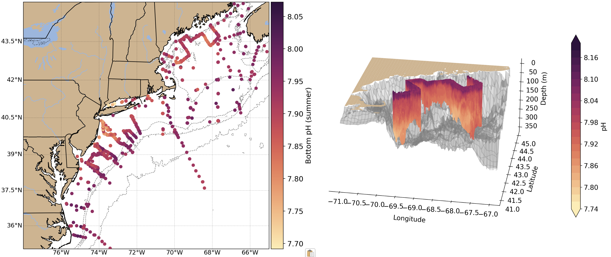
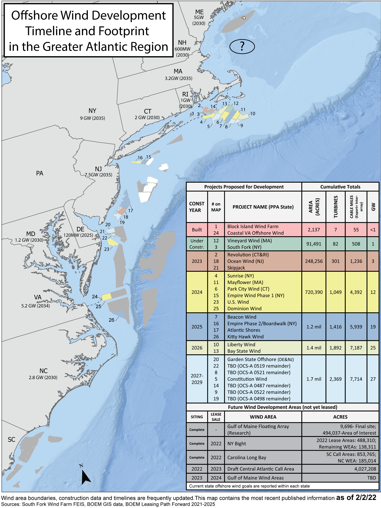

```{r setup, include=FALSE}

# library(tint)
# # invalidate cache when the package version changes
# knitr::opts_chunk$set(tidy = FALSE, cache.extra = packageVersion('tint'))
# options(htmltools.dir.version = FALSE)

#Default Rmd options
knitr::opts_chunk$set(echo = FALSE,
                      message = FALSE,
                      dev = "cairo_pdf",
                      warning = FALSE,
                      fig.width = 4,
                      fig.asp = 0.45,
                      fig.align = 'center'
                      ) #allows for inserting R code into captions

#Plotting and data libraries
#remotes::install_github("noaa-edab/ecodata@0.1.0") #change to 2020 ecodata version for release
library(tidyverse)
library(tidyr)
library(ecodata)
library(here)
library(kableExtra)

```

```{r, code = readLines("https://raw.githubusercontent.com/NOAA-EDAB/ecodata/master/chunk-scripts/human_dimensions_NE.Rmd-setup.R")}
```

```{r, code = readLines("https://raw.githubusercontent.com/NOAA-EDAB/ecodata/master/chunk-scripts/human_dimensions_NE.Rmd-GIS-setup.R")}
```

```{r, code = readLines("https://raw.githubusercontent.com/NOAA-EDAB/ecodata/master/chunk-scripts/macrofauna_NE.Rmd-setup.R")}
```

```{r, code = readLines("https://raw.githubusercontent.com/NOAA-EDAB/ecodata/master/chunk-scripts/LTL_NE.Rmd-setup.R")}
```

\setcounter{page}{5}
\thispagestyle{fancy}

# Introduction

## About This Report

This report is for the New England Fishery Management Council (NEFMC). The purpose of this report is to synthesize ecosystem information to allow the NEFMC to better meet fishery management objectives. The major messages of the report are summarized on pages 1, 2, and 3, and synthesis themes are illustrated on page 4. Information in this report is organized into two sections; [performance measured against ecosystem-level management objectives](#performance-relative-to-fishery-management-objectives) (Table \ref{tab:management-objectives}), and potential [risks to meeting fishery management objectives](#risks-to-meeting-fishery-management-objectives) ([climate change](#climate-and-ecosystem-productivity) and [other ocean uses](#other-ocean-uses-offshore-wind)).  

## Report structure

The two main sections contain subsections for each management objective or potential risk. Within each subsection, we first review indicator trends, and the status of the most recent data year relative to a threshold (if available) or relative to the long-term average. Second, we synthesize results of other indicators and information to outline potential implications for management (i.e., connecting indicator(s) status to management and why an indicator(s) is important). For example, if there are multiple drivers related to an indicator trend, which drivers may be more or less supported by current information, and which, if any, can be affected by management action(s)? Similarly, which risk indicators warrant continued monitoring to evaluate whether regime shifts or ecosystem reorganization are likely? We emphasize that these implications are intended to represent testable hypotheses at present, rather than “answers,” because the science behind these indicators and syntheses continues to develop.  

A glossary of terms^[https://noaa-edab.github.io/tech-doc/glossary.html], detailed technical methods documentation^[https://NOAA-EDAB.github.io/tech-doc] and indicator data^[https://github.com/NOAA-EDAB/ecodata] are available online. The details of standard figure formatting (Fig. \ref{fig:docformat}a), categorization of fish and invertebrate species into feeding groups (Table \ref{tab:species-groupings}), and definitions of ecological production units (EPUs, including Georges Bank, GB, and the Gulf of Maine, GOM; Fig. \ref{fig:docformat}b) are provided at the end of the document. 

```{r management-objectives}

mng_obj <- data.frame("Objective Categories" = c("Seafood Production",
                                                 "Profits","Recreation",
                                                 "Stability","Social & Cultural",
                                                 "Protected Species",
                                                 "Biomass","Productivity",
                                                 "Trophic structure","Habitat"),
"Indicators reported here" = c("Landings; commercial total and by feeding guild; recreational harvest",
                               "Revenue decomposed to price and volume",
                               "Days fished; recreational fleet diversity",
                               "Diversity indices (fishery and ecosystem)",
                               "Community engagement/reliance status",
                               "Bycatch; population (adult and juvenile) numbers, mortalities",
                               "Biomass or abundance by feeding guild from surveys",
                               "Condition and recruitment of managed species, Primary productivity",
                               "Relative biomass of feeding guilds, Zooplankton",
                               "Estuarine and offshore habitat conditions"))

knitr::kable(mng_obj, linesep = "",
      col.names = c("Objective Categories","Indicators reported here"),
      caption = "Example ecosystem-scale objectives for the New England Region",
      #align = 'c',
      booktabs = T) %>%
 # kable_styling(latex_options = "hold_position", "scale_down") %>%
 # column_spec(c(2), width = c("25em")) %>%
  row_spec(0, bold = TRUE) %>%
 # group_rows("Provisioning/Cultural", 1,4) %>%
 # group_rows("Supporting/Regulating", 5,9)
  pack_rows("Provisioning/Cultural Services", 1,6) %>%
  pack_rows("Supporting/Regulating Services", 7,10)


```
 
# Performance relative to fishery management objectives

In this section, we examine indicators related to broad, ecosystem-level fishery management objectives.  These objectives are derived from National legislation as the NEFMC has not formally adopted any ecosystem-level objectives for management. We also provide hypotheses on the implications of these trends—*why* we are seeing them, what’s driving them, and potential or observed regime shifts or changes in ecosystem structure. Identifying multiple drivers, regime shifts, and potential changes to ecosystem structure, as well as identifying the most vulnerable resources, can help managers determine whether we can do anything differently to meet objectives and how to prioritize for upcoming issues/risks. 

*Special note on data availability for the 2022 report*

The Catch Accounting and Monitoring System (CAMS) that will be used to provide commercial landings and discard information at the Ecological Production Unit (EPU) scale is under development.  As of February 2022, our standard indicators relying on EPU scale landings data cannot be calculated for 2020 (commercial seafood production, commercial profits, ecosystem overfishing). We provide information based on coastwide commercial landings information available at this time in @thunberg_northeast_2021^[https://spo.nmfs.noaa.gov/sites/default/files/TM221.pdf], and will calculate our standard indicators at EPU scales with disaggregated 2020 commercial landings data when they are available.

## Seafood Production 

### Indicator: Landings; commercial and recreational

Total commercial landings (black) within New England are not yet available for 2020; Figure \ref{fig:total-landings} includes data only through 2019. However, we do not anticipate the long-term declining trend in landings to change. 

```{r total-landings, fig.cap = "Commercial seafood landings for Georges Bank and the Gulf of Maine.  The red lines are landings of species managed by the New England Fishery Management Council (NEFMC) while the black lines includes both the managed species as well as landings of species not managed by the NEFMC. mt = metric tons", code = readLines("https://raw.githubusercontent.com/NOAA-EDAB/ecodata/master/chunk-scripts/human_dimensions_NE.Rmd-comdat-total-landings.R"), fig.width = 7.5, fig.asp = 0.21}
```

Although the data has not been updated for 2020, the long term downward trends in commercial landings for the Gulf of Maine and Georges Bank identified in earlier reports are not anticipated to change with the addition of another year’s worth of data. Coastwide landings for a number of species managed by the NEFMC showed mixed trends in 2020 when compared to the average landings between 2015 - 2019. Groundfish landings were above the 5 year average, while monkfish and scallop landings were down. Although scallop decreases are partially explained by a decreased TAC, analyses suggest that the drop in landings is at least partially due to market disruptions due to the COVID-19 pandemic. Lobster landings also decreased in 2020 when compared to the average landings between 2015 - 2019.

Overall, recreational harvest (retained fish presumed to be eaten) have also declined in New England (Fig. \ref{fig:rec-landings}).  Recreational harvest in 2020 was the lowest since estimates began.

```{r rec-landings, fig.cap = paste0("Total recreational seafood harvest (millions of pounds) in the ",region," region."), code = readLines("https://raw.githubusercontent.com/NOAA-EDAB/ecodata/master/chunk-scripts/human_dimensions_NE.Rmd-recdat-landings.R")}

```

Recreational shark landings of pelagic and prohibited sharks have increased over the last couple of years (Fig \ref{fig:rec_hms}). This is likely influenced by regulatory changes implemented in 2018 intended to rebuild shortfin mako stocks. In 2021 the International Commission for the Conservation of Atlantic Tunas (ICCAT) finalized recommendations for a two-year retention ban (ICCAT Rec.21-09), which will also affect total overall landings of pelagic sharks in coming years.

```{r rec_hms, fig.cap="Recreational shark landings from Marine Recreational Information Program.", code = readLines("https://raw.githubusercontent.com/NOAA-EDAB/ecodata/master/chunk-scripts/human_dimensions_NE.Rmd-rec_hms.R"), fig.width=5, fig.asp=.35}

```

Aquaculture production is not yet included in total seafood landings, but we are working toward that in future reports. Available aquaculture production of oysters for a subset of New England states was showing an increase in annual production per acre leased until a sharp decline in 2020 caused by the COVID-19 disruptions (Fig. \ref{fig:aquaculture}).

```{r aquaculture, fig.cap="Total oyster production per acre leased for New England states.", code = readLines("https://raw.githubusercontent.com/NOAA-EDAB/ecodata/master/chunk-scripts/human_dimensions_NE.Rmd-aquaculture-pa.R")}

```

### Implications

Declining commercial and recreational landings can be driven by many interacting factors, including combinations of ecological and stock production, management actions, market conditions (including COVID-19 disruptions), and environmental changes.  While we cannot evaluate all possible drivers at present, here we evaluate the extent to which stock status and changes in system biomass play a role.

#### Stock Status

Eight stocks are currently estimated to be below BMSY, while status relative to BMSY could not be assessed for 13 additional stocks (Fig. \ref{fig:stock-status}). Therefore, stock status and associated management constraints are likely contributing to decreased landings. To better address the role of management in future reports, we could examine how the total allowable catch (TAC) and the percentage of the TAC taken for each species has changed through time.

```{r stock-status, fig.cap = "Summary of single species status for NEFMC and jointly federally managed stocks (Goosefish and Spiny dogfish).  The dotted vertical line is the target biomass reference point of B\\textsubscript{MSY}.  The dashed lines are the management thresholds of B\\textsubscript{MSY} (verticle) or F\\textsubscript{MSY} (horizontal).", code = readLines("https://raw.githubusercontent.com/NOAA-EDAB/ecodata/master/chunk-scripts/human_dimensions_NE.Rmd-stock-status.R"), fig.width = 7.5, fig.asp = 0.5}
```

#### System Biomass

Aggregate biomass trends derived from scientific resource surveys have been relatively stable in both regions (Fig. \ref{fig:nefsc-biomass-gb} & Fig. \ref{fig:nefsc-biomass-gom}). The benthivores group spiked during the last decade, due to haddock recruitment, but appears to be returning to average levels (although many surveys were not completed in 2020). There are also increasing trends in piscivores, planktivores, and benthos in at least one season in both regions.  While managed species comprise varying proportions of aggregate biomass, trends in landings are not mirroring shifts in the overall trophic structure of survey-sampled fish and invertebrates.

```{r nefsc-biomass-gb, fig.cap = "Spring (left) and fall (right) surveyed biomass on Georges Bank. The shaded area around each annual mean represents 2 standard deviations from the mean.", code = readLines("https://raw.githubusercontent.com/NOAA-EDAB/ecodata/master/chunk-scripts/macrofauna_NE.Rmd-aggregate-biomass-gb.R"), fig.width=8, fig.asp = 0.75}
```

```{r nefsc-biomass-gom, fig.cap = "Spring (left) and fall (right) surveyed biomass in the Gulf of Maine. The shaded area around each annual mean represents 2 standard deviations from the mean.", code = readLines("https://raw.githubusercontent.com/NOAA-EDAB/ecodata/master/chunk-scripts/macrofauna_NE.Rmd-aggregate-biomass-gom.R"), fig.width=8, fig.asp = 0.75}
```

#### Effect on Seafood Production

With the poor or unknown stock status of many managed species, the decline in commercial landings most likely reflects lower catch quotas implemented to rebuild overfished stocks, as well as market dynamics.  

The decline in recreational seafood landings stems from multiple drivers. Some of the decline, such as for recreational shark landings,  continues to be driven by tightening regulations. However, changes in demographics and preferences over recreational activities likely play a role in non-HMS (Highly Migratory Species) declines in recreational harvest, with current harvests the lowest in the time series.  

Other environmental changes require monitoring as they may become important drivers of future landings:
  
  - Climate is trending into uncharted territory. Globally, 2021 was the sixth warmest year on record^[https://www.climate.gov/news-features/features/2021-global-climate-summary-6th-warmest-year-record] with regional marine heatwaves apparent (see [Climate Risks section](#climate-and-ecosystem-productivity)).
  - Stocks are shifting distribution, moving towards the northeastward and into deeper waters throughout the Northeast US Large Marine Ecosystem (Fig. \ref{fig:species-dist}).
  - Some ecosystem composition and production changes have been observed (see [Stability section](#stability)).
  - Some fishing communities are affected by environmental justice vulnerabilities (see [Environmental Justice and Social Vulnerability section](#social-vulnerability)).
    
        
```{r species-dist, fig.cap = "Aggregate species distribution metrics for species in the Northeast Large Marine Ecosystem.", code = readLines("https://raw.githubusercontent.com/NOAA-EDAB/ecodata/master/chunk-scripts/macrofauna_MAB.Rmd-species-dist.R"), fig.asp=0.8}
```

## Commercial Profits 
        
### Indicators: revenue (a proxy for profits)  

Total commercial revenues have not been updated for 2020.  However, we do not anticipate the long-term declining trend in revenue from managed species in the GOM to change, as it probably reflects declines in quotas and low allowable catches for stocks with rebuilding plans.  Additionally, we know that coastwide a number of species managed by the NEFMC, as well as lobster, experienced a decline in revenue when compared to the average revenue generated 2015 - 2019.  This decline was driven by a mix of landings declines (monkfish, lobster, scallops) and price declines (monkfish, lobster, scallops, and groundfish).
        
```{r comm-revenue, fig.width = 4, fig.asp = 0.45, fig.cap = "Revenue through 2019 for the New England region (black) and revenue from NEFMC managed species (red).", code = readLines("https://raw.githubusercontent.com/NOAA-EDAB/ecodata/master/chunk-scripts/human_dimensions_NE.Rmd-comdat-comm-revenue.R"), fig.width = 7.5, fig.asp = 0.2}
```
        
### Implications 

The Bennet indicator evaluating changes in landings volume and price for New England will be updated when 2020 New England landings become available.

The continued dependence on lobster in the GOM and sea scallops on GB is affected by multiple drivers including resource availability and market conditions.  As both species are sensitive to ocean warming and acidification, it is important to monitor these and other climate drivers.

## Recreational Opportunities 
        
### Indicators: Days fished, fleet diversity  

Recreational effort (days fished) increased during 1980-2010, but has since declined to just below the long-term average (Fig. \ref{fig:rec-op}). Recreational fleet are defined as either private vessels, shore-based, or party-charter vessels.  Recreational fleet diversity, or the relative importance of each fleet type, has remained relatively stable over the latter half of the time series (Fig. \ref{fig:rec-div}). 
        
```{r rec-op, fig.cap = paste0("Recreational effort in ",region,"."), code = readLines("https://raw.githubusercontent.com/NOAA-EDAB/ecodata/master/chunk-scripts/human_dimensions_NE.Rmd-recdat-effort.R")}
```
        
```{r rec-div, fig.cap = paste0("Recreational fleet effort diversity in ",region,"."), code = readLines("https://raw.githubusercontent.com/NOAA-EDAB/ecodata/master/chunk-scripts/human_dimensions_NE.Rmd-recdat-diversity.R")}
```
        
### Implications

The absence of a long term trend in recreational days fished and fleet effort diversity suggests relative stability in the overall number of recreational opportunities in the region.
        
## Stability 

### Indicators: fishery fleet and catch diversity, ecological component diversity

While there are many potential metrics of stability, we use diversity indices as a first check to evaluate overall stability in fisheries and ecosystems. In general, diversity that remains constant over time suggests a similar capacity to respond to change over time. A significant change in diversity over time does not necessarily indicate a problem or an improvement, but does indicate a need for further investigation. We examine commercial fleet and species catch diversity, and recreational species catch diversity (with fleet effort diversity discussed above), and diversity in zooplankton, larval and adult fishes.

#### Fishery Diversity

Diversity estimates have been developed for fleets landing managed species, and species landed by commercial vessels with New England permits. A fleet is defined here as the combination of gear type (Scallop Dredge, Clam Dredge, Other Dredge, Gillnet, Hand Gear, Longline, Bottom Trawl, Midwater Trawl, Pot, or Purse Seine) and vessel length category (Less than 30 ft, 30 to 50 ft, 50 to 75 feet, 75 ft and above).  Commercial fishery fleet count is at or near the time series low (Fig. \ref{fig:commercial-div}), although the revenue fleet diversity does not show a similar decline. This suggests that the fleets disengaging from the region are those that were historically smaller to start with.

```{r commercial-div, fig.cap = paste0("Fleet count and diversity in ",region,"."), code = readLines("https://raw.githubusercontent.com/NOAA-EDAB/ecodata/master/chunk-scripts/human_dimensions_NE.Rmd-commercial-div.R"), fig.asp=0.8}
```

As noted [above](#recreational-opportunities), recreational fleet effort diversity is stable. However, recreational species catch diversity has been above the time series average since 2008 with a long-term positive trend (Fig. \ref{fig:commercial-div-species-div}).  Of note is that, although the positive trend was not significant in the 2021 report, a long-term trend has been reported in the past, indicating the ephemeral nature of the increase.

```{r commercial-div-species-div,  fig.cap = paste0("Species revenue diversity in ",region,"."), code = readLines("https://raw.githubusercontent.com/NOAA-EDAB/ecodata/master/chunk-scripts/human_dimensions_NE.Rmd-recdat-div-catch.R")}
```

#### Ecological Diversity

Ecological diversity indices show mixed trends. Up to 2019, zooplankton diversity was increasing in the GB (Fig. \ref{fig:zoo-diversity-gb}), while no trend was evident in the GOM (Fig. \ref{fig:zoo-diversity-gom}). 2020 surveys were incomplete due to COVID-19. Zooplankton and larval fish diversity indicators will be updated once 2021 survey results have been processed. Adult fish diversity is measured as the expected number of species in a standard number of individuals sampled from the NEFSC bottom trawl survey. There is no vessel correction for this metric, so indices collected aboard the research vessel Albatross IV (up to 2008) and the research vessel Henry B. Bigelow (2009 - Present) are calculated separately (Fig. \ref{fig:exp-n}).  This metric shows an increasing trend in the GOM with no trends on GB.

```{r zoo-diversity-gb, fig.cap = "Zooplankton diversity on Georges Bank, based on Shannon diversity index.", code = readLines("https://raw.githubusercontent.com/NOAA-EDAB/ecodata/master/chunk-scripts/LTL_NE.Rmd-zoo-diversity-gb.R"), fig.asp=0.4}
```

```{r zoo-diversity-gom, fig.cap = "Zooplankton diversity in the Gulf of Maine, based on Shannon diversity index.", code = readLines("https://raw.githubusercontent.com/NOAA-EDAB/ecodata/master/chunk-scripts/LTL_NE.Rmd-zoo-diversity-gom.R"), fig.asp=0.4}
```

```{r exp-n, fig.cap = "Adult fish diversity for Georges Bank and in the Gulf of Maine, based on expected number of species.", code = readLines("https://raw.githubusercontent.com/NOAA-EDAB/ecodata/master/chunk-scripts/macrofauna_NE.Rmd-exp-n.R"), fig.width=8, fig.asp=.4}
```

### Implications

Fleet diversity indices can be used to evaluate stability objectives as well as risks to fishery resilience and to maintaining equity in access to fishery resources [@gaichas_implementing_2018]. The relatively low diversity estimates for the commercial fishery are likely driven by the continued reliance on just a small number of species.  This trend could diminish the capacity to respond to future fishing opportunities. Meanwhile, the increase in recreational species catch diversity is due to  recent increases in ASMFC and MAFMC managed species within the region as well as decreased limits on more traditional regional species.

Ecological diversity indices can provide insight into ecosystem structure. Changes in ecological diversity over time may indicate altered ecosystem structure with implications for fishery productivity and management [@friedland_changes_2020]. Increasing zooplankton diversity through 2019 was driven by the declining dominance of the calanoid copepods *Centropages typicus*, while the overall abundance of zooplankton species was increasing. Stable adult fish diversity on GB suggests the same overall number and evenness over time, but doesn’t rule out species substitutions (e.g., warm-water species replacing cold-water ones). Increasing adult diversity in the GOM suggests an increase in warm-water species and should be closely monitored.  

As a whole, the examined diversity indicators suggest overall stability in the fisheries and ecosystem components. However, increasing diversity in the recreational catch, GB zooplankton, and GOM adult fish suggests warning signs of a potential regime shift or ecosystem restructuring and warrants continued monitoring to determine if managed species are affected.

## Environmental Justice and Social Vulnerability 

### Indicators: Environmental Justice and Social Vulnerability in commercial and recreational fishing communities

Social vulnerability measures social factors that shape a community’s ability to adapt to change. A subset of these can be used to assess potential environmental justice issues. Environmental Justice is defined in Executive Order 12898 as federal actions intended to address disproportionately high and adverse human health and environmental effects of federal actions on minority and low-income populations. Three of the existing NOAA Fisheries Community Social Vulnerability Indicators (CSVIs), the Poverty Index, Population Composition Index, and Personal Disruption Index, can be used for mandated Environmental Justice analysis^[https://www.fisheries.noaa.gov/national/socioeconomics/social-indicators-coastal-communities].

Commercial fishery engagement measures the number of permits and dealers, and pounds and value landed in a community, while reliance expresses these numbers based on the level of fishing activity relative to the total population of a community. Recreational fishery engagement measures shore, private vessel, and for-hire fishing effort while reliance expresses these numbers based on fishing effort relative to the population of a community.

In 2021, we reported the top ten most engaged, and top ten most reliant commercial and recreational fishing communities and their associated social vulnerability. Here we apply the same selection standard for top ten fishing communities for both sectors, and focus on examining the environmental justice vulnerability in these communities.

Communities plotted in the upper right section of Fig.\ref{fig:commercial-engagement} scored high for both commercial engagement and reliance, including Chatham, MA; Newington, NH; Stonington, Vinalhaven, and Beals, ME. Communities that ranked medium-high or above for one or more of the environmental justice indicators are highlighted in bright orange: New Bedford and Boston, MA; and Cranberry Isle, ME.

```{r commercial-engagement, fig.cap= "Commercial engagement, reliance, and environmental justice vulnerability for the top commercially engaged and reliant fishing communities in New England.  Communities ranked medium-high or above for one or more of the environmental justice indicators are highlighted in bright orange. *Community scored high (1.00 and above) for both commercial engagement and reliance indicators.", code = readLines("https://raw.githubusercontent.com/NOAA-EDAB/ecodata/master/chunk-scripts/human_dimensions_NE.Rmd-commercial-engagement.R"), fig.width = 7.5, fig.asp = 0.55}
```

Fig. \ref{fig:commercial-EJ} shows the detailed scores of the three environmental justice indicators for the same communities plotted in Fig.\ref{fig:commercial-engagement}. Communities are plotted clockwise in a descending order of commercial engagement scores from high to low, with the most highly engaged community, New Bedford, MA, listed on the top. Among the communities ranked medium-high or above for environmental justice vulnerability, New Bedford, MA scored high for the poverty index, and medium-high for personal disruption and population composition indices. Boston scored medium-high for personal disruption index and poverty index. Cranberry Isle scored high for the poverty index.

```{r commercial-EJ, fig.cap="Environmental justice indicators (Poverty Index, population composition index, and personal disruption index) for top commercial fishing communities in New England. *Community scored high (1.00 and above) for both commercial engagement and reliance indicators.", out.width='80%'}

#knitr::include_graphics("images/EJ_Commercial_MAB.png")

#get rid of the gray excel outline using R package magick
ComEJ <- magick::image_read("images/EJ_Commercial_NE.png") 

# from https://stackoverflow.com/questions/64597525/r-magick-square-crop-and-circular-mask
# get height, width and crop longer side to match shorter side
ii <- magick::image_info(ComEJ)

cropComEJ <- ComEJ %>%
  #magick::image_crop(cropComEJ, "820x580+5+5")
  magick::image_crop(paste0(ii$width-10,"x",ii$height-10, "+5+5"))

cropComEJ
```

No communities in New England scored high for both recreational engagement and reliance (Fig.\ref{fig:recreational-engagement}).  All of the top recreational communities scored lower than medium-high for all of the three environmental justice indicators, meaning that environmental justice may not be a major concern in these communities at this time, based on this particular analysis.

```{r recreational-engagement, fig.cap= "Recreational engagement and reliance, and environmental justice vulnerability, for the top recreationally engaged and reliant fishing communities in New England. None of these communities ranked medium-high or above for one or more of the environmental justice indicators.", code = readLines("https://raw.githubusercontent.com/NOAA-EDAB/ecodata/master/chunk-scripts/human_dimensions_NE.Rmd-recreational-engagement.R"), fig.width = 7.5, fig.asp = 0.55}
```

Fig. \ref{fig:recreational-EJ} orders communities clockwise in a descending order of recreational engagement scores from high to low, with the most highly engaged community, Narragansett/Point Judith, RI, listed on the top. Narragansett/Point Judith, like all of these top recreational communities ranked low for environmental justice vulnerability. In fact, the scores below 0 for all three environmental justice indicators implies a lower than average level of vulnerability, based on recreational engagement and reliance,  among the communities included in the analysis. 

```{r recreational-EJ, fig.cap="Environmental justice indicators (Poverty Index, population composition index, and personal disruption index) for top recreational fishing communities in New England. *Community scored high (1.00 and above) for both commercial engagement and reliance indicators.", out.width='80%'}
#knitr::include_graphics("images/EJ_Recreational_MAB.png")


#get rid of the gray excel outline using R package magick
RecEJ <- magick::image_read("images/EJ_Recreational_NE.png") 

# from https://stackoverflow.com/questions/64597525/r-magick-square-crop-and-circular-mask
# get height, width and crop longer side to match shorter side
ii <- magick::image_info(RecEJ)

cropRecEJ <- RecEJ %>%
  #magick::image_crop(cropComEJ, "820x580+5+5")
  magick::image_crop(paste0(ii$width-10,"x",ii$height-10, "+5+5"))

cropRecEJ
```

Both commercial and recreational fishing are important activities in Narragansett/Point Judith, RI and Newington, NH, meaning these communities may be impacted simultaneously by commercial and recreational regulatory changes. Both of these communities currently score low for all of the three environmental justice indicators, indicating that environmental justice may not be a major concern in these communities at the moment based on the indicators analyzed.

### Implications
These plots provide a snapshot of the presence of environmental justice issues in the most highly engaged and most highly reliant commercial and recreational fishing communities in New England. These communities may be vulnerable to changes in fishing patterns due to regulations and/or climate change. When any of these communities are also experiencing social vulnerability including environmental justice issues, they may have lower ability to successfully respond to change.

## Protected Species

Protected species include marine mammals protected under the Marine Mammal Protection Act, endangered and threatened species protected under the Endangered Species Act, and migratory birds protected under the Migratory Bird Treaty Act. In the Northeast U.S., endangered/threatened species include Atlantic salmon, Atlantic and shortnose sturgeon, all sea turtle species, and five baleen whales. Fishery management objectives for protected species generally focus on reducing threats and on habitat conservation/restoration. Here we report on the status of these actions as well as indicating the potential for future interactions driven by observed and predicted ecosystem changes in the Northeast U.S. region. Protected species objectives include managing bycatch to remain below potential biological removal (PBR) thresholds, recovering endangered populations, and monitoring unusual mortality events (UMEs). 

### Indicators: bycatch, population (adult and juvenile) numbers, mortalities

As of 2019, rolling 5 year average bycatch indices for both harbor porpoise and gray seal bycatch were below current PBR thresholds, thus meeting management objectives. However, the 2019 bycatch estimate for gray seals was the highest in the time series and above PBR for that year (see 2021 report^[https://repository.library.noaa.gov/view/noaa/29525]). Bycatch indices were not updated because of low 2020 observer coverage caused by COVID-19 restrictions.

The North Atlantic right whale population was on a recovery trajectory until 2010, but has since declined (Fig. \ref{fig:narw-abundance}). Reduced survival rates of adult females and diverging abundance trends between sexes have also been observed. It is estimated that there are fewer than 100 adult females remaining in the population. 

```{r narw-abundance, fig.cap = "Estimated North Atlanic right whale abundance on the Northeast Shelf.", code = readLines("https://raw.githubusercontent.com/NOAA-EDAB/ecodata/master/chunk-scripts/macrofauna_MAB.Rmd-narw-abundance.R"), fig.width=5}
```

North Atlantic right whale calf counts have generally declined after 2009 to the point of having zero new calves observed in 2018 (Fig. \ref{fig:NARW-calf-abundance}). However, seven new calves were born in 2019, 10 were born in 2020, and preliminary 2021 observations of 18 calves have been recorded as of January 2022.. 

```{r NARW-calf-abundance, fig.cap = "Number of North Atlantic right whale calf births, 1990 - 2019.", code = readLines("https://raw.githubusercontent.com/NOAA-EDAB/ecodata/master/chunk-scripts/macrofauna_MAB.Rmd-NARW-calf-abundance.R"), fig.width=5}
```

This year, the Unusual Mortality Event (UME) for North Atlantic right whales continued. Since 2017, the total UME right whale mortalities includes 34 dead stranded whales, 13 in the US and 21 in Canada. When alive but seriously injured whales (16) are taken into account, 50 individual whales are included in the UME. During 2020, two mortalities were documented, however, recent research suggests that many mortalities go unobserved and the true number of mortalities are about three times the count of the observed mortalities [@pace_cryptic_2021]. The primary cause of death is “human interaction” from entanglements or vessel strikes^[https://www.fisheries.noaa.gov/national/marine-life-distress/2017-2022-north-atlantic-right-whale-unusual-mortality-event]. 

Two additional UMEs continued from previous years for humpback whales and minke whales; suspected causes include human interactions and/or infectious disease. A UME for both gray and harbor seals was declared from 2018-2020 due to a high number of mortalities thought to be caused by phocine distemper virus, but is pending closure as of January 2022^[https://www.fisheries.noaa.gov/national/marine-life-distress/active-and-closed-unusual-mortality-events].

### Implications

Bycatch management measures have been implemented to maintain bycatch below PBR thresholds. The downward trend in harbor porpoise bycatch can also be due to a decrease in  harbor porpoise abundance in US waters, reducing their overlap with fisheries, and a decrease in gillnet effort. The increasing trend in gray seal bycatch may be related to an increase in the gray seal population (U.S. pup counts).

The number of gray seals in U.S. waters has risen dramatically in the last three  decades. Based on a survey conducted in 2016, the size of the gray seal population in the U.S. during the breeding season was approximately 27,000 animals, while in Canada the population was estimated to be roughly 425,000. A survey conducted in 2021 in both countries will provide updated estimates of abundance. The population in Canada is increasing at roughly 4% per year, and contributing to rates of increase in the U.S., where the number of pupping sites has increased from 1 in 1988 to 9 in 2019. Mean rates of increase in the number of pups born at various times since 1988 at four of the more data-rich pupping sites (Muskeget, Monomoy, Seal, and Green Islands) ranged from no change on Green Island to high rates of increase on the other three islands, with a maximum increase of 26.3% (95\%CI: 21.6 - 31.4\%; @wood_rates_2020 Fig. \ref{fig:seals}). These high rates of increase provide further support for the hypothesis that seals from Canada are continually supplementing the breeding population in U.S. waters.  

```{r seals, fig.cap = "Estimated mean rates of increase (solid line) and CIs (shaded area) in number of gray seal pups born at four United States pupping colonies at various times from 1988 to 2019. From Wood et al. 2019", code = readLines("https://raw.githubusercontent.com/NOAA-EDAB/ecodata/master/chunk-scripts/macrofauna_NE.Rmd-seal-pups.R"), fig.width=5, fig.asp = .7}
```

Strong evidence exists to suggest that interactions between right whales and both the fixed gear fisheries in the U.S. and Canada and vessel strikes in the U.S. are contributing substantially to the decline of the species [@hayes_north_2018]. Further, right whale distribution has changed since 2010. New research suggests that recent climate driven changes in ocean circulation have resulted in right whale distribution changes driven by increased warm water influx through the Northeast Channel, which has reduced the primary right whale prey (*Calanus finmarchicus*) in the central and eastern portions of the Gulf of Maine [@hayes_north_2018; @record_rapid_2019; @sorochan_north_2019]. Additional potential stressors include offshore wind development, which overlaps with important habitat areas used year-round by right whales, including mother and calf migration corridors and foraging habitat [@schick_whale_2009]. This area is also the only known right whale winter foraging habitat. Additional information can be found in the [offshore wind section](#other-ocean-uses:-offshore-wind) [@quintana-rizzo_narw_wind_2021].

The UMEs are under investigation and are likely the result of multiple drivers. For all three large whale UMEs, human interaction appears to have contributed to increased mortalities, although investigations are not complete. An investigation into the cause of the seal UME so far suggests phocine distemper virus as a potential cause. 

A climate vulnerability assessment is currently underway for Atlantic and Gulf of Mexico marine mammal populations and will be reported on in future versions of this report.

\newpage

# Risks to meeting fishery management objectives

## Climate and Ecosystem Productivity

Large scale climate related changes in the ecosystem can lead to changes in important habitats and ecological interactions, potentially resulting in regime shifts and ecosystem reorganization.

### Climate Change Indicators: ocean temperatures, heatwaves, currents, acidification

#### Ocean temperature and salinity
Ocean temperatures continue to warm at both the surface (Fig. \ref{fig:seasonal-sst-anom-gridded}) and bottom (Fig. \ref{fig:bottom-temp-gb} & Fig. \ref{fig:bottom-temp-gom}) throughout the Northeast Shelf including New England. Seasonal sea surface temperatures in 2021 were above average throughout the year, with some seasons rivaling or exceeding the record warm temperatures observed in 2012.

```{r seasonal-sst-anom-gridded, fig.cap="New England (EPUs outlined in grey) seasonal sea surface temperature (SST) time series overlaid onto 2021 seasonal spatial anomalies. Seasons are defined as: Jan-Mar for winter, Apr-Jun for spring, Jul-Sep for summer, and Oct-Dec for fall.", code=readLines("https://raw.githubusercontent.com/NOAA-EDAB/ecodata/master/chunk-scripts/LTL_NE.Rmd-seasonal-sst-anomaly-gridded.R"), fig.width = 8, fig.asp = 1}
```

```{r bottom-temp-gb, fig.cap="Annual Georges Bank bottom temperature anomalies. (black = observations, red = reanalysis)", code=readLines("https://raw.githubusercontent.com/NOAA-EDAB/ecodata/master/chunk-scripts/LTL_NE.Rmd-bottom-temp-gb.R"), fig.width=6}
```

```{r bottom-temp-gom, fig.cap="Annual Gulf of Maine bottom temperature anomalies. (black = observations, red = reanalysis)", code=readLines("https://raw.githubusercontent.com/NOAA-EDAB/ecodata/master/chunk-scripts/LTL_NE.Rmd-bottom-temp-gom.R"), fig.width=6}
```

#### Marine heatwaves
A marine heatwave is a warming event that lasts for five or more days with sea surface temperatures warmer than 90% of previously observed (1982-2011) temperatures for that date [@hobday_hierarchical_2016]. Marine heatwaves measure not just high temperature, but how long the ecosystem is subjected to the high temperature. They are driven by both atmospheric and oceanographic factors and can have dramatic impacts on marine ecosystems. The region is experiencing more frequent marine heatwaves over the last decade, including 2021, compared to the historical period.

Georges Bank experienced six distinct marine heatwaves throughout all seasons in 2021, which included the warmest event on record. This record event began on May 27^th^ and lasted 39 days (Fig. \ref{fig:heatwave-year-gb}). Relative to prior years, this marine heatwave ranked 1^st^ on record in terms of maximum intensity (+4.50 $^\circ$C above average on July 1^st^) and 13^th^ on record in terms of cumulative intensity (98 $^\circ$C-days) (Fig \ref{fig:heatwave-intensity-gb}). The strongest four marine heatwaves on record in Georges Bank occurred over the last five years (2015, 2016, 2020, 2021).

```{r heatwave-year-gb, fig.cap="Marine heatwave events (red shading above black line) on Georges Bank occuring in 2021.", code=readLines("https://raw.githubusercontent.com/NOAA-EDAB/ecodata/master/chunk-scripts/LTL_NE.Rmd-heatwave-year-gb.R"), fig.asp=.6}
```

```{r heatwave-intensity-gb, fig.cap="Marine heatwave cumulative intensity (left) and maximum intensity (right) on Georges Bank.", code=readLines("https://raw.githubusercontent.com/NOAA-EDAB/ecodata/master/chunk-scripts/LTL_NE.Rmd-heatwave-gb.R"), fig.width=8, fig.asp=.25}
```

The Gulf of Maine experienced marine heatwaves over 80% of the year in 2021. Six distinct marine heatwaves occurred throughout all seasons with the strongest event beginning on June 6^th^ and lasted 28 days (Fig \ref{fig:heatwave-year-gom}). Relative to prior years, this marine heatwave ranked 8^th^ on record in terms of maximum intensity (+3.81 $^\circ$C above average on June 29^th^). The marine heatwave that began on September 7^th^ currently ranks 6^th^ in cumulative intensity (200 $^\circ$C-days) (Fig \ref{fig:heatwave-intensity-gom}). This marine heatwave continued throughout December.

```{r heatwave-year-gom, fig.cap="Marine heatwave events (red shading above black line) in the Gulf of Maine occuring in 2021.", code=readLines("https://raw.githubusercontent.com/NOAA-EDAB/ecodata/master/chunk-scripts/LTL_NE.Rmd-heatwave-year-gom.R"), fig.asp=.6}
```

```{r heatwave-intensity-gom, fig.cap="Marine heatwave cumulative intensity (left) and maximum intensity (right) in the Gulf of Maine.", code=readLines("https://raw.githubusercontent.com/NOAA-EDAB/ecodata/master/chunk-scripts/LTL_NE.Rmd-heatwave-gom.R"), fig.width=8, fig.asp=.25}
```

#### Ocean currents and features

Variability of the Gulf Stream is one of the major drivers of changes in the oceanographic conditions of the Slope Sea and subsequently the Northeast U.S. continental shelf [@gangopadhyay_census_2020]. Changes in the Gulf Stream and Slope Sea can affect large-scale climate phenomena as well as local ecosystems and coastal communities. During the last decade, the Gulf Stream has become less stable and shifted northward [@andres_recent_2016; @caesar_observed_2018] (Fig. \ref{fig:GSI}).  A more northern Gulf Stream position is associated with warmer ocean temperature on the northeast shelf [@zhang_role_2007], a higher proportion of Warm Slope Water in the Northeast Channel, and increased sea surface height along the U.S. east coast [@goddard_extreme_2015].

```{r GSI, fig.cap = "Index representing changes in the location of the Gulf Stream north wall. Positive values represent a more northerly Gulf Stream position.", code=readLines("https://raw.githubusercontent.com/NOAA-EDAB/ecodata/master/chunk-scripts/LTL_MAB.Rmd-gsi.R"), fig.width=6}
```

In 2019, we also observed the second lowest proportion of Labrador Slope Water entering the Gulf of Maine since 1978 (Fig. \ref{fig:wsw-prop}). The changing proportions of source water affect the temperature, salinity, and nutrient inputs to the Gulf of Maine ecosystem.

```{r wsw-prop, fig.cap = "Proportion of Warm Slope Water (WSW) and Labrador slope water (LSLW) entering the GOM through the Northeast Channel.", code=readLines("https://raw.githubusercontent.com/NOAA-EDAB/ecodata/master/chunk-scripts/LTL_NE.Rmd-slopewater.R"), fig.width=6}
```

Since 2008, the Gulf Stream has moved closer to the Grand Banks, reducing the supply of cold, fresh, and oxygen-rich Labrador Current waters to the Northwest Atlantic Shelf [@goncalves_neto_changes_2021]. Nearly every year since 2010, warm slope water made up more than 75% of the annual slope water proportions entering the Gulf of Maine.  In 2017 and 2019, almost no cooler Labrador Slope water entered the Gulf of Maine through the Northeast Channel (Fig. \ref{fig:wsw-prop}).  The changing proportions of source water affect the temperature, salinity, and nutrient inputs to the Gulf of Maine ecosystem.  In 2021, warm slope water continued to dominate (86.1%) inputs to the Gulf of Maine. The 2022 position of the north wall of the Gulf Stream is forecasted to be similar to 2021 [@silver_forecasting_2021], extending this pattern.

The increased instability of the Gulf Stream position and warming of the Slope Sea may also be connected to the regime shift increase in the number of warm core rings formed annually in the Northwest Atlantic [@gangopadhyay_observed_2019; @gangopadhyay_census_2020] (Fig. \ref{fig:wcr}). Timing of ring formation may also be changing. In 2021, a remarkable number of rings were observed simultaneously near the shelf break in June. When warm core ring water moves onto the continental shelf, it can alter the habitat and disrupt seasonal movements of fish [@gawarkiewicz_changing_2018].

```{r wcr, fig.show = 'hold', out.width = "49%", fig.cap= "Warm core ring formation on the Northeast U.S. Shelf: Annual number of rings (left) and June 2021 rings (right), where the black line is the 200 m isobath (the shelf break) and the red lines are the 20 and 24 degree isotherms.", fig.width=8}
#code=readLines("https://raw.githubusercontent.com/NOAA-EDAB/ecodata/master/chunk-scripts/LTL_MAB.Rmd-wcr.R")

#left
upper.line<-ecodata::wcr %>%
  dplyr::filter(Time>2000) %>% 
  dplyr::mutate(hline = c(mean(Value)))
lower.line<-ecodata::wcr%>%
  dplyr::filter(Time<2000) %>% 
  dplyr::mutate(hline = c(mean(Value)))
wcr<- upper.line %>% 
  rbind(lower.line)

wcr %>% 
  ggplot2::ggplot(aes(x = Time, y = Value))+
    ggplot2::annotate("rect", fill = shade.fill, alpha = shade.alpha,
      xmin = x.shade.min , xmax = x.shade.max,
      ymin = -Inf, ymax = Inf) +
  ggplot2::geom_point()+
  ggplot2::geom_line()+
  ggplot2::ylab("Warm Core Ring Births")+
  ggplot2::xlab(element_blank())+
  ggplot2::ggtitle("Warm Core Rings")+
  ecodata::theme_ts()+
  ggplot2::geom_segment(data = upper.line, aes(x = min(Time), y = hline, 
                                      xend = max(Time), yend = hline, color = "segment") )+
  ggplot2::geom_segment(data = lower.line, aes(x = min(Time), y = hline, 
                                    xend = max(Time), yend = hline, color = "segment") )+
  ggplot2::theme(legend.position = "none")+
  ecodata::theme_title()

# right
knitr::include_graphics("images/D_20210608-MUR-SST-WCR.PNG")

```

When warm core rings and eddies interact with the continental slope they can transport warm, salty water to the continental shelf [@chen_mesoscale_2022], and this is now happening more frequently [@gawarkiewicz_changing_2018; @gawarkiewicz_increasing_nodate]. These interactions can be significant contributors to marine heatwaves in the Mid-Atlantic Bight [@gawarkiewicz_characteristics_2019; @chen_mesoscale_2022] as well as the movement of shelf-break species inshore [@gawarkiewicz_changing_2018; @potter_horizontal_2011; @worm_predator_2003]. 

Changes in ocean temperature and circulation alter habitat features such as the seasonal cold pool, a 20–60 m thick band of cold, relatively uniform near-bottom water that persists from spring to fall over the mid and outer shelf of the Mid-Atlantic Bight and southern flank of Georges Bank [@lentz_seasonal_2017; @chen_seasonal_2018]. It is a reservoir of nutrients that feeds phytoplankton productivity, is essential fish spawning and nursery habitat, and affects fish distribution and behavior [@lentz_seasonal_2017; @miles_offshore_2021]. The average temperature of the cold pool is getting warmer over time [@miller_state-space_2016; @du_pontavice_incorporating_nodate], the area is getting smaller [@friedland_middle_2022], and the duration is getting shorter (Fig. \ref{fig:cold-pool}).

```{r cold-pool, fig.cap="Seasonal cold pool indices: mean temperature within the cold pool, cold pool persistence, and spatial extent.",  code=readLines("https://raw.githubusercontent.com/NOAA-EDAB/ecodata/master/chunk-scripts/LTL_MAB.Rmd-cold_pool.R"), fig.width=10, fig.asp=.35}

```

#### Ocean Acidification
Ocean acidification (OA) has caused measured declines in global ocean pH. On the Northeast Shelf, summer bottom pH (2007-2021) varied spatially and temporally, ranging from 7.69-8.07 (Fig. \ref{fig:ne-oa}, left panel). The lowest pH values were recorded in the Gulf of Maine. In summer 2021, water column pH ranged from 7.72-8.18 (Fig. \ref{fig:ne-oa}, right panel) in the Gulf of Maine. The highest values occurred at the surface and decreased with depth, reaching minimum values in the deeper waters (below 200 m) of Jordan and Wilkinson Basins. 

```{r ne-oa, out.width = '80%', fig.cap = "Left: Summer bottom pH collated from all quality-controlled vessel- and glider-based measurements from 2007-2021. Right: Glider-based pH profiles collected during summer 2021 in the Gulf of Maine."}



```

### Ecosystem Productivity Indicators: phytoplankton, zooplankton, forage fish, fish condition

#### Phytoplankton

Phytoplankton support the food web as the primary food source for zooplankton and filter feeders such as shellfish. Numerous environmental and oceanographic factors interact to drive the abundance, composition, spatial distribution, and productivity of phytoplankton. In 2021, phytoplankton biomass (measured as chlorophyll a concentration) was above average in winter, but below average during the typical spring bloom period in both Georges Bank and Gulf of Maine.  Summer concentrations were also low, but there was an anomalously high fall bloom \ref{fig:chl-weekly}.  Primary productivity (the rate of photosynthesis) was above average during the winter bloom and well above average on Georges Bank during the summer \ref{fig:pp-weekly}.

```{r chl-weekly, fig.cap = "Weekly chlorophyll concentrations on Georges Bank and in the Gulf of Maine are shown by the colored line for 2021. The long-term mean is shown in black and shading indicates +/- 1 sample SD.", code=readLines("https://raw.githubusercontent.com/NOAA-EDAB/ecodata/master/chunk-scripts/LTL_NE.Rmd-chl-weekly.R"), fig.width = 5, fig.asp=.4}
```

```{r pp-weekly, fig.cap = "Weekly primary productivity on Georges Bank and in the Gulf of Maine are shown by the colored line for 2021. The long-term mean is shown in black and shading indicates +/- 1 sample SD.", code=readLines("https://raw.githubusercontent.com/NOAA-EDAB/ecodata/master/chunk-scripts/LTL_NE.Rmd-pp-weekly.R"), fig.width = 5, fig.asp=.4}
```

The seasonal cycle of size distribution of phytoplankton shows that the spring and fall bloom periods are dominated by larger-celled microplankton, while smaller-celled nanoplankton dominate during the warmer summer months. The proportion of the smallest phytoplankton, picoplankton (0.2-2 microns), are relatively constant throughout the year. In 2021, microplankton proportions were above average during the winter and fall bloom periods, but below average for the summer months in both Georges Bank and the Gulf of Maine (Fig. \ref{fig:weekly-phyto-size-gb} & Fig. \ref{fig:weekly-phyto-size-gom}).

```{r weekly-phyto-size-gb, fig.cap="The annual climatology (1998-2020) percent composition of the phytoplankton size classes on Georges Bank based on satellite observations in the shaded portions. The 2021 proportions for the microplankton (>20 microns, green) and nanoplankton (2-20 microns, orange) are shown in the bold lines.", code=readLines("https://raw.githubusercontent.com/NOAA-EDAB/ecodata/master/chunk-scripts/LTL_NE.Rmd-weekly-phyto-size-gb.R"), fig.asp=.6}
```

```{r weekly-phyto-size-gom, fig.cap="The annual climatology (1998-2020) percent composition of the phytoplankton size classes in the Gulf of Maine based on satellite observations in the shaded portions. The 2021 proportions for the microplankton (>20 microns, green) and nanoplankton (2-20 microns, orange) are shown in the bold lines.", code=readLines("https://raw.githubusercontent.com/NOAA-EDAB/ecodata/master/chunk-scripts/LTL_NE.Rmd-weekly-phyto-size-gom.R"), fig.asp=.6}
```

#### Zooplankton
While zooplankton indicators could not be updated for this report due to 2020 survey disruptions and lags in sample processing, data up to 2019 showed long-term increasing trends of gelatinous zooplankton and krill on the northeast shelf (see 2021 report^[https://repository.library.noaa.gov/view/noaa/29525]). Preliminary 2021 observations found the total volume of plankton caught in the bongo net was significantly greater than the previous years due to increased gelatinous zooplankton, predominantly salps (*Thalia democratica*). Unusually high concentrations of salps were found throughout the Northeast shelf and in the Slope Sea during other summer 2021 scientific surveys, which may be associated with water mass intrusions at the shelf break [@madin_periodic_2006; @deibel_predictability_2009]. Salps are filter feeders feeding on phytoplankton and other small particles and may have contributed to the below average phytoplankton biomass in summer 2021 (Fig. \ref{fig:chl-weekly}).

#### Forage Fish Energy Content
Nutritional value (energy content) of juvenile and adult forage fish as prey is related to environmental conditions, fish growth, and reproductive cycles. Forage energy density measurements from NEFSC trawl surveys 2017-2021 are building toward a time series to evaluate trends (Fig. \ref{fig:energy-density}). Limited data from the spring 2020 survey, and complete spring 2021 survey  measurements were consistent with previous reports: the energy density of Atlantic herring was almost half the value (5.69 +/- 0.07 kJ/g wet weight) reported in earlier studies (10.6-9.4 kJ/ g wet weight). Silver hake, longfin squid (*Loligo* in figure) and shortfin squid (*Illex* in figure) were also lower than previous estimates [@steimle_energy_1985; @lawson_important_1998]. Energy density of alewife, butterfish, sand lance, and Atlantic mackerel varies seasonally, with seasonal estimates both higher and lower than estimates from previous decades.

```{r energy-density, fig.cap="Forage fish energy density mean and standard deviation by season and year, compared with 1980s (solid line; Steimle and Terranove 1985) and 1990s (dashed line; Lawson et al. 1998) values.", code=readLines("https://raw.githubusercontent.com/NOAA-EDAB/ecodata/master/chunk-scripts/macrofauna_MAB.Rmd-energy-density.R"), fig.width = 7.5, fig.asp = 0.5}
```

#### Fish Condition
The health and well being of individual fish can be related to body shape condition indices (i.e., weight at a given length) such as relative condition index, which is the ratio of observed weight to predicted weight based on length [@le_cren_length-weight_1951]. Heavier and fatter fish at a given length have higher relative condition which is expected to improve growth, reproductive output, and survival. A pattern of generally good condition was observed across many species prior to 2000, followed by a period of generally poor condition from 2001-2010, with a mix of good and poor condition 2011-2019, and improved condition for many species in 2021 (Fig. \ref{fig:gb-cf} & Fig. \ref{fig:gom-cf}). Preliminary results of synthetic analyses show that changes in temperature, zooplankton, fishing pressure, and population size influence the condition of different fish species. 

```{r gb-cf, fig.cap = "Condition factor for fish species on Georges Bank based on fall NEFSC bottom trawl survey data. No survey was conducted in 2020.", out.width = '100%'}


```

```{r gom-cf, fig.cap = "Condition factor for fish species in the Gulf of Maine based on fall NEFSC bottom trawl survey data. No survey was conducted in 2020.", out.width = '100%'}

knitr::include_graphics("images/GOM_Condition_allsex_2022_viridis.jpg")
```

#### Fish Productivity
We describe patterns of aggregate fish productivity on Georges Bank and the Gulf of Maine with the small fish per large fish anomaly indicator, derived from NEFSC bottom trawl survey data (Fig. \ref{fig:productivity-anomaly-gb} & Fig. \ref{fig:productivity-anomaly-gom}). The indicator shows great variability with both regions being below average for much of the past decade.

```{r productivity-anomaly-gb, fig.cap = "Small fish per large fish biomass anomaly on Georges Bank. The summed anomaly across species is shown by the black line.", code=readLines("https://raw.githubusercontent.com/NOAA-EDAB/ecodata/master/chunk-scripts/macrofauna_NE.Rmd-productivity-anomaly-gb.R"), fig.width=5, fig.asp=.7}
```

```{r productivity-anomaly-gom, fig.cap = "Small fish per large fish biomass anomaly in the Gulf of Maine. The summed anomaly across species is shown by the black line.", code=readLines("https://raw.githubusercontent.com/NOAA-EDAB/ecodata/master/chunk-scripts/macrofauna_NE.Rmd-productivity-anomaly-gom.R"), fig.width=5, fig.asp=.7}
```

### Ecosystem Structure Indicators: distribution shifts, diversity, predators

As noted in the [Landings Implications section above](#landings), stocks are shifting their spatial distributions throughout the region. In aggregate, fish stocks are moving northeastward along the shelf and into deeper waters.

Long-term trends show that zooplankton and adult fish diversity are increasing in the GOM, while zooplankton diversity is increasing on GB.  The rest of the diversity indices are stable over time with current values near the long term average (see [Diversity Indicators section, above](#diversity)).

New indicators for shark populations, combined with information on grey seals (see [Protected Species Implications section, above](#protected-species)), suggests predator populations in New England are either stable (sharks, Figs. \ref{fig:observed-sharks}, \ref{fig:hms-cpue-sharks}) or increasing (gray seals, Fig. \ref{fig:seals}). Stable predator populations suggest stable predation pressure on managed species, but increasing predator populations may reflect increasing predation pressure.

```{r observed-sharks, fig.cap="Estimated number of sharks per unit effort from Northeast Fisheries Observer Program data.", code=readLines("https://raw.githubusercontent.com/NOAA-EDAB/ecodata/master/chunk-scripts/macrofauna_NE.Rmd-observed-sharks.R"), fig.width = 6, fig.asp = .4}
```

```{r hms-cpue-sharks, fig.cap="Estimated number of sharks per unit effort from Highly Migratory Species Pelagic Observer Program data.", code=readLines("https://raw.githubusercontent.com/NOAA-EDAB/ecodata/master/chunk-scripts/macrofauna_MAB.Rmd-hms-cpue-sharks.R"), fig.width=6, fig.asp = .4}
```

Stock status is mixed for Atlantic Highly Migratory Species (HMS) stocks (including sharks, swordfish, billfish, and tunas) occurring in the New England region. While there are several HMS species considered to be overfished or that have unknown stock status, the population status for some managed Atlantic sharks and tunas is at or above the biomass target (Fig. \ref{fig:hms-stock-status} ), suggesting the potential for robust predator populations among these managed species. 

```{r hms-stock-status, fig.cap = "Summary of single species status for HMS stocks; key to species names at https://noaa-edab.github.io/tech-doc/atlantic-highly-migratory-species-stock-status.html.", code=readLines("https://raw.githubusercontent.com/NOAA-EDAB/ecodata/master/chunk-scripts/human_dimensions_MAB.Rmd-hms-stock-status.R"), fig.width = 7, fig.asp = 0.5}
```

As noted in the [Protected Species section](#protected-species), gray seal populations are increasing. Harbor and gray seals occupying New England waters are generalist predators that consume more than 30 different prey species. An evaluation of hard  parts found in seal stomachs showed that harbor and gray seals predominantly exploit abundant demersal fish species (i.e. red, white, and silver hake). Other relatively abundant prey species found in hard-part remains include sand lance, yellowtail flounder, four-spotted flounder, Gulf-stream flounder, haddock, herring, redfish, and squids.

A recent stable isotope study utilizing gray seal scat samples obtained from Massachusetts habitats showed individual gray seals can specialize on particular prey. It also found that gray seals vary their diet seasonally, focusing on demersal inshore species prior to the spring molt, and offshore species such as sand lance after molting. DNA studies on gray seal diet in Gulf of Maine and Massachusetts waters found spiny dogfish and Jonah crab present in gray seal scat samples. Skate and crab remains were also found in gray seal stomach remains. In contrast to direct feeding, it is uncertain if the presence of skates and crabs is due to secondary consumption or scavenging.

### Habitat Risk Indicators: habitat assessments, harmful algal blooms, fishing gear impacts

#### Habitat Climate Vulnerability

The Northeast Regional Marine Fish Habitat Assessment (NRHA) is a collaborative effort to describe and characterize estuarine, coastal, and offshore fish habitat distribution, abundance, and quality in the Northeast. This includes mapping inshore and offshore habitat types used by focal fish species, summarizing impacts of habitat climate vulnerability on these species, modeling predicted future species distributions, and developing a publicly accessible decision support tool to visualize these results. This is a three-year project led by the New England and Mid-Atlantic Fishery Management Councils in collaboration with many partners including NOAA Fisheries, and will be completed in July 2022^[https://www.mafmc.org/nrha].

As part of the NRHA work, climate vulnerability information from NOAA’s Habitat Climate Vulnerability Assessment [@farr_assessment_2021] and the Northeast Fish and Shellfish Climate Vulnerability Assessment [@hare_vulnerability_2016]^[https://www.fisheries.noaa.gov/new-england-mid-atlantic/climate/northeast-vulnerability-assessment] is synthesized for approximately 70 species in the northeast region. In particular, winter founder, a species deemed highly vulnerable to climate change, is highly dependent on vulnerable habitats such as submerged aquatic vegetation, kelp, intertidal sand and mud, and tidal wetlands throughout New England and in the Mid-Atlantic. Details on highly vulnerable habitats with linkages to a variety of species, including which life stages have different levels of dependence on a particular habitat, are available in a detailed table^[https://noaa-edab.github.io/ecodata/Hab_table].

#### Harmful Algal Blooms

Water quality as a component of habitat is of concern to managed species. Harmful Algal Blooms can degrade water quality. One example is *Alexandrium* blooms, which can result in Paralytic Shellfish Poisoning. *Alexandrium* cyst distribution and abundance are surveyed annually in the Gulf of Maine. After strong bloom events in 2005 and 2009, the time series suggests lower overall cyst abundance through 2020. However, bloom events and shellfishery closures do occur annually on a small scale and economic impacts can be substantial to inshore shellfisheries (mussels, clams, and quahogs). More information on Harmful Algal Blooms are available in the Synthetic Indicator Catalog^[https://noaa-edab.github.io/catalog/harmful-algal-blooms-alexandrium.html].

#### Fishing Gear Impacts

Estimates of the impacts of fishing gear on habitat are available through the habitat section of the Northeast Ocean Data Portal^[https://www.northeastoceandata.org/data-explorer/]. The data portal hosts selected outputs from the Northeast Fishing Effects Model which combines seafloor data (sediment type, energy regime) with fishing effort data to generate percent habitat disturbance estimates in space and time. More detailed information can be found in the Synthetic Indicator Catalog^[https://noaa-edab.github.io/catalog/northeast-fishing-effects-model.html].

### Implications

#### Links between climate change and managed species 

Estuarine, nearshore, and offshore habitats support many life stages of state and federally-managed species that are highly vulnerable to climate change. Overall, multiple drivers interact differently for each species producing a range of population impacts.

In addition to distribution shifts, climate change may shrink or fragment available habitat for species such as cusk [@hare_cusk_2012]. Projections of climate change scenarios appear to increase the vulnerability of cod to habitat loss on Georges Bank and particularly to the south, while warmer water temperatures in the Gulf of Maine may decrease survival of early life stages of cod [@fogarty_cod_2007]. Both productivity and abundance decline for winter flounder with increasing water temperatures, potentially inhibiting the rebuilding of the stock despite reduced fishing pressure [@bell_rebuilding_2014].

#### Heatwave impacts
While marine heatwaves lasting over days may disturb the marine environment, long lasting events such as the warming in 2012 (Fig. \ref{fig:heatwave-intensity-gb}) can have significant impacts to the ecosystem [@gawarkiewicz_characteristics_2019]. The 2012 heatwave affected the lobster fishery most notably, but other species also shifted their geographic distributions and seasonal cycles [@mills_fisheries_2013]. 2012 is still the warmest year on record in the Northeast U.S. LME, however temperatures in 2021 rivaled or exceeded 2012 in some seasons.  The 2012 heatwave was caused by a shift in the atmospheric Jet Stream, whereas the 2017 marine heatwave in the Mid-Atlantic was associated with a strong positive salinity anomaly and is likely related to cross-shelf flow driven by the presence of a warm core ring adjacent to the shelfbreak south of New England [@gawarkiewicz_characteristics_2019]. During the 2017 event, warm water fish typically found in the Gulf Stream were caught in shallow waters near Block Island, RI [@gawarkiewicz_changing_2018]. Ocean temperatures in 2021 rivaled or exceeded the record temperatures in 2012 in some seasons, but the impacts to fisheries have yet to be determined.

#### Cold pool impacts
Changes in the cold pool habitat can affect species distribution, recruitment, and migration timing for multiple federally managed species. Southern New England-Mid Atlantic yellowtail flounder recruitment and settlement are related to the strength of the cold pool [@miller_state-space_2016]. The settlement of pre-recruits during the cold pool event represents a bottleneck in yellowtail life history, during which a local and temporary increase in bottom temperature negatively impacts the survival of the settlers. Including the effect of cold pool variations on yellowtail recruitment reduced retrospective patterns and improved the skill of short-term forecasts in a stock assessment model [@du_pontavice_incorporating_nodate; @miller_state-space_2016]. The cold pool also provides habitat for the ocean quahog [@powell_ocean_2020; @friedland_middle_2022]. Growth rates of ocean quahogs in the MAB (southern portion of their range) have increased over the last 200 years whereas little to no change has been documented in the northern portion of their range in southern New England, likely a response to a warming and shrinking cold pool [@pace_two-hundred_2018].

#### Distribution shift impacts

Trends for a suite of 48 commercially or ecologically important fish species along the entire Northeast Shelf continue to show distributional shifts northeastward and generally into deeper water (Fig. \ref{fig:species-dist}). We hope to expand analysis beyond fish. Marine mammal distribution maps are available online;^[https://www.nefsc.noaa.gov/AMAPPSviewer/] updated maps and trend analyses are currently being developed.

Shifting species distributions alter both species interactions and fishery interactions. In particular, shifting species distributions can alter expected management outcomes from spatial allocations and affect the efficacy of bycatch measures based on historical fish and protected species distributions.

#### Ecosystem productivity change impacts

Climate and associated changes in the physical environment affect ecosystem productivity, with warming waters increasing the rate of photosynthesis at the base of the food web. However, increased summer production in the region may not translate to increased fish biomass because smaller phytoplankton dominate during this season. 

While krill and large gelatinous zooplankton have increased over time, smaller zooplankton periodically shift in abundance between the larger, more nutritious *Calanus finmarchicus* and smaller bodied copepods with no apparent overall trend. The nutritional content of larger bodied forage fish and squid changes seasonally in response to ecosystem conditions, with apparent declines in energy density for Atlantic herring and *Illex* squid relative to the 1980s, but similar energy density for other forage species. Some of these factors are now being linked to the relative condition of managed fishes.

## Other Ocean Uses: Offshore Wind

### Indicators: development timeline, revenue in lease areas, coastal community vulnerability

As of February 2022, 24 offshore wind development projects are proposed for construction over the next decade in the Northeast (timelines and project data are based on Tables E-2, E-4, and E-4-2 of South Fork Wind Farm Final Environmental Impact Statement). Offshore wind areas are anticipated to cover more than 1.7 million acres by 2030 in the Greater Atlantic region (Fig. \ref{fig:wind-proposed-dev}). Beyond 2030 values include acreage for the NY Wind Energy Areas (WEA) and Gulf of Maine Area of Interest for floating research array.

```{r wind-proposed-dev, fig.cap='Proposed wind development on the northeast shelf.', code=readLines("https://raw.githubusercontent.com/NOAA-EDAB/ecodata/master/chunk-scripts/human_dimensions_MAB.Rmd-wind-proposed-dev.R")}
```

Just over 2,500 foundations and more than 7,000 miles of inter-array and offshore export cables are proposed to date. The colored chart in Fig. \ref{fig:wind-dev-cumul} also presents the offshore wind development timeline in the Greater Atlantic region with the estimated year that foundations would be constructed (matches the color of the wind areas). These timelines and data estimates are expected to shift but represent the most recent information available as of February 2022. Based on current timelines, the areas affected would be spread out such that it is unlikely that any one particular area would experience full development at one time. In addition, this rapid build out will be more impactful to the Mid-Atlantic than to New England, recognizing that the lease areas in RI and MA are part of the Mid-Atlantic for the purposes of this report. Offshore floating wind is also expected to be developed in the Gulf of Maine. Although no commercial wind areas have been proposed, the state of Maine submitted an application to BOEM to lease 9,696 acres (15 square miles) for the first floating offshore wind research site in federal waters of the GOM. This area is shown at the top of Figure \ref{fig:wind-dev-cumul}, with the original Area of Interest (AOI) and the final lease site already submitted to BOEM. Additionally, BOEM announced that commercial lease area designations for the Gulf of Maine are expected in 2023, with lease sales in 2024. Lastly, for each state in the region, Figure \ref{fig:wind-dev-cumul} shows the states’ current energy goals (GW and year as of January 2022). It is expected that ME, NH and the MA outstanding energy goals not met within the MA/RI WEA will come from GOM development.   

```{r wind-dev-cumul, fig.cap = "All Northeast Project areas by year construction ends (each project has 2 year construction period).  The question mark in the Gulf of Maine refers to the yet to be determined Gulf of Maine winds areas.", out.width='90%'}
#knitr::include_url("https://raw.githubusercontent.com/NOAA-EDAB/ecodata/master/docs/images/All_2021128_needsgraph-01.jpg")

```

Based on federal vessel logbook data, average commercial fishery revenue from trips in the current offshore wind lease areas and the New York Bight leasing areas identified in the proposed sale notice represented 1-12\% of the total annual revenue for the most affected fisheries in federal waters from 2008-2019 (Fig. \ref{fig:wea-spp-rev}). 

```{r wea-spp-rev, fig.cap="Fishery revenues from NEFMC managed species in the Wind energy lease areas.", code=readLines("https://raw.githubusercontent.com/NOAA-EDAB/ecodata/master/chunk-scripts/human_dimensions_NE.Rmd-wea-spp-rev.R"), fig.width = 6, fig.asp = .4}
```

The scallop fishery could be the most affected fishery, with a maximum of 12\% of annual fishery revenue occurring within potential wind lease areas during this period. The skate fishery, monkfish, and small-mesh multispecies fisheries could also be substantially affected, with a maximum of 10\%, 8\%, and 7\% of annual revenues affected, respectively (see Table \ref{tab:wea-landings-rev}).

```{r wea-landings-rev}
#fig.cap="Percent Landings and Revenue from wind energy areas. Data from GARFO VTR.",
#, out.width="90%", code=readLines("https://raw.githubusercontent.com/NOAA-EDAB/ecodata/master/chunk-scripts/human_dimensions_MAB.Rmd-wea-landings-rev.R")

dt<- ecodata::wea_landings_rev %>% 
  dplyr::select("GARFO and ASMFC Managed Species", "perc_landings_max"  ,"perc_landings_min",
                "perc_revenue_max","perc_revenue_min" ) %>%
  dplyr::filter(`GARFO and ASMFC Managed Species` %in% 
                  c('Atlantic sea scallops', 'Atlantic herring', 'Monkfish', 
                    'Silver hake', 'Skate wings')) %>%
  dplyr::rename("Maximum Percent Total Annual Regional Species Landings"="perc_landings_max",
    "Maximum Percent Total Annual Regional Species Revenue"="perc_revenue_max",
    "Minimum Percent Total Annual Regional Species Landings"="perc_landings_min",
    "Minimum Percent Total Annual Regional Species Revenue"="perc_revenue_min",) 
kable(dt,"latex", booktabs = TRUE,
      caption = "Top ten species Landings and Revenue from Wind Energy Areas.") %>% 
  kable_classic(full_width = F, html_font = "Cambria") %>%
  column_spec(2:5, width = "10em") %>%
  kable_styling(latex_options = "scale_down")

```

Proposed wind development areas interact with the region’s federal scientific surveys. Scientific surveys are impacted by offshore wind in four ways: 1. Exclusion of NOAA Fisheries’ sampling platforms from the wind development area due to operational and safety limitations; 2. Impacts on the random-stratified statistical design that is the basis for scientific assessments, advice, and analyses; 3. Alteration of benthic and pelagic habitats, and airspace in and around the wind energy development, requiring new designs and methods to sample new habitats; and, 4. Reduced sampling productivity through navigation impacts of wind energy infrastructure on aerial and vessel survey operations. Increase vessel transit between stations may decrease data collections that are already limited by annual days-at-sea day allocations. The total survey area overlap ranges from 1-14\% for all Greater Atlantic federal surveys. Individual survey strata have significant interaction with wind, including the sea scallop survey (up to 96\% of individual strata) and the bottom trawl survey  (BTS, up to 60\% strata overlap). Additionally, up to 50\% of the southern New England North Atlantic right whale survey’s area overlaps with proposed project areas. A region-wide survey mitigation program is underway (Table \ref{tab:wind-survey-table})

```{r wind-survey-table}
#, out.width="90%", code=readLines("https://raw.githubusercontent.com/NOAA-EDAB/ecodata/master/chunk-scripts/human_dimensions_MAB.Rmd-wind-survey-table.R")

dat<- data.frame(XSurvey= c("Fall BTS", "Spring BTS", "EcoMon", "Scallop",
                            "Shellfish(Clams)", "Right Whale (Air)", 
                            "Marine Mammal/Turtle (Ship/Air)",
                            "Altantic Shark (Bottom Long-Line",
                            "GOM Bottom Long-Line", "GOM Shrimp Survey", 
                            "Atlantic Shark COASTPAN"), 
                 X1 = c("Started", "Started", "No",
                                                    "Started", "No", "Inital", 
                                                    "No", "No","No", "No","No"), 
                 X2 = c("Inital", "Initial", "No", "Initial", 
                                            "No", "Initial","No", "No","No", "No",
                                            "No" ), 
                 X3 = c( "No", "No","No",
                        "No","No",  "Initial", "No", "No","No", "No","No"), 
                 X4 = c("No", "No","No", "No","No","No", 
                                         "No","No", "No","No","No"), 
                 X5 = c("No", "No","No", "No","No","No", 
                                         "No","No", "No","No","No"),
                 X6 = c("Initial", "Initial","No", "No","No","No", 
                                         "No","No", "No","No","No"))

column_names <- c("Survey","1.Evaluate designs & Impacts","2.Design New Methods","3.Calibrate New/Existing Surveys","4.Bridge Solutions","5.Conduct New Surveys","6.Comms & Data")
#DT::datatable(dat, colnames = column_names)

kable(dat, col.names = column_names, "latex", booktabs = TRUE,
      caption = "Survey mitigation planning.") %>% 
  kable_classic(full_width = F, html_font = "Cambria") %>%
  column_spec(2:7, width = "10em") %>%
  kable_styling(latex_options = "scale_down")

```

Equity and environmental justice are priority concerns with offshore wind development and fisheries impacts in the Northeast. Fig. \ref{fig:wea-port-rev} links historic port revenue (2008-2019) from within all wind lease areas as a proportion of the port’s total revenue based on vessel trip reports as described in the revenue and landings of species in the wind indicator above. The range (minimum and maximum) of total percent revenue from within wind energy areas is presented in the graph and ports are sorted with the highest revenue from within wind areas to least. 

```{r wea-port-rev, fig.cap="Percent of port revenue from Wind Energy Areas (WEA) in descending order from most to least port revenue from WEA. EJ = Environmental Justice.", code=readLines("https://raw.githubusercontent.com/NOAA-EDAB/ecodata/master/chunk-scripts/human_dimensions_NE.Rmd-wea-port-rev.R"), fig.width=6.5, fig.asp=.85, fig.align='left'}
```

For example, Westport, MA had a minimum of 10% and maximum of 29% overlap of wind energy revenue to the total port revenue between 2008-2019. Those communities that score Med-High or higher in at least one of the vulnerability indicators that address environmental justice concerns (i.e., Poverty, Population Composition, Personal Disruption; see  indicator definitions) are noted with a triangle. Gentrification pressure is also highlighted here, with those communities that score Med-High or higher in one or more gentrification pressure indicators (i.e., Housing Disruption, Retiree Migration, Urban Sprawl) represented with a circle (Fig. \ref{fig:wea-port-rev}). BOEM reports that cumulative offshore wind development (if all proposed projects are developed) could have moderate impacts on low-income members of environmental justice communities who work in the commercial fishing and for-hire fishing industry due to disruptions to fish populations, restrictions on navigation and increased vessel traffic as well as existing vulnerabilities of low-income workers to economic impacts [@boem_vineyard_2020]. 

Top  fishing communities high in environmental justice concerns (i.e., New Bedford, MA, New London, CT) should be considered in decision making to reduce the social and economic impacts and aid in the resilience and adaptive capacity of underserved communities. Environmental justice concerns also highlights communities where we need to provide further resources to reach underserved and underrepresented groups and create opportunities for and directly involve these groups in the decision-making process. 

### Implications
Current plans for rapid buildout of offshore wind in a patchwork of areas spreads the impacts differentially throughout the region (Fig. \ref{fig:wind-dev-cumul}).

Up to 12% of total average revenue for major New England commercial species in lease areas could be forgone or reduced and associated effort displaced if all sites are developed. Displaced fishing effort can alter historic fishing area, timing, and method patterns, which can in turn change habitat, species (managed and protected), and fleet interactions. Several factors, including fishery regulations, fishery availability, and user conflicts affect where, when, and how fishing effort may be displaced.

Planned development overlaps mother and calf migration corridors and a significant foraging habitat that is used throughout the year (Fig \ref{fig:whales-wind}).  Turbine presence and extraction of energy from the system could alter local oceanography [@christiansen_wind_2022] and may affect right whale prey availability. Proposed wind development areas also bring increased vessel strike risk from construction and operation vessels. In addition, there are a number of potential impacts to whales from pile driving and operational noise such as displacement, increased levels of communication masking, and elevated stress hormones.  

```{r whales-wind, out.width="60%", fig.cap="Northern Right Whale persistent hotspots and Wind Energy Areas."}
knitr::include_graphics("images/NARW_hotpsot_persistence_2_1_2022_TPW.png")
```

Scientific data collection surveys for ocean and ecosystem conditions, fish, and protected species will be altered, potentially increasing uncertainty for management decision making.

The increase of offshore wind development can have both positive (e.g., employment opportunities) and negative (e.g., space-use conflicts) effects. Continued increase in coastal development and gentrification pressure has resulted in loss of fishing infrastructure space within ports. Understanding these existing pressures can allow for avoiding and mitigating negative impacts to our shore support industry and communities dependent on fishing. Some of the communities with the highest revenue overlap with offshore wind that are also vulnerable to gentrification pressure are Point Judith, RI, New Bedford, MA and Newport, RI. 

# Contributors

**Editors** (NOAA NMFS Northeast Fisheries Science Center, NEFSC): Sean Lucey, Sarah Gaichas, Kimberly Bastille, Geret DePiper, Kimberly Hyde, Scott Large, Chris Orphanides, Laurel Smith. 

**Contributors** (NEFSC unless otherwise noted): Aaron Beaver (Anchor QEA), Andy Beet, Ruth Boettcher (Virginia Department of Game and Inland Fisheries), Mandy Bromilow (NOAA Chesapeake Bay Office), Joseph Caracappa, Zhuomin Chen (Woods Hole Oceanographic Institution), Doug Christel (GARFO), Patricia Clay, Lisa Colburn, Jennifer Cudney (NMFS Atlantic HMS Management Division), Tobey Curtis (NMFS Atlantic HMS Management Division), Geret DePiper, Dan Dorfman (NOAA-NOS-NCCOS), Hubert du Pontavice, Emily Farr (NMFS Office of Habitat Conservation), Michael Fogarty, Paula Fratantoni, Kevin Friedland, Marjy Friedrichs (VIMS), Sarah Gaichas, Ben Galuardi (GARFO), Avijit Gangopadhyay (School for Marine Science and Technology, University of Massachusetts Dartmouth), James Gartland (Virginia Institute of Marine Science), Glen Gawarkiewicz (Woods Hole Oceanographic Institution), Sean Hardison, Kimberly Hyde, John Kocik, Steve Kress (National Audubon Society’s Seabird Restoration Program), Young-Oh Kwon (Woods Hole Oceanographic Institution), Andrew Lipsky, Sean Lucey, Don Lyons (National Audubon Society’s Seabird Restoration Program), Chris Melrose, Shannon Meseck, Ryan Morse, Brandon Muffley (MAFMC), Kimberly Murray, Chris Orphanides, Richard Pace, Tom Parham (Maryland DNR), CJ Pellerin (NOAA Chesapeake Bay Office), Charles Perretti, Grace Roskar (NMFS Office of Habitat Conservation), Grace Saba (Rutgers), Vincent Saba, Sarah Salois, Chris Schillaci (GARFO), Dave Secor (CBL), Angela Silva, Adrienne Silver (UMass/SMAST), Emily Slesinger (Rutgers University), Laurel Smith, Talya tenBrink (GARFO), Bruce Vogt (NOAA Chesapeake Bay Office), Ron Vogel (University of Maryland Cooperative Institute of Satellite Earth System Studies and NOAA/NESDIS Center for Satellite Applications and Research), John Walden, Harvey Walsh, Changhua Weng, Mark Wuenschel.  

\newpage 

# Document Orientation

The figure format is illustrated in Fig \ref{fig:docformat}a. Trend lines are shown when the slope is significantly different from 0 at the p < 0.05 level. An orange line signifies an overall positive trend, and purple signifies a negative trend. To minimize bias introduced by small sample size, no trend is fit for < 30 year time series. Dashed lines represent mean values of time series unless the indicator is an anomaly, in which case the dashed line is equal to 0. Shaded regions indicate the past ten years. If there are no new data for 2020, the shaded region will still cover this time period. The spatial scale of indicators is either coastwide, New England states (Connecticut, Rhode Island, Massachusetts, New Hampshire, and Maine), or at one of the two Ecosystem Production Units (EPUs, Fig. \ref{fig:docformat}b) levels in the region, Georges Bank (GB) or Gulf of Maine (GOM).

```{r docformat, fig.cap = "Document orientation. a. Key to figures. b.The Northeast Large Marine Ecosystem.",  fig.width = 8, fig.height = 2.5}
#fig.subcap= c('Key to figures.', 'The Northeast Large Marine Ecosystem.'), out.width = '.49\\linewidth', fig.show="hold" 
# FIgure orientation subfigure
m <- 0.1
x <- 1985:2018
y <-  m*x + rnorm(30, sd = 0.35)

data <- data.frame(x = x,
      y = y)

#Define constants for figure plot
x.shade.max <- max(x)
x.shade.min <- x.shade.max - 9 
hline = mean(y)

#Plot series with trend 
psample <- ggplot2::ggplot(data = data,aes(x = x, y = y)) +
#Highlight last ten years
annotate("rect", fill = shade.fill, alpha = shade.alpha,
xmin = x.shade.min , xmax = x.shade.max,
ymin = -Inf, ymax = Inf) +
geom_point(size = pcex) +
scale_color_manual(aesthetics = "color")+
guides(color = FALSE) +
geom_hline(aes(yintercept = hline),
  size = hline.size,
 alpha = hline.alpha,
 linetype = hline.lty)+
geom_line() +
geom_gls() +
scale_y_continuous(labels = function(l){trans = l / 1000})+
scale_x_continuous(breaks = seq(1985, 2015, by = 5), expand = c(0.01, 0.01)) +
ylab(expression("Invented Index, 10"^3*"widgets")) +
xlab("Time") +
labs(tag = "a")  +
theme_ts()


# EPU map subfigure
# Set lat/lon window for map
xmin = -78
xmax = -65
ymin = 36
ymax = 45
xlims <- c(xmin, xmax)
ylims <- c(ymin, ymax)

#CRS
crs <- "+proj=longlat +lat_1=35 +lat_2=45 +lat_0=40 +lon_0=-77 +x_0=0 +y_0=0 +datum=NAD83 +no_defs +ellps=GRS80 +towgs84=0,0,0"

#Specify data frame with lat/lon locations for labels
epu_labels <- data.frame(EPU = c("Mid-Atlantic\n Bight",
                     "Gulf of Maine",
                     "Georges Bank"),
             latitude = c(40,42.85,41),
             longitude = c(-72.7,-69,-68.5))

#Map of NE LME
epumap <- ggplot() +
geom_sf(data = coast, size = map.lwd) +
geom_sf(data = epu_sf, fill = "transparent", size = map.lwd) +
coord_sf(crs = crs, xlim = xlims, ylim = ylims) +
geom_text(data = epu_labels, aes(x = longitude,
                        y = latitude,
                        label = EPU),
size = 1.7)+
theme_map() +
scale_x_continuous(breaks = seq(-78, -65, by = 4), expand = c(0.01, 0.01)) +
xlab("Longitude") +
ylab("Latitude") +
labs(tag = "b")

psample + plot_spacer() + epumap + plot_layout(ncol = 3, widths=c(3,.5,4.5))

```

Fish and invertebrates are aggregated into similar feeding guild categories (Table \ref{tab:species-groupings}) to evaluate ecosystem level trends in predators and prey. 

```{r species-groupings, warning=F}

# new table with all species listed by management entity
df <- ecodata::species_groupings %>%
dplyr::select(SOE.20, COMNAME, Fed.Managed) %>%
filter(SOE.20 != "Other") %>%
distinct() %>%
group_by(SOE.20, Fed.Managed) %>%
summarize_all(funs(paste(na.omit(.), collapse = ", "))) %>%
spread(Fed.Managed, COMNAME) %>%
arrange(factor(SOE.20, levels = c("Apex Predator", "Piscivore", "Planktivore", "Benthivore", "Benthos")))
df<-df[c(1,3,2,4,5)] %>%
mutate_all(tolower)


knitr::kable(df, booktabs = TRUE, caption = 'Feeding guilds and management bodies.', 
 col.names = c("Guild", "MAFMC", "Joint", "NEFMC", "State or Other")) %>%
kable_styling(font_size=10, latex_options=c("repeat_header", "scale_down", "hold_position")) %>%
row_spec(0,bold=TRUE) %>%
column_spec(1, width="2cm") %>%
column_spec(2, width="4cm") %>%
column_spec(3, width="2cm") %>%
column_spec(4, width="5cm") %>%
column_spec(5, width="6cm") %>%
#column_spec(3, width="7.5cm") #%>%
collapse_rows(columns = 1, latex_hline = "major", valign = "middle")

```

\newpage 

# References
